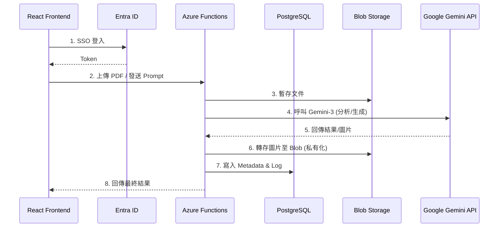
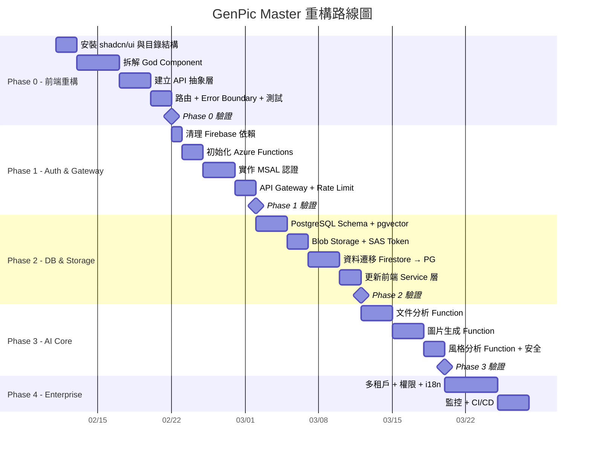

# GenPic Master - 企業級 AI 圖片生成平台

> 產品規劃文件 v2.0  
> 最後更新：2026-02-10

---

## 一、產品願景

**GenPic Master** 是一個企業級 AI 圖片生成平台，專為將企業文件（企劃書、SOP、教育訓練簡報、政府文宣）轉化為**風格一致、高度相依的連續劇情圖**而設計。

### 核心價值主張

| 痛點 | 解決方案 |
|------|----------|
| 企業製作視覺素材耗時費力 | AI 自動生成，分鐘級產出 |
| 委外設計風格難統一 | 風格鎖定機制，確保系列圖一致性 |
| 文件內容難以視覺化 | 智慧文件分析，自動提取關鍵場景 |
| AI 生成可能產出不當內容 | 多層內容審核機制，確保企業合規 |

---

## 一之二、現況評估 (Current State Analysis)

> 在規劃重構前，必須先清楚認知目前程式碼的技術債。

### 已實作功能

| 功能 | 狀態 | 技術實現 |
|:---|:---|:---|
| 參考圖風格分析 | ✅ 可用 | Firebase Vertex AI SDK → Gemini Flash |
| 風格提示詞生成 | ✅ 可用 | JSON 結構化回傳 (中文描述 + 英文 Prompt) |
| 風格收藏 CRUD | ✅ 可用 | Firestore 直接讀寫 |
| 單張圖片生成 | ✅ 可用 | Firebase Vertex AI SDK → Imagen 3 |
| Microsoft SSO 登入 | ✅ 可用 | Firebase Auth + OAuthProvider |
| 生成歷史記錄 | ✅ 可用 | Firestore + Base64 圖片 (壓縮至 JPEG 0.6) |

### 主要技術債

| 問題 | 嚴重度 | 說明 |
|:---|:---:|:---|
| **God Component** | 🔴 | `InfographicGenerator.jsx` 單檔 969 行，UI + 邏輯 + API 全部耦合 |
| **API Key 外洩風險** | 🔴 | `VITE_GEMINI_API_KEY` 打包進前端 Bundle，可被 DevTools 擷取 |
| **無元件拆分** | 🔴 | 全站僅一個 React Component，無法獨立測試或複用 |
| **圖片存 Firestore** | 🟡 | Base64 字串存進 Firestore document，有 1MB 限制且效能差 |
| **無錯誤邊界** | 🟡 | 任何子元件 crash 將導致全站白屏 |
| **無路由機制** | 🟡 | SPA 內部使用 Tab state 切換，無法直連特定頁面 |
| **無 API 抽象層** | 🟡 | Firebase SDK 直接散佈在 UI 元件中，更換 backend 需大改 |
| **無測試** | 🟡 | 零測試覆蓋，重構時缺乏保護網 |
| **shadcn/ui 未安裝** | 🟢 | DESIGN_GUIDELINE.md 已規劃但尚未安裝元件 |

---

## 二、目標使用者

| 使用者類型 | 使用情境 | 核心需求 |
|------------|----------|----------|
| **企業內部員工** | 製作內部教育訓練素材 | 快速將 SOP 轉為圖解步驟 |
| **行銷單位** | 製作對外宣傳素材 | 品牌風格一致性、批次產出 |
| **政府機關** | 製作公共政策宣導 | 內容審核嚴格、多語系支援 |

---

## 三、功能規劃

### 3.1 核心功能

#### 📄 智慧文件分析引擎

| 功能 | 說明 | 優先級 |
|------|------|--------|
| 多格式支援 | PDF、Word (.docx)、PowerPoint (.pptx)、純文字 (.txt/.md)、PNG、JPG | P0 |
| 文件結構解析 | 識別標題、段落、條列、圖表、重點標記 | P0 |
| 關鍵場景擷取 | 自動識別文件中適合視覺化的關鍵場景 | P0 |
| 劇情分鏡規劃 | 將文件切分為多個連續場景，建立故事線 | P0 |
| 角色/物件一致性 | 識別文件中的角色與物件，確保跨圖一致 | P1 |

#### 🎨 風格管理系統

| 功能 | 說明 | 優先級 |
|------|------|--------|
| 參考圖風格分析 | 上傳參考圖，AI 分析並提取風格特徵 | P0 (已實作) |
| 風格提示詞生成 | 自動生成中英文風格描述與標籤 | P0 (已實作) |
| 風格收藏庫 | 儲存、命名、標籤化常用風格 | P0 (已實作) |
| 企業風格範本 | 預設企業常用風格（扁平插畫、3D、寫實等） | P1 |
| 品牌色彩鎖定 | 指定品牌主色系，生成時自動套用 | P1 |

#### 🖼️ 連續劇情圖生成

| 功能 | 說明 | 優先級 |
|------|------|--------|
| 單張圖片生成 | 結合風格與腳本生成單張圖片 | P0 (已實作) |
| 批次場景生成 | 一次生成多張連續場景圖 | P0 |
| 角色一致性引擎 | 確保同一角色在不同場景外觀一致 | P0 |
| 場景連貫性控制 | 維持背景、時間、環境的連續性 | P1 |
| 圖片長寬比設定 | 16:9 / 4:3 / 1:1 / 9:16 | P0 (待修復) |
| 解析度選項 | 標準 / 高清 / 4K | P1 |

---

### 3.2 輔助功能

#### 👤 使用者管理

| 功能 | 說明 | 優先級 |
|------|------|--------|
| Microsoft SSO 登入 | 企業帳號整合 | P0 (已實作) |
| 多租戶架構 | 企業間資料隔離 | P0 |
| 角色權限控制 | 管理員 / 編輯者 / 檢視者 | P1 |
| 用量配額管理 | 每月 API 用量上限 | P1 |

#### 📚 資產管理

| 功能 | 說明 | 優先級 |
|------|------|--------|
| 生成歷史記錄 | 保存所有生成的圖片 | P0 (已實作) |
| 專案資料夾 | 按專案組織圖片 | P1 |
| 圖片標籤分類 | 自動/手動標籤 | P2 |
| 批次下載匯出 | 打包下載整個專案 | P1 |

#### �️ 內容審核 (Content Moderation)

| 功能 | 說明 | 優先級 |
|------|------|--------|
| Prompt 敏感詞過濾 | 送出前檢查使用者輸入是否含不當內容 | P0 |
| AI 安全設定 | 設定 Gemini Safety Settings (BLOCK_MEDIUM_AND_ABOVE) | P0 |
| 生成結果審核 | 對 AI 回傳的圖片進行二次合規檢查 | P1 |
| 審核日誌 | 記錄被攔截的請求，供管理者審閱 | P2 |

#### �🔗 整合與 API

| 功能 | 說明 | 優先級 |
|------|------|--------|
| REST API | 提供程式化存取 | P1 |
| Webhook 通知 | 生成完成通知 | P2 |
| 第三方整合 | Teams、Slack、Notion | P2 |

### 3.3 多裝置支援 (Mobile Experience)

| 功能 | 說明 | 優先級 |
| :--- | :--- | :--- |
| **響應式設計 (RWD)** | 全站介面自動適應手機、平板、桌機，確保跨裝置體驗一致 | P0 |
| **行動裝置檢視** | 針對手機提供最佳化的「直式卡片瀏覽」模式，方便通勤時審閱 | P0 |
| **觸控手勢優化** | 支援滑動換頁、雙指縮放等原生手勢操作 | P1 |
| **行動版簡易編輯** | 支援手機端快速修改 Prompt 與重繪，複雜排版功能則引導至桌機版 | P1 |

### 3.4 缺漏功能補充 (Identified Gaps)

#### 🌐 國際化 (i18n)

| 功能 | 說明 | 優先級 |
|:---|:---|:---|
| 多語系框架 | 整合 `react-i18next`，UI 文案全部抽離為語系檔 | P1 |
| 繁中 / 英文切換 | 預設繁體中文，可手動切換英文 | P1 |
| Prompt 自動翻譯 | 使用者輸入中文劇情，系統自動產出英文 Prompt 送 AI | P0 (已內建) |

#### 📊 可觀測性 (Observability)

| 功能 | 說明 | 優先級 |
|:---|:---|:---|
| 結構化日誌 | Azure Functions 搭配 Application Insights 記錄所有 API 呼叫 | P0 |
| 前端錯誤追蹤 | React Error Boundary + 錯誤回報至後端 | P0 |
| 使用量儀表板 | 統計每日 API 呼叫數、生成圖片數、使用者活躍度 | P1 |
| AI 成本追蹤 | 記錄每次 Gemini API 呼叫的 Token 消耗量與估算費用 | P1 |

#### 🔄 資料遷移 (Data Migration)

| 功能 | 說明 | 優先級 |
|:---|:---|:---|
| Firestore → PostgreSQL | 撰寫一次性遷移腳本，將既有使用者資料搬至新 DB | P0 |
| 圖片搬遷 | Firestore Base64 → Azure Blob Storage 真實圖檔 | P0 |
| 回退計畫 | 遷移失敗時可恢復原 Firestore 資料 | P0 |

---

## 四、技術架構選型 (Technical Stack)

本專案將從現有 Firebase 原型遷移至 **Azure 基礎設施 + Google AI 智慧引擎** 的企業級混合雲架構。

### 4.1 雲端基礎設施 (Hosted on Azure)

| 層級 | 技術方案 | 選擇理由 |
| :--- | :--- | :--- |
| **Frontend Hosting** | **Azure Static Web Apps** | 專為 React/Vite 設計的現代化 PaaS，內建全球 CDN 加速與 CI/CD 整合。 |
| **Identity / Auth** | **Microsoft Entra ID** | 支援 Microsoft 365 企業帳號 SSO 登入，符合公司資安合規規範。 |
| **Backend Compute** | **Azure Functions** | Serverless 架構 (Node.js)。作為「AI Proxy」保護 API Key 並轉發請求。 |
| **Database** | **Azure Database for PostgreSQL** | (Flexible Server) 配合 `JSONB` 儲存腳本，並利用 `pgvector` 實作風格庫向量搜尋。 |
| **Object Storage** | **Azure Blob Storage** | 儲存企業上傳的原始文件 (PDF/SOP) 與 AI 生成的高解析度圖片。 |

### 4.2 AI 核心引擎 (Powered by Gemini)

| 功能模組 | 指定模型 | 應用說明 |
| :--- | :--- | :--- |
| **連續圖片生成** | **gemini-3-pro-image-preview** | **核心生成引擎**。利用多模態生成能力，精準控制角色一致性與場景細節。 |
| **智慧文件分析** | **gemini-3-pro-preview** | 利用長文本 (2M+ Tokens) 推理能力，一次讀取整份 PDF/SOP 並提取分鏡。 |
| **風格分析** | **gemini-3-pro-preview** | 針對參考圖進行風格特徵提取與 Prompt 優化。 |

### 4.3 系統架構流程 (Architecture Flow)



### 4.4 AI API 呼叫範例 (Reference)

以下為 **gemini-3-pro-image-preview** 的標準 HTTP 請求範例，供 Azure Functions 開發參考：

```http
POST https://aiplatform.googleapis.com/v1/projects/{projectId}/locations/global/publishers/google/models/gemini-3-pro-image-preview:generateContent
Content-Type: application/json
Authorization: Bearer <API_KEY>

{
  "contents": [
    {
      "role": "user",
      "parts": [
        {
          "text": "一隻在充滿霓虹燈的賽博龐克城市中喝咖啡的貓，4k 高畫質，電影光效"
        }
      ]
    }
  ]
}
```

---

## 五、使用者體驗流程 (User Workflow)

```text
1. 上傳與分析 (Upload & Analyze)
   [PDF/PPT 文件] --> [Azure Blob] --> [Gemini 3 文件分析] --> [分鏡腳本草稿]

2. 風格設定 (Configure Style)
   [參考圖/企業範本] --> [Gemini 3 風格分析] --> [角色/風格鎖定參數]

3. 腳本編輯 (Edit Script)
   [React 前端畫布] --> [調整每張圖的 Prompt 與 分鏡描述]

4. 批次生成 (Batch Generate)
   [確認腳本] --> [Azure Functions] --> [Gemini 3 圖片生成] --> [Azure Blob]

5. 審視與交付 (Review & Export)
   [預覽故事線] --> [微調重繪] --> [下載高解析圖檔]
```

---

## 六、專案轉型計畫 (Migration Execution)

為從現有 Firebase 原型平滑遷移至 Azure 企業架構，本專案將採行**原地重構 (In-place Refactoring)** 策略。

> ⚠️ **關鍵洞察**：現有程式碼是 969 行的巨型單體元件，必須 **先重構前端結構 (Phase 0)**，才能安全地替換後端。否則在 Phase 1–3 中每次改動都會衝突且難以測試。

---

### Phase 0: 前端基礎重構 (Frontend Foundation) 🏗️

> **目標**：將巨型元件拆解為可組合的模組化架構，建立 API 抽象層，使後端可被替換。  
> **原則**：此階段不改變任何業務功能，Firebase 仍為後端，確保隨時可 demo。

執行細節請參考 [docs/EXECUTION_DETAILS.md](docs/EXECUTION_DETAILS.md)。

註：Firebase 僅作為 Phase 0 過渡依賴，Phase 1 會清除。

#### Step 0.1 — 安裝 shadcn/ui 與專案結構
- [ ] 安裝 DESIGN_GUIDELINE.md 中規劃的核心 shadcn/ui 元件
- [ ] 建立目標目錄結構：
  ```
  src/
  ├── components/
  │   ├── ui/           ← shadcn/ui 元件
  │   ├── layout/       ← Header, Sidebar, MainPanel
  │   ├── create/       ← 製作區相關元件
  │   ├── styles/       ← 風格庫相關元件
  │   └── history/      ← 歷史紀錄相關元件
  ├── hooks/            ← useAuth, useStyles, useImageGen, useHistory
  ├── services/         ← API 抽象層 (apiClient, authService, aiService)
  ├── lib/              ← utils, constants
  ├── types/            ← TypeScript 型別 (若啟用 TS)
  └── pages/            ← 路由頁面元件
  ```

#### Step 0.2 — 拆解 InfographicGenerator.jsx
- [ ] 抽出 `hooks/useAuth.js` — 登入/登出/認證狀態
- [ ] 抽出 `hooks/useStyles.js` — 風格 CRUD 與狀態
- [ ] 抽出 `hooks/useHistory.js` — 歷史紀錄 CRUD
- [ ] 抽出 `hooks/useImageGeneration.js` — 分析 + 生成邏輯
- [ ] 拆分 UI 元件：
  - `components/layout/AppHeader.jsx`
  - `components/create/StyleAnalyzer.jsx`
  - `components/create/ScriptEditor.jsx`
  - `components/create/ImagePreview.jsx`
  - `components/styles/StyleLibrary.jsx`
  - `components/styles/StyleCard.jsx`
  - `components/history/HistoryPanel.jsx`
  - `components/history/HistoryCard.jsx`

#### Step 0.3 — 建立 API 抽象層
- [ ] 建立 `services/apiClient.js` — 統一的 HTTP/SDK 呼叫介面
- [ ] 建立 `services/authService.js` — 認證相關 (目前包裝 Firebase Auth，之後換 MSAL)
- [ ] 建立 `services/aiService.js` — AI 呼叫 (目前包裝 Vertex AI SDK，之後改 Azure Functions)
- [ ] 建立 `services/storageService.js` — 資料存取 (目前包裝 Firestore，之後改 REST API)
- [ ] 所有 hooks 改為呼叫 service 層，不再直接 import Firebase SDK

#### Step 0.4 — 基礎設施與品質
- [ ] 安裝 React Router DOM，實作基本路由 (`/`, `/styles`, `/history`)
- [ ] 安裝 React Error Boundary，包裹頂層元件
- [ ] 設定 Vitest + React Testing Library
- [ ] 為每個 service 撰寫基礎單元測試
- [ ] 驗證：拆分後所有現有功能仍正常運作（冒煙測試）

---

### Phase 1: Auth & API Gateway (清理 Firebase → Azure) 🔐

> **前置條件**：Phase 0 完成，API 抽象層已到位。

執行細節請參考 [docs/EXECUTION_DETAILS.md](docs/EXECUTION_DETAILS.md)。

#### Step 1.1 — 清理 Firebase 依賴
- [ ] 移除 `firebase` npm 套件
- [ ] 刪除 `firestore.rules`、`firebase.json`（如存在）
- [ ] 刪除 `vercel.json`，改用 Azure Static Web Apps 設定 (`staticwebapp.config.json`)
- [ ] 移除 `src/config.js` 中的 Firebase 設定

#### Step 1.2 — Azure Functions 初始化
- [ ] 建立 `api/` 目錄，初始化 Azure Functions (Node.js v20+)
- [ ] 安裝 `@google/generative-ai`、`pg`、`@azure/storage-blob`
- [ ] 實作 `api/health/index.js` — Health check 端點
- [ ] 設定環境變數管理（Azure Key Vault / App Settings）

#### Step 1.3 — 實作 MSAL 認證
- [ ] 前端安裝 `@azure/msal-react` + `@azure/msal-browser`
- [ ] 更新 `services/authService.js`：Firebase Auth → MSAL
- [ ] 實作 Azure Function middleware：驗證 Bearer Token + 注入 `user.uid`
- [ ] 設定 CORS：僅允許前端 origin

#### Step 1.4 — API Gateway
- [ ] 實作 Rate Limiting middleware (每分鐘上限)
- [ ] 統一錯誤回傳格式 `{ error: { code, message } }`
- [ ] 更新 `services/apiClient.js`：加入 Token 自動附加與 401 重試邏輯

---

### Phase 2: Database & Storage 💾

> **前置條件**：Phase 1 完成，API Gateway 可驗證 Token。

執行細節請參考 [docs/EXECUTION_DETAILS.md](docs/EXECUTION_DETAILS.md)。

#### Step 2.1 — PostgreSQL 建置
- [ ] 建立 Azure Database for PostgreSQL (Flexible Server)
- [ ] 撰寫 Migration 腳本：`users`、`projects`、`scenes`、`styles` 表
- [ ] 啟用 `pgvector` 擴充套件，建立風格向量索引
- [ ] 設定 Connection Pool (最大連線數、逾時)

#### Step 2.2 — Blob Storage 建置
- [ ] 建立 Azure Blob Storage 容器 (`uploads`、`generated`、`thumbnails`)
- [ ] 實作 SAS Token 簽發 Azure Function
- [ ] 實作檔案格式與大小驗證 (白名單 + 50MB 上限)
- [ ] 實作自動縮圖生成 (≤ 400px，用於列表預覽)

#### Step 2.3 — 資料遷移
- [ ] 撰寫一次性遷移腳本：Firestore → PostgreSQL
- [ ] 遷移圖片：Firestore Base64 → Blob Storage 真實檔案
- [ ] 驗證資料完整性（比對筆數 + 抽樣內容）
- [ ] 建立回退計畫：保留 Firestore 讀取能力 30 天

#### Step 2.4 — 更新前端 Service 層
- [ ] 更新 `services/storageService.js`：Firestore → REST API (`/api/styles`, `/api/history`)
- [ ] 更新圖片上傳流程：Base64 → SAS Token 直傳 Blob

---

### Phase 3: AI Core Integration 🤖

> **前置條件**：Phase 2 完成，前端已切換至 REST API。

執行細節請參考 [docs/EXECUTION_DETAILS.md](docs/EXECUTION_DETAILS.md)。

#### Step 3.1 — 文件分析 Function
- [ ] 實作 `api/analyze-document/index.js`
- [ ] 使用 `@google/generative-ai` → `gemini-3-pro-preview`
- [ ] 支援 PDF、DOCX、PPTX、TXT/MD 格式（Blob URL 輸入）
- [ ] 回傳結構化分鏡 JSON

#### Step 3.2 — 圖片生成 Function
- [ ] 實作 `api/generate-images/index.js`
- [ ] 使用 `gemini-3-pro-image-preview` 模型
- [ ] 支援長寬比參數 (16:9 / 4:3 / 1:1 / 9:16)
- [ ] 生成完成後自動存入 Blob + 寫入 DB Metadata
- [ ] 實作失敗重試 (最多 3 次 + exponential backoff)

#### Step 3.3 — 風格分析 Function  
- [ ] 實作 `api/analyze-style/index.js`
- [ ] 遷移現有前端 Vertex AI 分析邏輯至後端
- [ ] 更新 `services/aiService.js`：Vertex AI SDK → REST API

#### Step 3.4 — 安全強化
- [ ] 確認所有 AI API Key 僅存在 Azure Functions 環境變數
- [ ] 實作 Prompt 敏感詞前置過濾
- [ ] 設定 Gemini Safety Settings (BLOCK_MEDIUM_AND_ABOVE)
- [ ] 前端程式碼掃描：確認零 API Key 外洩

---

### Phase 4: 企業級功能與 Polish 🏢

> **前置條件**：Phase 1–3 完成，核心功能穩定。

執行細節請參考 [docs/EXECUTION_DETAILS.md](docs/EXECUTION_DETAILS.md)。

- [ ] 多租戶資料隔離 (Tenant-based Row Level Security)
- [ ] 角色權限控制 (管理員 / 編輯者 / 檢視者)
- [ ] 用量配額管理 (每月 API 用量上限 + 儀表板)
- [ ] i18n 國際化 (react-i18next)
- [ ] 批次生成佇列 (Azure Queue + 進度 Webhook)
- [ ] 專案資料夾與批次匯出
- [ ] Application Insights 監控整合
- [ ] CI/CD Pipeline (GitHub Actions → Azure Static Web Apps + Functions)

---

## 七、功能驗證計畫 (Verification & Acceptance)

> 每個 Phase 開發完成後，需依照以下驗證清單逐項確認，全數通過方可進入下一階段。  
> 驗證方式分為：**自動測試 (A)**、**手動測試 (M)**、**程式碼審查 (R)**。

### 7.0 Phase 0 驗證：前端基礎重構

| # | 驗證項目 | 驗證方式 | 預期結果 | 通過 |
|:--|:---|:---:|:---|:---:|
| F-01 | 元件拆分完整性 | R | `InfographicGenerator.jsx` 不存在或僅為 Page Wrapper（< 50 行） | [ ] |
| F-02 | Service 層解耦 | R | `components/` 內無直接 import `firebase/*`，一律透過 `services/` | [ ] |
| F-03 | 冒煙測試 | M | 風格分析 → 生成圖片 → 存歷史 → 讀歷史 → 刪歷史 → 皆正常 | [ ] |
| F-04 | 路由導航 | M | 瀏覽器直接存取 `/styles` 可到風格庫頁面，重新整理不 404 | [ ] |
| F-05 | Error Boundary | M | 故意讓子元件拋出錯誤 → 顯示 Fallback UI，不白屏 | [ ] |
| F-06 | Vitest 可執行 | A | `npm test` 通過所有 service 層基礎測試 | [ ] |
| F-07 | shadcn/ui 元件載入 | M | Button, Card, Dialog, Tabs 等元件正常渲染 | [ ] |

---

### 7.1 Phase 1 驗證：Auth & API Gateway

#### 7.1.1 身份驗證 (Authentication)

| # | 驗證項目 | 驗證方式 | 預期結果 | 通過 |
|:--|:---|:---:|:---|:---:|
| A-01 | Microsoft SSO 登入流程 | M | 點擊登入 → 導向 Microsoft 登入頁 → 成功回調 → 顯示使用者名稱與頭貼 | [ ] |
| A-02 | Tenant 限制 | M | 設定 `MICROSOFT_TENANT_ID` 後，僅該組織帳號可登入；外部帳號被拒絕並顯示錯誤 | [ ] |
| A-03 | 登出流程 | M | 點擊登出 → 清除 Token → UI 回到未登入狀態 | [ ] |
| A-04 | Token 過期自動重新整理 | M | 長時間掛置後操作，MSAL 自動以 refresh token 取得新 access token，不中斷使用 | [ ] |
| A-05 | 未登入存取保護 | A | 未帶 Token 呼叫 `/api/*` → 回傳 `401 Unauthorized` | [ ] |
| A-06 | 無效 Token 拒絕 | A | 帶過期或竄改的 Token → 回傳 `401`，response body 包含錯誤描述 | [ ] |

#### 7.1.2 API Gateway

| # | 驗證項目 | 驗證方式 | 預期結果 | 通過 |
|:--|:---|:---:|:---|:---:|
| G-01 | Health check 端點 | A | `GET /api/health` → `200 { status: "ok" }` | [ ] |
| G-02 | Token 驗證中介層 | A | 合法 Token → request 中注入 `user.uid` 與 `user.email` | [ ] |
| G-03 | CORS 設定 | A | 僅允許前端 origin；其他 origin 被拒 | [ ] |
| G-04 | Rate limiting | A | 同一使用者 1 分鐘超過上限 → 回傳 `429 Too Many Requests` | [ ] |
| G-05 | 錯誤回傳格式一致 | R | 所有 API 錯誤回傳 `{ error: { code, message } }` 統一結構 | [ ] |

---

### 7.2 Phase 2 驗證：Database & Storage

#### 7.2.1 資料庫 (PostgreSQL)

| # | 驗證項目 | 驗證方式 | 預期結果 | 通過 |
|:--|:---|:---:|:---|:---:|
| D-01 | Schema 遷移腳本 | A | 執行 migration → 建立 `users`、`projects`、`scenes`、`styles` 表 → 無錯誤 | [ ] |
| D-02 | 多租戶資料隔離 | A | 使用者 A 建立的專案，使用者 B 查詢不到（即使直接操作 API） | [ ] |
| D-03 | JSONB 場景儲存 | A | 寫入分鏡腳本（含中文、特殊字元、emoji） → 讀取完整還原 | [ ] |
| D-04 | pgvector 風格搜尋 | A | 插入 5 個風格向量 → 以目標向量查詢 → 回傳前 3 相似且排序正確 | [ ] |
| D-05 | 連線池與超時 | A | 模擬 50 併發連線 → 無 connection leak、所有請求在 5 秒內回應 | [ ] |
| D-06 | 資料備份機制 | R | 確認已開啟 Azure 自動備份，保留天數 ≥ 7 天 | [ ] |

#### 7.2.2 物件儲存 (Blob Storage)

| # | 驗證項目 | 驗證方式 | 預期結果 | 通過 |
|:--|:---|:---:|:---|:---:|
| S-01 | SAS Token 上傳 | A | 前端取得 SAS Token → 直接上傳至 Blob → 回傳成功 URL | [ ] |
| S-02 | SAS Token 過期 | A | 使用過期 SAS Token 上傳 → 回傳 `403 Forbidden` | [ ] |
| S-03 | 檔案格式限制 | A | 上傳 `.exe` → 被拒；上傳 `.pdf`、`.docx`、`.pptx`、`.png`、`.jpg` → 成功 | [ ] |
| S-04 | 檔案大小限制 | A | 上傳超過 50MB 的檔案 → 被拒並顯示明確錯誤訊息 | [ ] |
| S-05 | 私有化存取 | M | 生成的圖片 URL 不可公開存取；需經 API 轉發或帶 SAS Token | [ ] |
| S-06 | 圖片壓縮與縮圖 | A | 上傳原圖後，系統自動產生縮圖（≤ 400px 寬）用於歷史列表 | [ ] |

---

### 7.3 Phase 3 驗證：AI Core Integration

#### 7.3.1 文件分析 (`analyze-document`)

| # | 驗證項目 | 驗證方式 | 預期結果 | 通過 |
|:--|:---|:---:|:---|:---:|
| AI-01 | PDF 文件分析 | M | 上傳 3 頁 PDF → 回傳 JSON 分鏡腳本，含 ≥ 3 個場景描述 | [ ] |
| AI-02 | Word 文件分析 | M | 上傳 `.docx` → 正確識別標題、條列、段落結構 | [ ] |
| AI-03 | PPT 文件分析 | M | 上傳 `.pptx` → 每張投影片對應一個場景 | [ ] |
| AI-04 | 純文字分析 | M | 上傳 `.txt` / `.md` → 依段落切分場景 | [ ] |
| AI-05 | 中文內容處理 | M | 全中文文件 → Prompt 翻譯正確、場景描述語義無損 | [ ] |
| AI-06 | 大檔案處理 | M | 上傳 50 頁 PDF → 在 60 秒內回傳結果，不超時 | [ ] |
| AI-07 | 錯誤處理 | A | 上傳損壞檔案 → 回傳友善錯誤訊息，不 crash | [ ] |
| AI-08 | API Key 不外洩 | R | 前端程式碼中不含任何 Gemini API Key，全部經 Azure Functions 代理 | [ ] |

#### 7.3.2 風格分析

| # | 驗證項目 | 驗證方式 | 預期結果 | 通過 |
|:--|:---|:---:|:---|:---:|
| ST-01 | 參考圖風格提取 | M | 上傳扁平插畫風 → 回傳含 `style_name`、`style_description_zh`、`style_prompt_en`、`suggested_tags` | [ ] |
| ST-02 | 多風格區分 | M | 分別上傳水彩、3D、像素風格 → 三次分析結果明顯不同 | [ ] |
| ST-03 | 風格收藏 CRUD | A | 建立 → 列表可見 → 修改名稱 → 刪除 → 列表移除 | [ ] |
| ST-04 | 風格套用 | M | 從風格庫點擊套用 → 自動填入 style prompt → 生成圖片風格一致 | [ ] |

#### 7.3.3 圖片生成 (`generate-images`)

| # | 驗證項目 | 驗證方式 | 預期結果 | 通過 |
|:--|:---|:---:|:---|:---:|
| IG-01 | 單張圖片生成 | M | 輸入 Prompt + 風格 → 10 秒內回傳圖片 → 圖片可正常顯示 | [ ] |
| IG-02 | 長寬比 16:9 | M | 設定 16:9 → 生成圖片寬高比約 1.78:1 (±5% 容差) | [ ] |
| IG-03 | 長寬比 4:3 | M | 設定 4:3 → 生成圖片寬高比約 1.33:1 | [ ] |
| IG-04 | 長寬比 1:1 | M | 設定 1:1 → 生成圖片寬高比約 1:1 | [ ] |
| IG-05 | 長寬比 9:16 | M | 設定 9:16 → 生成圖片寬高比約 0.56:1 | [ ] |
| IG-06 | 批次生成 (3 張) | M | 提交 3 張分鏡 → 全部生成完成 → 順序正確 → 風格一致 | [ ] |
| IG-07 | 批次生成 (10 張) | M | 提交 10 張分鏡 → 全部成功 → 總耗時 ≤ 3 分鐘 | [ ] |
| IG-08 | 生成失敗重試 | A | 模擬 AI API 返回 500 → 自動重試最多 3 次 → 仍失敗時回傳友善錯誤 | [ ] |
| IG-09 | 生成歷史儲存 | A | 生成完成 → 自動寫入 DB + Blob → 歷史列表可見 → 可重新載入 | [ ] |
| IG-10 | 圖片下載 | M | 點擊下載 → 瀏覽器下載 `.png` 檔案 → 檔案可開啟且畫質正常 | [ ] |

---

### 7.4 跨 Phase 驗證：UI & 體驗

#### 7.4.1 響應式設計 (RWD)

| # | 驗證項目 | 驗證方式 | 預期結果 | 通過 |
|:--|:---|:---:|:---|:---:|
| U-01 | 桌機版佈局 (≥ 1280px) | M | 左側控制面板 + 右側預覽面板，並排顯示 | [ ] |
| U-02 | 平板版佈局 (768px–1279px) | M | 同桌機但控制面板略窄，內容不溢出 | [ ] |
| U-03 | 手機版佈局 (< 768px) | M | 垂直堆疊，控制面板上方、預覽下方 | [ ] |
| U-04 | 手機輸入焦點 | M | 點擊 Textarea → 控制面板展開全屏 → 預覽面板隱藏 → 失焦後恢復 | [ ] |
| U-05 | 內容不水平溢出 | M | 所有斷點下無水平捲軸 | [ ] |

#### 7.4.2 元件行為

| # | 驗證項目 | 驗證方式 | 預期結果 | 通過 |
|:--|:---|:---:|:---|:---:|
| C-01 | 按鈕 disabled 狀態 | M | 所有按鈕在不可操作時顯示 disabled 樣式且不可點擊 | [ ] |
| C-02 | Loading 回饋 | M | 所有非同步操作期間顯示 Spinner 或 Skeleton | [ ] |
| C-03 | 空狀態引導 | M | 風格庫/歷史為空時顯示引導文案 | [ ] |
| C-04 | 錯誤提示 | M | API 錯誤 → 顯示 Alert 元件，文案友善且可關閉 | [ ] |
| C-05 | 圖片上傳預覽 | M | 選擇圖片 → 立即顯示預覽 → 可清除 → 清除後回到上傳介面 | [ ] |
| C-06 | Tab 切換 | M | 點擊製作區/風格庫/紀錄 → 內容正確切換 → 選中 Tab 有明確視覺指示 | [ ] |
| C-07 | 搜尋過濾 | M | 在風格庫/歷史輸入關鍵字 → 即時過濾結果 → 清空搜尋恢復全部 | [ ] |

#### 7.4.3 效能

| # | 驗證項目 | 驗證方式 | 預期結果 | 通過 |
|:--|:---|:---:|:---|:---:|
| P-01 | 首次載入效能 | A | Lighthouse Performance ≥ 80 分 | [ ] |
| P-02 | Bundle 大小 | A | 主要 JS bundle gzipped ≤ 300KB | [ ] |
| P-03 | LCP (最大內容繪製) | A | ≤ 2.5 秒 | [ ] |
| P-04 | CLS (累積版面偏移) | A | ≤ 0.1 | [ ] |
| P-05 | API 回應時間 | A | 非 AI 端點 P95 ≤ 500ms | [ ] |

#### 7.4.4 安全性

| # | 驗證項目 | 驗證方式 | 預期結果 | 通過 |
|:--|:---|:---:|:---|:---:|
| SEC-01 | XSS 防護 | A | 在 Prompt 輸入 `<script>alert(1)</script>` → 被轉義或過濾，不執行 | [ ] |
| SEC-02 | CSRF 防護 | R | API 驗證 Origin header 或使用 anti-CSRF Token | [ ] |
| SEC-03 | API Key 安全 | R | Gemini API Key 僅存在 Azure Functions 環境變數，不出現在前端程式碼或 Git 歷史 | [ ] |
| SEC-04 | 敏感資料日誌 | R | 伺服器日誌不記錄使用者上傳內容、Token、密碼等敏感資訊 | [ ] |
| SEC-05 | HTTPS 強制 | A | HTTP 請求自動導向 HTTPS，無混合內容警告 | [ ] |

#### 7.4.5 無障礙 (Accessibility)

| # | 驗證項目 | 驗證方式 | 預期結果 | 通過 |
|:--|:---|:---:|:---|:---:|
| ACC-01 | 鍵盤導航 | M | 純鍵盤 (Tab/Enter/Escape) 可完成完整操作流程 | [ ] |
| ACC-02 | 螢幕閱讀器 | M | 使用 NVDA/VoiceOver 可正確朗讀所有互動元素 | [ ] |
| ACC-03 | 色彩對比度 | A | 所有文字/背景組合 ≥ 4.5:1 (WCAG AA) | [ ] |
| ACC-04 | 圖片 Alt 文字 | R | 所有 `` 標籤有語義化 `alt` 屬性 | [ ] |
| ACC-05 | Focus 指示器 | M | 所有可互動元素有可見的 focus ring | [ ] |

---

### 7.5 驗證執行規範

#### 驗證流程

```text
1. 開發完成 → 自行跑通自動測試 (A) + 手動測試 (M)
2. 提交 PR → Code Review (R) 項目由審查者確認
3. 所有項目通過 → 標記 Phase 完成 → 進入下一 Phase
4. 任一項目失敗 → 開 Issue 追蹤 → 修復後重新驗證
```

#### 自動化測試工具

| 類型 | 工具 | 用途 |
|:---|:---|:---|
| **單元測試** | Vitest | 商業邏輯、工具函式 |
| **API 測試** | Vitest + supertest / REST Client | Azure Functions 端點驗證 |
| **E2E 測試** | Playwright | 完整使用者流程、跨瀏覽器驗證 |
| **效能測試** | Lighthouse CI | Core Web Vitals 自動檢測 |
| **無障礙測試** | axe-core / Lighthouse | WCAG AA 合規自動掃描 |
| **安全掃描** | npm audit + GitHub Dependabot | 相依套件漏洞偵測 |

#### 驗收標準

| 等級 | 標準 | 說明 |
|:---|:---|:---|
| **P0 功能** | 100% 通過 | 所有 P0 驗證項目必須全數通過，不可有例外 |
| **P1 功能** | ≥ 90% 通過 | 允許少量已知限制，但需開 Issue 追蹤 |
| **效能指標** | 符合基線 | Lighthouse ≥ 80、P95 ≤ 500ms、Bundle ≤ 300KB |
| **安全性** | 100% 通過 | 所有安全項目為硬性門檻，不可例外 |

---

## 八、重構執行順序總覽 (Execution Roadmap)

> 以下為建議的開發順序，每個 Phase 完成驗證後再進入下一個。



### 執行建議

| 項目 | 建議 |
|:---|:---|
| 先做什麼 | **Phase 0 (前端重構)** — 這是所有後續工作的基礎，也是風險最低的一步 |
| 為什麼 | 不改變任何功能或後端，純粹拆分程式碼，隨時可回退 |
| 每步驗證 | 每個 Step 結束後跑冒煙測試，確保未破壞既有功能 |
| Git 策略 | 每個 Phase 一個 feature branch，通過驗證後 merge 至 main |
| 風險管控 | Phase 2 資料遷移前務必完成 Firestore 完整備份 |
