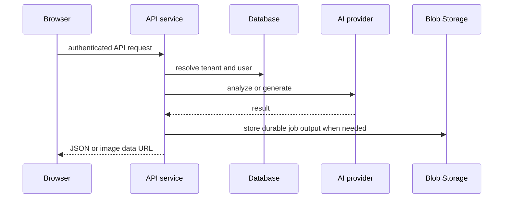

# Pixora architecture

Pixora is a Vite/React 19 single-page application backed by a CommonJS Express service that adapts Azure-Functions-style handlers. The browser owns interactive state and export artifacts; the API owns authentication verification, tenant resolution, persistence, provider credentials, and long-running GPT image work.

This is the normal authenticated request path; direct browser GPT calls are a separate legacy/configured surface described in [direct GPT Image](../frontend/direct-gpt-image.md).

## Runtime composition

- `src/main.jsx` initializes MSAL, handles its redirect promise, then mounts `MsalProvider`, `GoogleOAuthProvider`, and `AuthProvider` around `App`.
- `src/App.jsx` maps `/`, `/styles`, `/history`, `/admin`, and `/login`; all but login are protected, and `/admin` additionally waits for `/api/me` role data.
- `api/server.js` maps every `/api/*` route to a function-style handler through `invokeFunction`, applies JSON parsing, translates `context.res`, and starts `startImageJobWorker()` when invoked as the standalone API process.
- `staticwebapp.config.json` lets anonymous/authenticated users reach `/api/*` and rewrites non-asset, non-API navigation to `index.html`.

## Major ownership boundaries

| Boundary | Owner | Canonical details |
|---|---|---|
| Login, routing, local UI state | browser React app | [application](../frontend/application.md) |
| Creation, documents, transforms, exports | React hooks/components | [creation workflows](../frontend/create-workflows.md) |
| HTTP contract, CORS, route registry | `api/server.js`, `_shared/http.js` | [HTTP API](../backend/http-api.md) |
| Token verification, user/tenant and roles | API | [auth and admin](../backend/auth-tenancy-admin.md) |
| AI providers and image-job state machine | API | [AI generation](../backend/ai-generation.md) |
| Styles, history, templates, uploads, LINE | API and Postgres | [resources](../backend/resources.md) |
| Database evolution | ordered SQL migrations | [schema](../data/schema.md) |

## Change rules

The browser's `model` argument is not authoritative: `generate-images`, `image-transform`, and history recording use the tenant default from `tenant_model_settings`. Do not add a UI model choice without changing policy and its admin path. Likewise, API records are tenant/user scoped; follow the resource owner predicate rather than trusting client-side filtering.

Use [operations](../operations/development-deployment.md) for commands and deployment configuration.