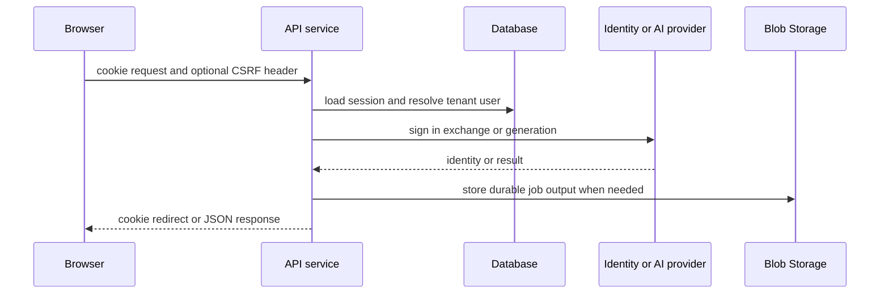

# Pixora architecture

Pixora is a Vite/React single-page application backed by a CommonJS Express service that adapts Azure-Functions-style handlers. The browser owns interactive state and export artifacts; the API owns provider verification, BFF session issuance, tenant resolution, persistence, provider credentials, and long-running GPT image work.

This shows the normal browser-to-API ownership boundary. Detailed sign-in and expiry behavior belongs to [server sessions](../backend/sessions.md); AI work is documented in [AI generation](../backend/ai-generation.md).

## Runtime composition

- `src/main.jsx` mounts `GoogleOAuthProvider` and `AuthProvider` around `App`; `AuthProvider` bootstraps its user from `GET /api/auth/session`.
- `src/App.jsx` maps `/`, `/library`, `/admin`, and `/login`; all but login are protected, and `/admin` additionally waits for `/api/me` role data. `LibraryPage` starts the library tab from its optional `section` query parameter; `AssetCenter` owns the live `section` and `view` URL state described in [Asset Center](../frontend/asset-center.md).
- `api/server.js` maps `/api/*` routes to function-style handlers through `invokeFunction`, applies JSON parsing, translates `context.res` as JSON or Buffer, registers the server PPTX and deck-job routes, and starts image and configured PPT Master workers when the standalone API process starts. The browser-to-server export split is detailed in [creation workflows](../frontend/create-workflows.md), [AI generation](../backend/ai-generation.md), and [PPT Master deck jobs](../backend/ppt-master-decks.md).
- `api/auth/index.js` exchanges Entra authorization codes or Google credentials for opaque cookies; `api/_shared/auth.js` checks each protected request before its resource handler executes.
- `staticwebapp.config.json` lets anonymous/authenticated users reach `/api/*` and rewrites non-asset, non-API navigation to `index.html`.

## Major ownership boundaries

| Boundary | Owner | Canonical details |
|---|---|---|
| Login, session bootstrap, route/profile UI | browser React app | [browser application](../frontend/application.md) |
| Cookie/session issuance, CSRF, provider exchange | API BFF | [server sessions](../backend/sessions.md) |
| HTTP contract, CORS, route registry | `api/server.js`, `_shared/http.js` | [HTTP API](../backend/http-api.md) |
| Tenant identity, roles, model policy | API | [authentication and administration](../backend/auth-tenancy-admin.md) |
| Creation, documents, transforms, exports | React hooks/components | [creation workflows](../frontend/create-workflows.md) |
| AI providers and image-job state machine | API | [AI generation](../backend/ai-generation.md) |
| PPT Master durable deck jobs and native PPTX compilation | API worker plus Python sidecar | [PPT Master deck jobs](../backend/ppt-master-decks.md) |
| Owner-scoped user uploads, fixed staging/ready Blob objects, and cleanup | API, Postgres, and Blob Storage | [owner-scoped uploads](../backend/uploads.md) |
| Styles, history, templates, generated assets, LINE | API and Postgres | [resources](../backend/resources.md) |
| Database evolution | ordered SQL migrations | [schema](../data/schema.md) |

## Change rules

A browser request cannot establish identity with a custom token header: the API derives it from the opaque session cookie, and unsafe requests additionally need the session CSRF value. Browser-only direct GPT generation and browser MSAL token handling are not runtime surfaces.

The browser's generation `model` argument is also not authoritative: `generate-images`, `image-transform`, and history recording use the tenant default from `tenant_model_settings`. Do not add a UI model choice without changing policy and its admin path. Likewise, API records are tenant/user scoped; follow the resource owner predicate rather than trusting client-side filtering.

Use [operations](../operations/development-deployment.md) for commands, BFF settings, CORS, and deployment configuration.
