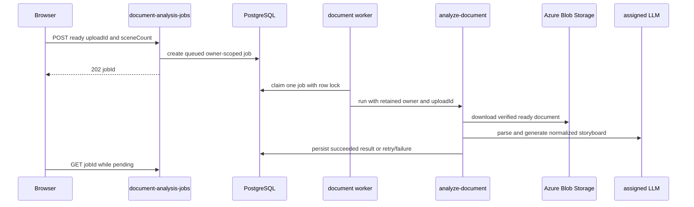
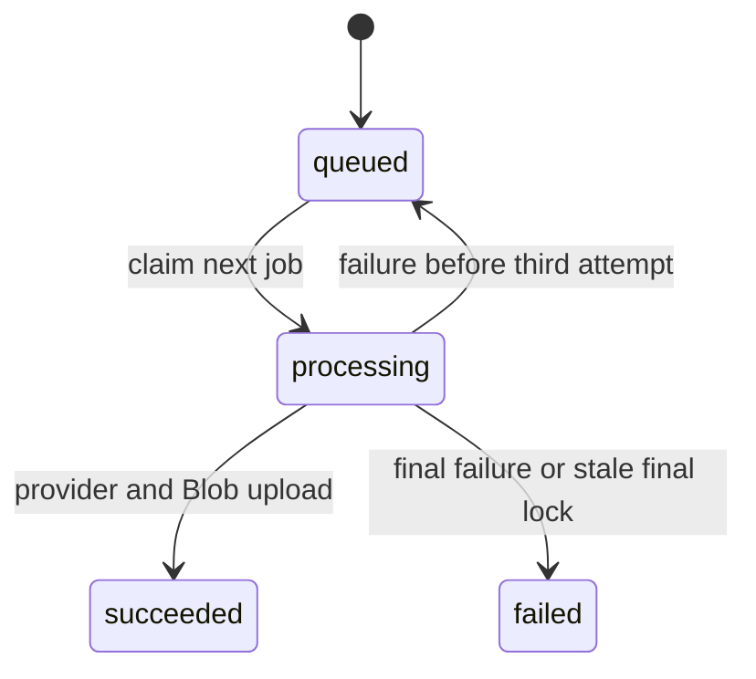

# AI generation and document storyboard analysis

This page owns the server-side structured-AI boundary: tenant model selection, provider adaptation, document parsing, and safe storyboard normalization. It also records the image-generation job lifecycle. Browser composition and the upload fallback live in [creation workflows](../frontend/create-workflows.md); route registration and the public catalog live in [HTTP API](http-api.md). PPT Master is a separate asynchronous deck system documented in [PPT Master deck jobs](ppt-master-decks.md), not a result mode of document analysis.

## Tenant-managed analysis models

An administrator configures model records and role assignments in `/admin`; their management and persistence contracts are documented in [authentication and administration](auth-tenancy-admin.md) and [schema](../data/schema.md). `llmModels.js::resolveRoleModel(tenantId, role)` reads and decrypts the tenant's primary model plus an optional distinct fallback. Management responses expose `hasApiKey`, never the key itself.

`llmProviders.js::LLM_ROLES` defines six provider-neutral roles: `document_analysis`, `prompt_optimization`, `deck_authoring`, `style_analysis`, `filename`, and `scene_optimization`. Every role may use Azure OpenAI or Google Gemini. A missing assignment becomes `LlmConfigurationError`, mapped by interactive callers to `503 llm_not_configured`; analysis does not silently fall back to `AZURE_OPENAI_*` or `GEMINI_MODEL_ANALYSIS` environment settings. Image generation and embeddings are separate environment-backed concerns.

## Provider-neutral runtime

`llmRuntime.js::generateJson` receives the resolved model/fallback, system and user messages, and an optional attachment. It dispatches Azure work to `azureOpenAI.js::postJsonCompletion` and Gemini work to `gemini.js::postGeminiJson`. Azure represents PDFs as `input_file` and other attachments as `input_image`; Gemini receives inline attachment data.

For `429` and `5xx` failures, the runtime makes at most four total attempts, reduces a nonempty output budget to 60% with an 8,000-token floor, waits with exponential jitter, and can switch to the assigned fallback. `OUTPUT_TRUNCATED` is different: when Azure reports an incomplete output-budget response or Gemini reports `MAX_TOKENS`, it retries the **same** model with double the budget, capped at 32,000 tokens. Other errors, malformed output, and local validation errors surface without retry.

`llmRuntime.test.js` covers attachment mapping, provider dispatch, fallback, retry budgets, truncation, and non-retryable errors. `llmModels.test.js` covers provider validation, encrypted-key omission, cross-provider assignment, and missing configuration. Use:

```sh
pnpm test --run api/_shared/__tests__/llmModels.test.js api/_shared/__tests__/llmRuntime.test.js api/_shared/__tests__/azureOpenAI.test.js
```

## Prompt optimization and reusable style contracts

`POST /optimize-prompt` resolves the tenant's `prompt_optimization` role and accepts required `userScript`, optional `styleContext`, and optional `imageLanguage`. `POST /optimize-scene` similarly resolves `scene_optimization` and accepts scene fields plus optional style context and `imageLanguage`. Both use `generateJson`, so they share tenant-model selection and retry behavior with the [provider-neutral runtime](#provider-neutral-runtime). They are optimization surfaces, not image-rendering endpoints: they return structured prompt/scene text that the browser later supplies to the generation flow documented in [creation workflows](../frontend/create-workflows.md).

The system prompts require a coherent English prose instruction, rather than a comma-separated keyword list. It must cover style, subject, setting, action or state, and composition/camera; literal text intended to appear in an image must be quoted, preserved rather than translated, and placed/typeset. `optimize-prompt` additionally asks for a user-facing Traditional Chinese description and explanation. `optimize-scene` returns optimized scene title, description, `visual_prompt`, and notes; if its `generateJson` call fails, it returns the original scene fields with a failure note rather than failing that inner parsing path.

`imageTextLanguage.js::buildImageTextDirective` is the shared translation from the browser setting to an optimizer instruction. Supported IDs are `en`, `zh-TW`, `zh-CN`, `ja`, `ko`, `es`, `fr`, `de`, and `none`. A supported language requires quoted literal image text to remain in that language; `none` requires no rendered text, labels, or layout text. Missing or unknown input returns an empty directive, preserving backwards-compatible optimizer requests. Do not accept a UI label as an ID or independently duplicate this mapping in an endpoint.

Style analysis is the adjacent reusable-style contract. `POST /analyze-style` resolves `style_analysis` and asks for `style_prompt` as subject-independent English prose: it may describe artistic movement, palette, lighting, materials, and composition, but must not name source-image subjects, objects, people, or text. That lets the returned prompt become style context for unrelated future content. Its user-facing description, source-image content summary, and suggested tags remain separate response fields. The handler sanitizes scalar/tag output before responding.

`imagePrompt.js::buildTransformPrompt` constructs direct edit instructions for `style_transfer`, `element_extract`, `bg_replace`, and `reference_gen`, then appends `buildGenerationTextDirective(imageLanguage)`. Mode semantics remain: style transfer preserves content and arrangement; element extraction preserves foreground subjects while moving them; background replacement preserves foreground appearance/pose; and reference generation preserves only aesthetic characteristics, not source content. This text is sent to the selected provider through `editGptImage` or the Gemini image call and is returned as `prompt`, so prompt wording changes can affect the rendering contract even without an HTTP schema change.

For a new image-text language, prompt schema, mode guarantee, or style-analysis reuse rule, change the shared helper or owning prompt constant, both consumer request paths in [creation workflows](../frontend/create-workflows.md), and focused tests together. `imageTextLanguage.test.js` proves a recognized optimizer mapping, the image-model quoted-text/default-language wording, generation `none`, and unsupported/missing values; `imagePrompt.test.js` proves the transform receives that generation directive. No focused handler test currently verifies authorization, role resolution, request forwarding, provider input, or response fallback for either optimizer; no focused test covers style analysis or transform mode wording.

```sh
pnpm test --run api/_shared/__tests__/imageTextLanguage.test.js
```

## Image prompt assembly and generation jobs

`POST /generate-images` is the server-owned text-to-image prompt boundary. It requires nonblank `userScript`, rather than accepting a browser-assembled `prompt`; optional `stylePrompt`, array `styleTags`, `purpose`, and `imageLanguage` remain separate creative inputs. `imagePrompt.js::buildImagePrompt` trims and de-duplicates nonblank style tags, keeps reusable style prose in a separate clause, and appends the subject plus only the purpose-appropriate system defaults. It rejects empty content.

`normalizeImagePurpose` accepts `infographic`, `storyboard`, or `freeform` case-insensitively after trimming; all other or absent values fall back to `infographic`. Infographic and storyboard add presentation-slide or cinematic-storyboard composition guidance **only unless the description already specifies framing**. `freeform` sends its description untouched by system additions: it adds neither composition nor an image-text-language directive, but retains any supplied style prose and palette cues. The handler returns the resulting `prompt` for direct work and when it creates a durable job. Browser callers therefore must send inputs, not reproduce this composition or persist a guessed final prompt. `buildGenerationTextDirective` and optimizer-facing `buildImageTextDirective` share `IMAGE_TEXT_LANGUAGES`: for a supported generation language, quoted literal text remains exactly as authored and only other rendered text defaults to that language; `none` prohibits rendered text; and missing/unknown IDs add nothing.

The pure contract is covered by `imagePrompt.test.js`: purpose normalization/defaulting, style prose/tag separation and de-duplication, conditional infographic/storyboard framing, a freeform description with no system directive, quoted-text/default-language wording, missing content, transform-mode guarantees, and unknown-mode fallback. `imageTextLanguage.test.js` isolates generation-directive behavior. `aiService.test.js` is the narrow consumer serialization check. There is no selector component, handler, replacement request-schema, tenant-policy, returned-prompt, or durable-job-forwarding test; add the relevant layer before changing public validation or persistence behavior.

```sh
pnpm test --run api/_shared/__tests__/imagePrompt.test.js api/_shared/__tests__/imageTextLanguage.test.js src/services/__tests__/aiService.test.js
```

## Document storyboard contract and durable queue

A completed document upload now normally enters `POST /document-analysis-jobs`, not a synchronous long analysis request. The endpoint requires an owned, unexpired, `ready` document `uploadId`, accepts `sceneCount` of `auto` or 1–10, creates a tenant/user-scoped `queued` row, and returns `202 { jobId, status }`. `GET /document-analysis-jobs/:id` exposes the same owner's status/attempts/timestamps and only returns `result` when succeeded or the stored safe error when failed. The state table and indexes are defined by `021_document_analysis_jobs.sql` in [schema](../data/schema.md); upload ownership and readiness are canonical in [Owner-scoped uploads and staged Blob storage](uploads.md).



`startDocumentAnalysisWorker` is started by `api/server.js`; it polls at `DOCUMENT_ANALYSIS_JOB_POLL_MS` (default 2000 ms) and prevents overlapping local cycles. `claimNextDocumentAnalysisJob` uses `FOR UPDATE SKIP LOCKED`, reclaims a 15-minute stale processing lock only while attempts are below two, and permanently marks timed-out jobs at the attempt limit. A failing first attempt is requeued after 15 seconds; the second failure is terminal. The worker calls `runDocumentAnalysis` with the persisted owner, which rechecks its source upload before any Blob read. It exists to keep large analysis outside the 45-second Static Web Apps API proxy window.

The legacy/small-file endpoint remains `POST /analyze-document`: it accepts either an owned ready `uploadId` or base64 content, but not both. Base64 is strict and limited to 80 KiB raw content; it is a fallback rather than an authorization bypass. For upload input, filename and MIME come from the persisted record, not browser metadata. `parseDocumentBuffer` reads TXT/Markdown directly, converts recognized office/document formats through `@firecrawl/anydoc`, and sends PDF/image vision inputs as attachments. Text above `DOCUMENT_ANALYSIS_MAX_CHARS` (default 500000) is rejected rather than truncated. The handler resolves the tenant `document_analysis` role and calls `generateJson` with an 8192-token output budget.

A successful result has nonempty normalized `scenes` and `recommended_style.prompt`, as before. `normalizeDocumentScene` handles aliases and bounds one table (eight columns/ten rows) and one chart (twelve labels/four series) per scene; the browser re-normalizes editable export input. The payload also retains document title, summary, characters, provider/model, and parser provenance.

### Change and validation guide

For queue changes, follow `document-analysis-jobs/index.js`, `_shared/documentAnalysisJobs.js`, `server.js`, `analyze-document/index.js`, migration `021`, and the polling consumer in [creation workflows](../frontend/create-workflows.md). Preserve the complete surface: route registration, public OpenAPI description, worker startup, owner recheck, polling result shape, and migration. For parser/prompt/normalization work also change `documentParser.js`, `llmRuntime.js`, provider adapter, and `documentScene.js`; do not change table/chart bounds in only one layer.

`documentAnalysisJobs.test.js` covers queue creation, owner-scoped retrieval, lock-safe claim, completion, and worker forwarding; the handler test covers 202 creation and owner-scoped status. `documentScene.test.js` and `documentParser.test.js` cover normalization/parser behavior. `aiService.test.js` is the browser request/poll serialization location. Run the focused queue and parser checks:

```sh
pnpm test --run api/_shared/__tests__/documentAnalysisJobs.test.js api/document-analysis-jobs/__tests__/index.test.js api/analyze-document/__tests__/index.test.js api/_shared/__tests__/documentScene.test.js api/_shared/__tests__/documentParser.test.js src/services/__tests__/aiService.test.js
```

## Image generation jobs

`POST /generate-images` requires `userScript`, assembles its provider prompt as described above, loads the tenant default model, and does not honor a client-selected model as policy. An optional `referenceUploadId` is resolved only as the caller's ready, unexpired image upload; caller-provided `imageUrl` is rejected. `POST /image-transform` likewise requires an owned image `uploadId` and rejects `imageBase64` and `imageUrl`. Both load bytes through `resolveOwnedImageUpload`/`downloadOwnedImage`, so signed URLs are not an image-input authorization surface. Transform modes are `style_transfer`, `element_extract`, `bg_replace`, and `reference_gen`; the shared image-model directive still receives optional `imageLanguage`. The owner-check contract is canonical in [Owner-scoped uploads and staged Blob storage](uploads.md).

Both handlers accept an optional, exact lowercase `quality` value of `low`, `medium`, or `high`; a supplied value outside that enum is `400 bad_request`. This is a GPT Image rendering-effort parameter, not Gemini image resolution or a tenant policy setting. `gptImage.js::normalizeImageQuality` lowercases/trims internal input and defaults omitted or invalid values to `medium`; `generateGptImage` sends it in the Azure JSON request and `editGptImage` sends it in multipart form data. Gemini ignores the field. The browser's `imageQuality` state is serialized as the API key `quality`; that client path is documented in [creation workflows](../frontend/create-workflows.md).



The local image worker claims one job at a time; database locking and tenant-scoped status retrieval are the durable boundary. Browser polling is owned by [creation workflows](../frontend/create-workflows.md), while generated assets are owned by [resources](resources.md).

When the selected model is `gpt-image-2`, an Azure Functions runtime calls `generateGptImage` directly; the standalone local runtime creates a durable job and returns `202 { jobId, status }`. `createImageJob` normalizes and stores `quality`; `claimNextImageJob` returns it; and `processNextImageJob` passes the stored value to Azure. Thus an asynchronous job must not recompute quality from a later browser preference. The `quality` column and its default/check constraint are owned by [schema](../data/schema.md), so deploy `019_image_job_quality.sql` before this persistence path.

`_shared/imageJobs.js` uses a transaction and `FOR UPDATE SKIP LOCKED`, increments attempts, can reclaim a processing lock older than 15 minutes, and retries up to three attempts with a five-second delay. Success stores the Blob object name and MIME type. `GET /image-jobs/:id` validates the ID and scopes reads to tenant and user before returning a data URL.

`gptImage.js::generateGptImage` and `editGptImage` each make at most three provider attempts: the initial request plus two retries for a parsed upstream `429` or `5xx` status. Their backoff waits 2 seconds then 4 seconds. The edit path builds a fresh multipart `FormData` body on every attempt, so a retry does not reuse a consumed upload body; malformed responses, local configuration/input errors, network errors without a qualifying status, and exhausted attempts still throw. The `image-transform` handler shares `isOverloadedError` for its Gemini retry loop and outer failure mapping. It recognizes numeric `429` or any numeric `>=500`, plus legacy message markers (`503`, `429`, `UNAVAILABLE`, or `high demand`); an exhausted matching error becomes `503` with `server_overloaded`, while other failures remain `502 transform_failed`. This is the failure contract consumed by the transform UI in [creation workflows](../frontend/create-workflows.md), not a successful-image response change.

For provider retry or transform-overload work, change the adapter and handler classification together only when both provider paths require the same policy. Preserve the distinction between the API's rate-limit `429` response and an upstream overload: the former returns before provider work, while the latter may retry and ultimately maps to `503`. `gptImage.test.js` covers normalization, JSON/multipart payloads, and an edit retry after a 500; `image-transform/index.test.js` covers owned input and the exhausted GPT edit 500-to-503 mapping. Run:

```sh
pnpm test --run api/_shared/__tests__/gptImage.test.js api/image-transform/__tests__/index.test.js
```

There is no focused generation handler, durable worker, or migration integration test. `src/services/__tests__/aiService.test.js` is the client serialization test location: it asserts that the generated request includes the `quality` key when the argument is omitted, but does not exercise a non-default quality value or the transform payload. Add those consumer cases before changing client serialization. Use controlled API integration for handler validation, locking, authorization, Blob behavior, or a migration deployment.
