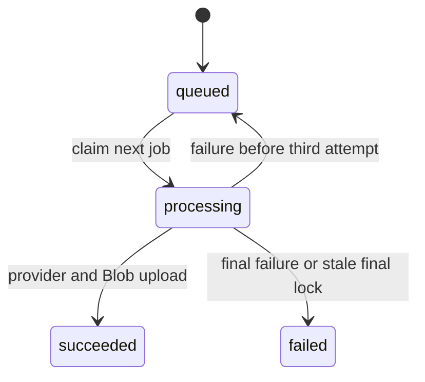

# AI generation and durable image jobs

Handlers authenticate, rate-limit, and generally resolve identity before work. `_shared/gemini.js` creates Google GenAI clients and normalizes JSON-ish textual output; `_shared/gptImage.js` maps aspect ratios, chooses Azure `api-key` or Bearer, and normalizes image response data. `azureOpenAI.js` separately powers prompt optimization through Responses JSON output.

## Generation and transformation

`POST /generate-images` requires `prompt`, loads the tenant default model, and **does not honor the client supplied model**. Gemini builds text plus an allowed reference image, retries overload-like failures twice with exponential delay, then returns a data URL. For `gpt-image-2`, Azure Functions runtime generates synchronously; standalone Express creates a job and returns `202 { jobId, status }`.

`POST /image-transform` accepts base64 or an allowed Blob URL. `buildTransformPrompt` supports `style_transfer`, `element_extract`, `bg_replace`, and default `reference_gen`; GPT edits multipart source data, Gemini sends inline data. Both return a model-tagged image. `isUrlAllowed` restricts production fetches to HTTPS, non-private addresses, and normally the configured Blob host.

### Document analysis contract

`POST /analyze-document` accepts `documentUrl` or `base64Content`, filename/MIME, `sceneCount`, and `mode`. `storyboard` prompt requests visual scenes; `presentation` also requests bullets, speaker notes, and layout. Numeric requested count is clamped to 1–10. Supported inputs are PDF, DOCX, PPTX, plain text, PNG, and JPEG (also recognized by extension). A same-account Blob URL is read with the Storage SDK; another URL must pass `isUrlAllowed`; missing/octet-stream MIME falls back to filename. Text input is decoded and truncated to 30,000 characters before Gemini. Response extraction attempts direct JSON, an outer `{...}` object, then a `[...]` scene array wrapper. Provider errors, parse errors, missing scenes, and fully empty normalized scenes return distinct failure responses; valid output maps snake/camel fields and guards presentation fields, then returns title, summary, scenes, characters, total count, estimated time, and mode.

Other AI routes: `analyze-style` returns style prompt/metadata, `optimize-scene` falls back to original fields if model JSON cannot parse, `optimize-prompt` requires Azure OpenAI JSON fields, embedding expects the configured vector dimension, and filename generation sanitizes/falls back rather than blocking creation.

## Job state machine

The worker in `_shared/imageJobs.js` runs one local cycle at a time. `claimNextImageJob` uses a transaction and `FOR UPDATE SKIP LOCKED`, increments attempts, and can reclaim a processing lock older than 15 minutes. It retries up to three attempts with a five-second delay; a stale job at max attempts fails. Success stores an image in Blob and records its name/mime type. `GET /image-jobs/:id` validates UUID and scopes retrieval to tenant and user before reading Blob into a data URL. Browser polling is `waitForImageJob` every two seconds, maximum 20 minutes; aborting stops browser waiting but cannot guarantee provider work is cancelled.

See [resources](resources.md) for storage details and [creation workflows](../frontend/create-workflows.md) for callers. Focused client coverage: `aiService.test.js`, `generationProgress.test.js`, and `gptImageService.test.js`; no worker handler test was found. Validate provider-free changes with `pnpm test`, then use controlled API integration tests for job locking/provider configuration.