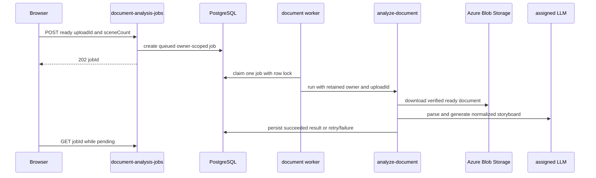
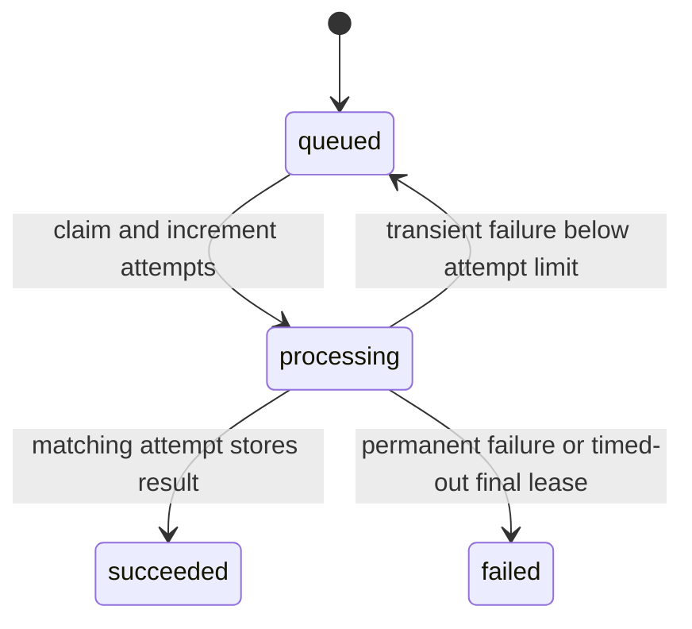

# AI generation and document storyboard analysis

This page owns the server-side structured-AI boundary: tenant model selection, provider adaptation, document parsing, and safe storyboard normalization. It also records the image-generation job lifecycle. Browser composition and the upload fallback live in [creation workflows](../frontend/create-workflows.md); route registration and the public catalog live in [HTTP API](http-api.md). PPT Master is a separate asynchronous deck system documented in [PPT Master deck jobs](ppt-master-decks.md), not a result mode of document analysis.

## Tenant-managed analysis models

An administrator configures model records and role assignments in `/admin`; their management and persistence contracts are documented in [authentication and administration](auth-tenancy-admin.md) and [schema](../data/schema.md). `llmModels.js::resolveRoleModel(tenantId, role)` reads and decrypts the tenant's primary model plus an optional distinct fallback. Management responses expose `hasApiKey`, never the key itself.

`llmProviders.js::LLM_ROLES` defines six provider-neutral roles: `document_analysis`, `prompt_optimization`, `deck_authoring`, `style_analysis`, `filename`, and `scene_optimization`. Every role may use Azure OpenAI or Google Gemini. A missing assignment becomes `LlmConfigurationError`, mapped by interactive callers to `503 llm_not_configured`; analysis does not silently fall back to `AZURE_OPENAI_*` or `GEMINI_MODEL_ANALYSIS` environment settings. Image generation is separate, and style embeddings are a distinct Azure AI Foundry concern documented in [resource APIs, Blob assets, and LINE sharing](resources.md): they do not use this role registry or the removed Gemini embedding helper.

## Provider-neutral runtime

`llmRuntime.js::generateJson` receives the resolved model/fallback, system and user messages, and an optional attachment. It dispatches Azure work to `azureOpenAI.js::postJsonCompletion` and Gemini work to `gemini.js::postGeminiJson`. Azure represents PDFs as `input_file` and other attachments as `input_image`; Gemini receives inline attachment data.

For `429` and `5xx` failures, the runtime makes at most four total attempts, reduces a nonempty output budget to 60% with an 8,000-token floor, waits with exponential jitter, and can switch to the assigned fallback. `OUTPUT_TRUNCATED` is different: when Azure reports an incomplete output-budget response or Gemini reports `MAX_TOKENS`, it retries the **same** model with double the budget, capped at 32,000 tokens. Other errors, malformed output, and local validation errors surface without retry.

`llmRuntime.test.js` covers attachment mapping, provider dispatch, fallback, retry budgets, truncation, and non-retryable errors. `llmModels.test.js` covers provider validation, encrypted-key omission, cross-provider assignment, and missing configuration. Use:

```sh
pnpm test --run api/_shared/__tests__/llmModels.test.js api/_shared/__tests__/llmRuntime.test.js api/_shared/__tests__/azureOpenAI.test.js
```

## Prompt optimization and reusable style contracts

`POST /optimize-prompt` resolves the tenant's `prompt_optimization` role. It requires a nonblank string `userScript` and can receive `styleContext`, `imageLanguage`, `imagePurpose`, `aspectRatio`, `optimizationMode`, and `transformMode`. `POST /optimize-scene` similarly resolves `scene_optimization` and receives scene fields plus style context, image language, and aspect ratio. Both build JSON data messages through `imagePromptStrategy.js`, use `generateJson`, and therefore share tenant-model selection and retry behavior with the [provider-neutral runtime](#provider-neutral-runtime). They are optimization surfaces, not image-rendering endpoints: they return a content or edit brief that the browser later supplies to the generation flow documented in [creation workflows](../frontend/create-workflows.md).

`imagePromptStrategy.js` is the shared authoring policy. It treats browser fields as data rather than instructions, describes valid `W:H` ratios as square, landscape, or portrait without inventing pixel dimensions, and falls back from unknown optimization modes to `generation`. In generation mode, the optimizer owns only the concrete content brief; server assembly adds deliverable, canvas, style, and text rules. Transform mode owns only the requested visual change; server assembly adds source-preservation, canvas, text, and style rules. `style_description` produces reusable style metadata. This separation prevents style or canvas instructions from being duplicated and helps constrain prompt-injection-like user content. `optimize-prompt` caps output at 2,000 tokens, trims all three required response strings, and returns an error for an incomplete response. `optimize-scene` caps output at 2,400 tokens and retains its existing fallback: a failed model call returns the original scene fields with a failure note.

The policy requires natural English prose rather than a comma-separated keyword list; it preserves user-provided facts and literal quoted text but must not invent data, brands, subjects, events, labels, or generic quality claims. Document analysis applies the same division: its `recommended_style.prompt` is reusable subject-independent style, while each `visual_prompt` is a scene-specific content brief. Style analysis is the adjacent reusable-style contract. `POST /analyze-style` resolves `style_analysis` and asks for `style_prompt` that describes media, lines/shapes, palette, lighting, material, and visual character without source subjects, objects, people, text, brands, fixed location, or camera. Its user-facing description, source-image content summary, and suggested tags remain separate response fields.

`imageTextLanguage.js::buildImageTextDirective` is the shared translation from browser setting to an optimizer instruction. Supported IDs are `en`, `zh-TW`, `zh-CN`, `ja`, `ko`, `es`, `fr`, `de`, and `none`. For a language ID, quoted literal text stays verbatim and appears only as often as requested, unspecified necessary text uses the selected language, and decorative/filler text is forbidden. `none` forbids created or retained image text. Missing or unknown input returns an empty directive. Do not accept a UI label as an ID or duplicate this mapping in an endpoint.

`imagePrompt.js::buildTransformPrompt` creates labeled `Edit`, `Preserve`, optional `Visual style`, `Canvas`, and `Text` sections for `style_transfer`, `element_extract`, `bg_replace`, and `reference_gen`. `style_transfer` and `bg_replace` preserve existing text/labels and prohibit new text regardless of selected image language. Other modes use the language directive. All modes preserve the source within their stated scope, while `reference_gen` may preserve referenced subjects and composition only when requested. This final text is stored with the queued edit and later sent through `editGptImage`; it is returned as `prompt`, so wording changes affect the rendering contract without an HTTP schema change.

For a new image-text language, optimizer context field, prompt section, mode guarantee, or style-analysis reuse rule, change `imagePromptStrategy.js` or the owning helper, both consumer request paths in [creation workflows](../frontend/create-workflows.md), and focused tests together. `imagePromptStrategy.test.js` covers canvas descriptions, mode normalization, and JSON data serialization; `imageTextLanguage.test.js` covers literal-text/no-text behavior; `imagePrompt.test.js` covers generation/reference and transform sections. There is still no focused handler test for optimizer authorization, role resolution, request forwarding, provider input, or scene fallback; add the relevant layer before changing those contracts.

```sh
pnpm test --run api/_shared/__tests__/imagePromptStrategy.test.js api/_shared/__tests__/imagePrompt.test.js api/_shared/__tests__/imageTextLanguage.test.js
```

## Image prompt assembly and generation jobs

`POST /generate-images` is the server-owned text-to-image prompt boundary. It requires nonblank `userScript`, rather than accepting a browser-assembled `prompt`; optional `stylePrompt`, array `styleTags`, `purpose`, `imageLanguage`, and `aspectRatio` remain separate creative inputs. When `referenceUploadId` is present, the handler marks input image 1 as a content reference. `imagePrompt.js::buildImagePrompt` trims and de-duplicates nonblank style tags and emits labeled `Deliverable`, `Content`, optional `Reference image`, `Composition and canvas`, `Visual style`, and `Text` sections. It rejects empty content.

`normalizeImagePurpose` accepts `infographic`, `storyboard`, or `freeform` case-insensitively after trimming; all other or absent values fall back to `infographic`. Infographic and storyboard add their deliverable/composition guidance only unless content already specifies framing. `freeform` omits only purpose-specific deliverable and composition defaults: it still applies explicit canvas, style, reference, and text-language settings. A syntactically valid `W:H` ratio becomes an orientation-aware canvas directive, but does not choose provider pixels; the provider adapter owns the ratio-to-size mapping. `buildGenerationTextDirective` makes quoted strings verbatim and count-aware, applies the chosen language only to necessary requested text without exact wording, forbids unrequested text, and treats `none` as fully visual output. Missing/unknown IDs add nothing. Browser callers send inputs, never reproduce the assembled prompt; the handler returns that final `prompt` with the durable admission.

The pure contract is covered by `imagePrompt.test.js`: purpose normalization/defaulting, labeled style/content sections, canvas and freeform behavior, reference-image limits, literal/no-text wording, and transform-mode guarantees. `imagePromptStrategy.test.js` isolates optimization context serialization, `imageTextLanguage.test.js` isolates text directives, and `aiService.test.js` is the narrow browser serialization check. `gptImage.test.js` verifies provider size mapping, including 16:9 `1536x864` and 9:16 `864x1536`. There is no selector component, optimizer-handler, generation-handler returned-prompt, replacement request-schema, tenant-policy, or durable-job-forwarding test; add the relevant layer before changing public validation or persistence behavior.

```sh
pnpm test --run api/_shared/__tests__/imagePrompt.test.js api/_shared/__tests__/imageTextLanguage.test.js src/services/__tests__/aiService.test.js
```

## Document storyboard contract and durable queue

A completed document upload now normally enters `POST /document-analysis-jobs`, not a synchronous long analysis request. The endpoint requires an owned, unexpired, `ready` document `uploadId`, accepts `sceneCount` of `auto` or 1–10, creates a tenant/user-scoped `queued` row, and returns `202 { jobId, status }`. `GET /document-analysis-jobs/:id` exposes the same owner's status/attempts/timestamps and only returns `result` when succeeded or the stored safe error when failed. The state table and indexes are defined by `021_document_analysis_jobs.sql` in [schema](../data/schema.md); upload ownership and readiness are canonical in [Owner-scoped uploads and staged Blob storage](uploads.md).



`startDocumentAnalysisWorker` is started by `api/server.js`; it polls at `DOCUMENT_ANALYSIS_JOB_POLL_MS` (default 2000 ms) and prevents overlapping local cycles. `claimNextDocumentAnalysisJob` uses `FOR UPDATE SKIP LOCKED`, reclaims a 15-minute stale processing lock only while attempts are below two, and permanently marks timed-out jobs at the attempt limit. A failing first attempt is requeued after 15 seconds; the second failure is terminal. The worker calls `runDocumentAnalysis` with the persisted owner, which rechecks its source upload before any Blob read. It exists to keep large analysis outside the 45-second Static Web Apps API proxy window.

The legacy/small-file endpoint remains `POST /analyze-document`: it accepts either an owned ready `uploadId` or base64 content, but not both. Base64 is strict and limited to 80 KiB raw content; it is a fallback rather than an authorization bypass. For upload input, filename and MIME come from the persisted record, not browser metadata. `parseDocumentBuffer` reads TXT/Markdown directly, converts recognized office/document formats through `@firecrawl/anydoc`, and sends PDF/image vision inputs as attachments. Text above `DOCUMENT_ANALYSIS_MAX_CHARS` (default 500000) is rejected rather than truncated. The handler resolves the tenant `document_analysis` role and calls `generateJson` with an 8192-token output budget.

A successful result has nonempty normalized `scenes` and `recommended_style.prompt`, as before. `normalizeDocumentScene` handles aliases and bounds one table (eight columns/ten rows) and one chart (twelve labels/four series) per scene; the browser re-normalizes editable export input. The payload also retains document title, summary, characters, provider/model, and parser provenance.

### Change and validation guide

For queue changes, follow `document-analysis-jobs/index.js`, `_shared/documentAnalysisJobs.js`, `server.js`, `analyze-document/index.js`, migration `021`, and the polling consumer in [creation workflows](../frontend/create-workflows.md). Preserve the complete surface: route registration, public OpenAPI description, worker startup, owner recheck, polling result shape, and migration. For parser/prompt/normalization work also change `documentParser.js`, `llmRuntime.js`, provider adapter, and `documentScene.js`; do not change table/chart bounds in only one layer.

`documentAnalysisJobs.test.js` covers queue creation, owner-scoped retrieval, lock-safe claim, completion, and worker forwarding; the handler test covers 202 creation and owner-scoped status. `documentScene.test.js` and `documentParser.test.js` cover normalization/parser behavior. `aiService.test.js` is the browser request/poll serialization location. Run the focused queue and parser checks:

```sh
pnpm test --run api/_shared/__tests__/documentAnalysisJobs.test.js api/document-analysis-jobs/__tests__/index.test.js api/analyze-document/__tests__/index.test.js api/_shared/__tests__/documentScene.test.js api/_shared/__tests__/documentParser.test.js src/services/__tests__/aiService.test.js
```

## Tenant image catalog and asynchronous jobs

`026_image_model_catalog.sql` replaces the fixed renderer policy with a per-tenant `image_models` catalog. A record has immutable `model_key`, `api_type`, and `deployment_name`; a tenant-local, case-insensitively unique label; a normalized Azure Images v1 endpoint; encrypted key ciphertext; ordered supported qualities; and a default selected from those qualities. The only API type is currently `azure-openai-images-v1`; capabilities are `low`, `medium`, `high`, `xhigh`, `max`, and `auto`. `gpt-image-2.5-flare` is a compatible catalog/deployment choice, not a process-wide special case. `imageModelConfig.js::normalizeImageEndpoint` permits only public Azure HTTPS Images v1 roots, without credentials, query/fragment, non-443 port, or arbitrary paths.

Catalog configuration and policy are separate. `imageModels.js` serializes catalog mutations, policy updates, and job admission on the same tenant row lock. `modelPolicy.js::validateModelPolicy` requires a nonempty allow-list of registered keys and a default inside it. Creating a catalog item changes neither. Updating runtime fields (endpoint or qualities/default) or deleting a model is blocked while an image or deck job using it is queued/processing; model identity cannot be changed. `resolveImageModel` queries by tenant and key, decrypts only for the server call, and returns `503 image_model_not_configured` for absent, unusable, or undecryptable configuration without exposing a diagnostic or another tenant's model.

`POST /generate-images` explicitly rejects browser `model` and `imageUrl`; it accepts only an owned `referenceUploadId` as an optional image reference, while other unrecognized fields are ignored. `POST /image-transform` explicitly rejects `model`, `imageUrl`, and `imageBase64`, and requires an owned `uploadId`. Both verify their owned input and create a job; generation with `referenceUploadId` is an `edit`, as is transform. Both always return `202`; no direct rendering path remains. Admission chooses the policy default (except the explicit saved-model administrator test), validates the model configuration and quality inside the tenant lock, and persists model, quality, operation, and edit source. `GET /image-jobs/:id` is tenant- and user-scoped and returns a result data URL only after success. Browser admission/polling and configuration-error presentation are owned by [creation workflows](../frontend/create-workflows.md).



A claim uses `FOR UPDATE SKIP LOCKED`; stale processing work can be reclaimed after 15 minutes, and there are at most three attempts with a five-second retry delay. `processNextImageJob` re-resolves the persisted tenant/model and validates its persisted quality—never the current policy—then rechecks an edit source before download. It stores output as `jobs/<job id>/<attempt>.png`; success/failure updates include `status = 'processing' AND attempts = ...`. This attempt fence prevents a late worker from publishing over the newer claim. `startImageJobWorker`, started from `api/server.js`, prevents overlapping local cycles. `gptImage.js` calls `${endpoint}/images/generations` or `/edits`, uses the tenant deployment name and validated quality, has a 12-minute request cap, and retries retryable provider failures internally before the queue retry policy applies.

Deck admission uses the same transaction: `deckJobs.js::createDeckJob` pins the current default to `image_model_key` when image density is not `none`, so later policy changes cannot redirect a queued deck. [PPT Master deck jobs](ppt-master-decks.md) consumes that pin; it falls back to layout-only pages if the pinned configuration cannot be resolved. History is a separate provenance boundary: `POST /history` accepts a job ID only for the same tenant/user and a succeeded job, takes its model from that job, and stores `history.image_job_id`. The migration's foreign key prevents invented or dangling job provenance; see [schema](../data/schema.md).

### Change and validation guide

For a catalog, model capability, provider adapter, job, or history-provenance change, follow `imageModelConfig.js` -> `imageModels.js`/`modelPolicy.js` -> admission handlers -> `imageJobs.js` -> `gptImage.js` -> `image-jobs/index.js`, plus `026`, OpenAPI, and the browser consumers. Preserve the policy/catalog separation, immutable identity, encrypted/non-returned keys, owner checks at admission **and** execution, persisted model/quality, attempt fencing, and asynchronous-only response contract. An admin test is a deliberate low-quality queued generation and does not prove edits or other qualities.

Run mocked unit/handler/consumer coverage first:

```sh
pnpm test --run api/_shared/__tests__/imageModels.test.js api/_shared/__tests__/imageJobs.test.js api/_shared/__tests__/gptImage.test.js api/generate-images/__tests__/index.test.js api/image-transform/__tests__/index.test.js api/image-jobs/__tests__/index.test.js api/admin/__tests__/imageModels.test.js api/me/__tests__/index.test.js src/hooks/__tests__/useImageGeneration.test.js src/hooks/__tests__/useImageTransform.test.js
```

`imageCatalog.integration.test.js` is an isolated PostgreSQL-schema integration test gated by `TEST_DATABASE_URL`; it has not run here because Docker Engine is unavailable. Run it only with an approved disposable PostgreSQL database. No actual Azure image generation or production migration was performed here; a live Azure test is a charged, administrator-initiated operation and a production migration requires the controlled rollout in [development, migrations, and deployment](../operations/development-deployment.md).
