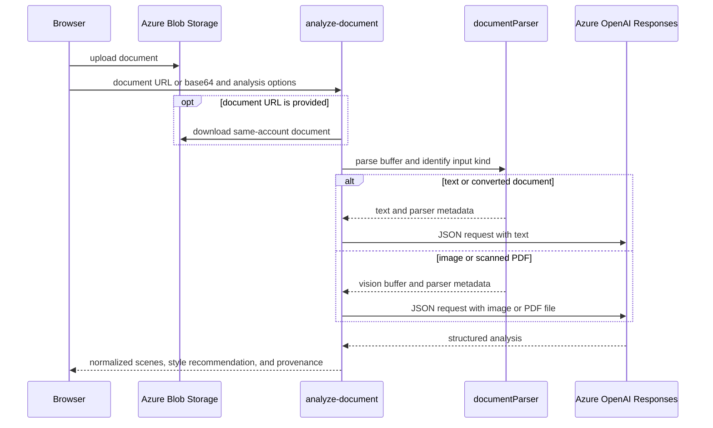
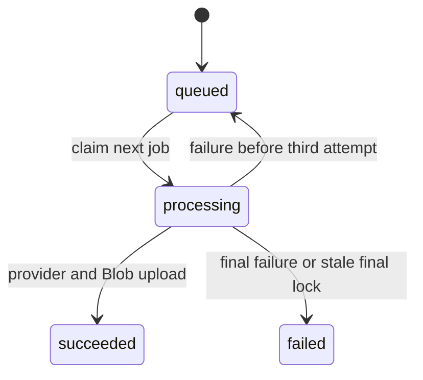

# AI generation and durable image jobs

Handlers authenticate, rate-limit, and generally resolve identity before work. `_shared/gemini.js` creates Google GenAI clients and normalizes JSON-ish textual output; `_shared/gptImage.js` maps aspect ratios, chooses Azure `api-key` or Bearer, and normalizes image response data. `azureOpenAI.js` separately powers prompt optimization through Responses JSON output.

## Generation and transformation

`POST /generate-images` requires `prompt`, loads the tenant default model, and **does not honor the client supplied model**. Gemini builds text plus an allowed reference image, retries overload-like failures twice with exponential delay, then returns a data URL. For `gpt-image-2`, Azure Functions runtime generates synchronously; standalone Express creates a job and returns `202 { jobId, status }`.

`POST /image-transform` accepts base64 or an allowed Blob URL. `buildTransformPrompt` supports `style_transfer`, `element_extract`, `bg_replace`, and default `reference_gen`; GPT edits multipart source data, Gemini sends inline data. Both return a model-tagged image. `isUrlAllowed` restricts production fetches to HTTPS, non-private addresses, and normally the configured Blob host.

### Document analysis contract

`POST /analyze-document` accepts `documentUrl` or `base64Content`, filename/MIME, `sceneCount`, and `mode`. `storyboard` requests visual scenes; `presentation` also requests bullets, speaker notes, and layout. Numeric requested count is clamped to 1–10. It recognizes the shared server format set in `_shared/documentParser.js`: PDF; Word, PowerPoint, and Excel variants; OpenDocument; RTF; EPUB; CSV; TXT/Markdown; and PNG/JPEG, by filename extension or MIME type. A same-account Blob URL is read with the Storage SDK; another URL must pass `isUrlAllowed`; missing/octet-stream MIME falls back to filename.

This sequence shows the document-analysis request path; the handler downloads only when the request identifies a Blob URL.

`parseDocumentBuffer` strips a text BOM and sends TXT/Markdown directly as text. It converts other recognized document formats to Markdown through `@firecrawl/anydoc`; a PDF that AnyDoc reports unsupported is instead sent as a PDF file for GPT vision. Images are sent as image input. The handler rejects empty or conversion failures with mapped `DocumentConversionError` status/code, and rejects text over `DOCUMENT_ANALYSIS_MAX_CHARS` (default `500000`) with `413 document_text_too_large`; it does not truncate. It then uses `_shared/azureOpenAI.js::generateJsonCompletion` against the configured Azure OpenAI deployment with JSON output and `maxOutputTokens: 8192`. The Responses adapter permits exactly one attached image or file input.

A valid model response must also supply `recommended_style.prompt`. `normalizeRecommendedStyle` converts the document-level recommendation to `{ name, description, prompt, tags }`: it stringifies scalar fields, splits string tags on ASCII or full-width commas, removes empty tags, and supplies the name `AI 文件建議風格` when absent. A missing or blank prompt is an `invalid_response` `502`; it is not silently replaced with an empty scene style. Provider errors, missing scenes, and fully empty normalized scenes return distinct failure responses. Valid output maps snake/camel scene fields and guards presentation fields, then returns title, summary, `recommended_style`, scenes, characters, total count, estimated time, mode, `analysis_provider`, `analysis_model`, `source_parser`, and `source_format`. [Creation workflows](../frontend/create-workflows.md) consumes that recommendation as the default shared style for every scene.

For a format, conversion, Responses-input, or response-normalization change, begin with `documentParser.js`, `azureOpenAI.js`, and `analyze-document/index.js`, then trace the browser consumer in [creation workflows](../frontend/create-workflows.md). `api/_shared/__tests__/documentParser.test.js` covers extension/MIME recognition, direct text, CSV conversion, image routing, and conversion error mapping; `azureOpenAI.test.js` covers image/PDF Responses input and configured deployment output. Run `pnpm test --run api/_shared/__tests__/documentParser.test.js api/_shared/__tests__/azureOpenAI.test.js`. There is no focused handler test for `recommended_style` normalization or its required-prompt rejection, so a change there needs a targeted handler test or controlled API integration. Handler-level route behavior and live conversion/provider behavior remain integration concerns; do not validate provider credentials for an adapter-only change.

Other AI routes: `analyze-style` returns style prompt/metadata, `optimize-scene` falls back to original fields if model JSON cannot parse, `optimize-prompt` requires Azure OpenAI JSON fields, embedding expects the configured vector dimension, and filename generation sanitizes/falls back rather than blocking creation.

## Job state machine

The worker in `_shared/imageJobs.js` runs one local cycle at a time. `claimNextImageJob` uses a transaction and `FOR UPDATE SKIP LOCKED`, increments attempts, and can reclaim a processing lock older than 15 minutes. It retries up to three attempts with a five-second delay; a stale job at max attempts fails. Success stores an image in Blob and records its name/mime type. `GET /image-jobs/:id` validates UUID and scopes retrieval to tenant and user before reading Blob into a data URL. Browser polling is `waitForImageJob` every two seconds, maximum 20 minutes; aborting stops browser waiting but cannot guarantee provider work is cancelled.

See [resources](resources.md) for storage details and [creation workflows](../frontend/create-workflows.md) for callers. Focused client coverage is `aiService.test.js` and `generationProgress.test.js`; no worker handler test was found. Validate provider-free changes with the focused client test, then use controlled API integration tests for job locking/provider configuration.
