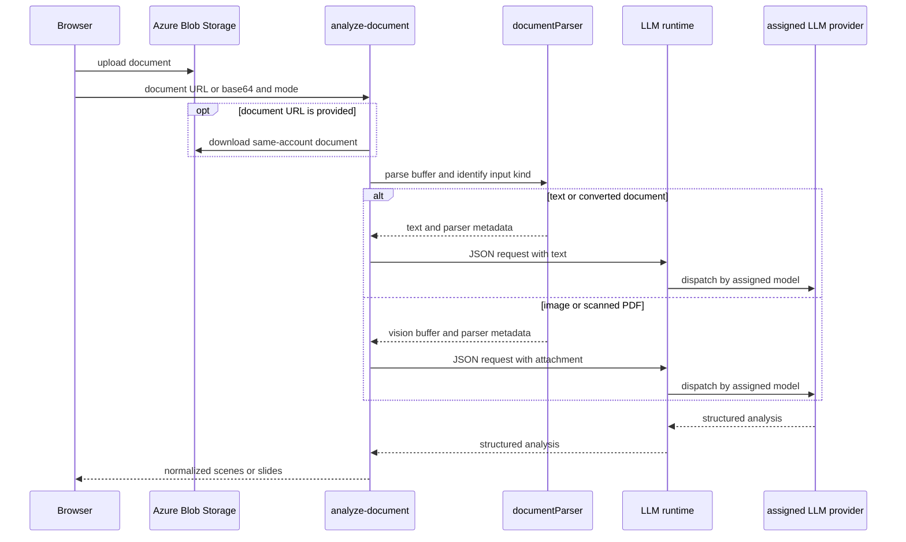
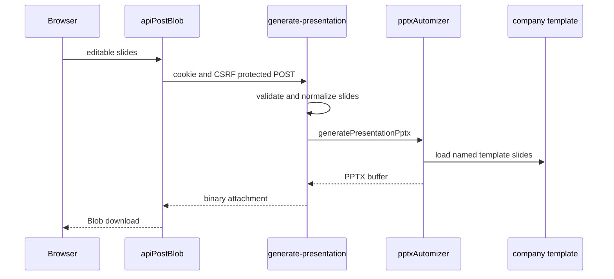
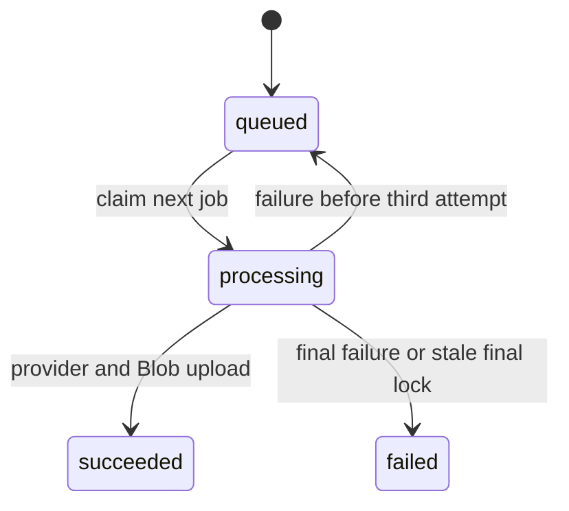

# AI generation, document analysis, and presentation rendering

Handlers authenticate, rate-limit, and resolve identity before tenant work. `_shared/gptImage.js` maps aspect ratios, chooses Azure `api-key` or Bearer authentication, and normalizes image responses. The structured analysis adapters are deliberately separate from image generation: `azureOpenAI.js` receives an Azure model object from its caller, while `_shared/gemini.js` creates the Gemini client for an assigned model.

## Tenant-managed analysis models

An administrator configures analysis-model records and role assignments in `/admin`; the browser composition is documented in [administrator panel and history preview](../frontend/admin-panel.md), the protected management contract in [authentication, tenancy, and administration](auth-tenancy-admin.md), and persistence in [schema](../data/schema.md). `llmModels.js::resolveRoleModel(tenantId, role)` reads and decrypts only the primary plus optional fallback assigned to that tenant and role. No endpoint or API key is returned to the browser: model lists expose `hasApiKey` only.

The role catalog in `llmProviders.js` identifies six product functions, but does **not** pin a role to a provider. Assignments require a primary model, an optional different fallback, and tenant-local model IDs; either selected model can be Azure OpenAI or Google Gemini. Azure endpoints must be public HTTPS (not a private/loopback host); Gemini discards any supplied endpoint because its SDK owns it. A missing assignment is `LlmConfigurationError`, which interactive callers translate to `503 llm_not_configured`; they do not fall back to `AZURE_OPENAI_*` or `GEMINI_MODEL_ANALYSIS` environment settings. Image generation and embeddings remain separate environment-backed concerns.

## Provider-neutral runtime and resilience

`llmRuntime.js::generateJson` is the common structured-completion boundary for all six roles. It receives the resolved `{ model, fallback }` plus a system/user message and optional `{ mimeType, base64 }` attachment, then dispatches by the active model's `provider`: Azure uses `azureOpenAI.js::postJsonCompletion`; Gemini uses `gemini.js::postGeminiJson`. A PDF becomes an Azure `input_file`, while other Azure attachments become `input_image`; the Gemini adapter receives inline attachment data. This is why document analysis, style analysis, prompt/scene optimization, filename generation, and PPT Master authoring can use either provider without each handler owning provider branching.

The runtime makes at most four total attempts for a `429` or a `5xx`; other errors, malformed output, and local validation errors surface without retry. Before each retry it reduces a nonempty `maxOutputTokens` to 60% with an 8,000-token floor, waits an exponential delay with jitter, and switches to the distinct assigned fallback by model ID. That peer may use the other provider. Do not convert a retryable response into a client-visible partial document or SVG result, and do not treat missing configuration as retryable.

`api/_shared/__tests__/llmRuntime.test.js` covers Azure image/PDF attachment mapping, Gemini dispatch, Azure-to-Gemini failover, retry budget floor/exhaustion, non-retryable `400`, and Azure endpoint validation. `llmModels.test.js` covers endpoint/provider validation, encrypted-key response omission, cross-provider assignment, and missing assignment. `azureOpenAI.test.js` is now the narrow single-call Azure payload adapter test. Run:

```sh
pnpm test --run api/_shared/__tests__/llmModels.test.js api/_shared/__tests__/llmRuntime.test.js api/_shared/__tests__/azureOpenAI.test.js
```

## Generation and transformation

`POST /generate-images` requires `prompt`, loads the tenant default model, and **does not honor the client-supplied model**. Gemini builds text plus an allowed reference image, retries overload-like failures twice with exponential delay, then returns a data URL. For `gpt-image-2`, Azure Functions generates synchronously while standalone Express creates a job and returns `202 { jobId, status }`.

`POST /image-transform` accepts base64 or an allowed Blob URL. `buildTransformPrompt` supports `style_transfer`, `element_extract`, `bg_replace`, and default `reference_gen`; GPT edits multipart source data and Gemini sends inline data. `isUrlAllowed` restricts production fetches to HTTPS, non-private addresses, and normally the configured Blob host.

## Document analysis: two distinct result contracts

`POST /analyze-document` accepts `documentUrl` or `base64Content`, filename/MIME, `mode`, and a mode-specific count: `sceneCount` for `storyboard`, `slideCount` for `presentation`. Numeric counts are clamped to 1–10. It recognizes the shared server format set in `_shared/documentParser.js`: PDF; Word, PowerPoint, and Excel variants; OpenDocument; RTF; EPUB; CSV; TXT/Markdown; and PNG/JPEG, by filename extension or MIME type. A same-account Blob URL is read with the Storage SDK; another URL must pass `isUrlAllowed`; missing/octet-stream MIME falls back to filename.



This is the shared transport path. The selected mode changes the prompt and response contract; it does not reinterpret one result as the other in the browser.

`parseDocumentBuffer` strips a text BOM and passes TXT/Markdown directly as text. It converts other recognized document formats to Markdown through `@firecrawl/anydoc`; a PDF that AnyDoc reports unsupported becomes a PDF attachment and images become image attachments. The handler maps empty/conversion failures to `DocumentConversionError` status/code and rejects text over `DOCUMENT_ANALYSIS_MAX_CHARS` (default `500000`) with `413 document_text_too_large`; it never truncates. Before provider work, it resolves the tenant's `document_analysis` assignment and calls `generateJson` with JSON output and `maxOutputTokens: 8192`. `llmRuntime` adapts that one attachment to the selected provider, so `analysis_provider` in response provenance is the configured primary model's provider rather than a hard-coded Azure value.

### Storyboard mode

Storyboard mode returns `scenes`, `recommended_style`, characters, and provenance. A valid model response must supply `recommended_style.prompt`; `normalizeRecommendedStyle` emits `{ name, description, prompt, tags }`, stringifies scalar fields, splits comma-delimited tags, and supplies `AI 文件建議風格` for a missing name. A missing/blank prompt is `invalid_response` `502`, not an empty style.

`normalizeDocumentScene` handles snake/camel aliases, applies safe scene number/title/layout fallbacks, and emits at most one normalized table and chart in the legacy arrays. Tables allow at most eight columns and ten rows; charts allow at most twelve labels and four series. Empty visuals disappear, numeric chart values are normalized with zero fill, and `column`/`donut` become `bar`/`doughnut`. `presentation_schema_version` is `null` in this mode. [Creation workflows](../frontend/create-workflows.md) owns storyboard image generation and browser PDF/PPTX export.

### Presentation mode

Presentation mode returns `slides`—not `scenes`—with `presentation_schema_version: 2`, `total_slides`, title/summary, and provenance. It deliberately has no image style, character, or image-generation contract: `recommended_style` is `null` and presentation cards do not enter the storyboard batch-generation flow.

Each normalized slide has `slide_number`, `slide_type`, `title`, `subtitle`, `body`, `bullets`, `speaker_notes`, `source_excerpt`, `table`, and `chart`. `normalizePresentationSlides` caps input at ten, drops only structurally unusable items, and re-numbers retained slides sequentially. Slide types are `cover`, `section`, `content`, and `closing`; an unrecognized or missing `slide_type` normalizes to `content`. Table/chart limits and numeric/chart-type normalization are shared with storyboard scenes, but presentation uses singular `table`/`chart` values. The normalizer is the safety boundary, not prompt compliance.

[Creation workflows](../frontend/create-workflows.md) keeps these modes separate: it submits `slideCount`, presents editable slides through `PresentationGenerator`, and sends that slide contract unchanged to the renderer.

### Change and validation guide

For a format, conversion, provider-attachment, or response-normalization change, begin with `documentParser.js`, `llmRuntime.js`, the selected provider adapter, `presentationSchema.js`, and `analyze-document/index.js`, then trace the selected browser consumer in [creation workflows](../frontend/create-workflows.md). Do not change a shared table/chart limit in only one consumer: document-scene normalization and presentation-slide normalization share those helpers.

`api/_shared/__tests__/presentationSchema.test.js` covers safe document scene fallbacks, independent presentation-slide normalization and re-numbering, chart-type normalization, and invalid visual rejection. Run:

```sh
pnpm test --run api/_shared/__tests__/presentationSchema.test.js
```

`documentParser.test.js` covers format/MIME recognition, direct text, CSV conversion, image routing, and conversion-error mapping. `llmRuntime.test.js` covers Azure image/PDF attachment conversion, Gemini dispatch, cross-provider failover, retry budget reduction/exhaustion, and immediate propagation of non-retryable errors; `azureOpenAI.test.js` is the narrow Azure request-payload check. Run the relevant focused test when parser or provider-adapter behavior changes; provider credentials are not required. No focused handler test covers mode branching, `slideCount`, or storyboard required-style rejection; add a handler test or use controlled API integration before changing those branches.

## Company-template PowerPoint export

`POST /generate-presentation` is authenticated, rate-limited, CSRF-protected, and binary. It rejects a missing/empty `slides` array and more than ten supplied entries with `400 bad_request`, calls `presentationSchema.js::normalizePresentationSlides`, and rejects a result with no usable content. On success it returns a no-store `.pptx` attachment with the Office presentation content type. Its registration and OpenAPI binary declaration are owned by [HTTP API](http-api.md); its browser caller is [creation workflows](../frontend/create-workflows.md).



This sequence shows the shipped export boundary. It has no provider call, Blob fetch, or client image data path.

`generatePresentationPptx` requires `api/assets/2026_ppt_template_16.9.pptx` through `COMPANY_TEMPLATE_PATH`; it fails rather than silently substituting another template. Automizer removes existing root slides, imports the company template, and copies one template slide per normalized result. The mapping is fixed: `cover` -> template slide 1, `section` -> 2, `closing` -> 5, and `content` -> 3 without a native visual or 4 with a `table` or `chart`.

`setNamedText` updates named template shapes and throws when an expected shape/name occurrence is absent. Cover, section, content, and closing each use distinct names. Content slides add body/bullets and native table/chart components using the Automizer PptxGenJS bridge; both visual types share the right column when present. `speaker_notes` remain in the analysis/client state but are not written into the generated deck. The template, its shape names, and this mapping are therefore one compatibility surface: changing the `.pptx` requires renderer inspection and an export test, not only a file replacement.

For renderer work, start with `_shared/pptxAutomizer.js` for template lifecycle, mappings, named-text dependencies, or native visual placement; use `generate-presentation/index.js` for request/response policy. `api/_shared/__tests__/pptxAutomizer.test.js` normalizes a company-template slide and creates a ZIP-based PPTX containing native visuals. The combined contract check is:

```sh
pnpm test --run api/_shared/__tests__/presentationSchema.test.js api/_shared/__tests__/pptxAutomizer.test.js
```

A renderer module test does not prove the public binary endpoint: add a handler test before changing auth, CSRF, rate limit, input status codes, attachment headers, or error mapping. Run the client service/blob tests from [creation workflows](../frontend/create-workflows.md) when the JSON or download boundary changes. Do not run a provider check for this export.

## Job state machine



The worker in `_shared/imageJobs.js` runs one local cycle at a time. `claimNextImageJob` uses a transaction and `FOR UPDATE SKIP LOCKED`, increments attempts, and can reclaim a processing lock older than 15 minutes. It retries up to three attempts with a five-second delay; a stale job at max attempts fails. Success stores an image in Blob and records its name/mime type. `GET /image-jobs/:id` validates UUID and scopes retrieval to tenant and user before reading Blob into a data URL. Browser polling is `waitForImageJob` every two seconds, maximum 20 minutes; aborting stops browser waiting but cannot guarantee provider work is cancelled.

See [resources](resources.md) for storage details and [creation workflows](../frontend/create-workflows.md) for callers. Focused client coverage is `aiService.test.js` and `generationProgress.test.js`; no worker handler test was found. Validate provider-free changes with the focused client test, then use controlled API integration tests for job locking/provider configuration.
