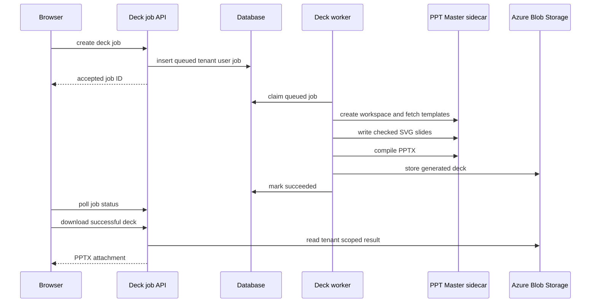
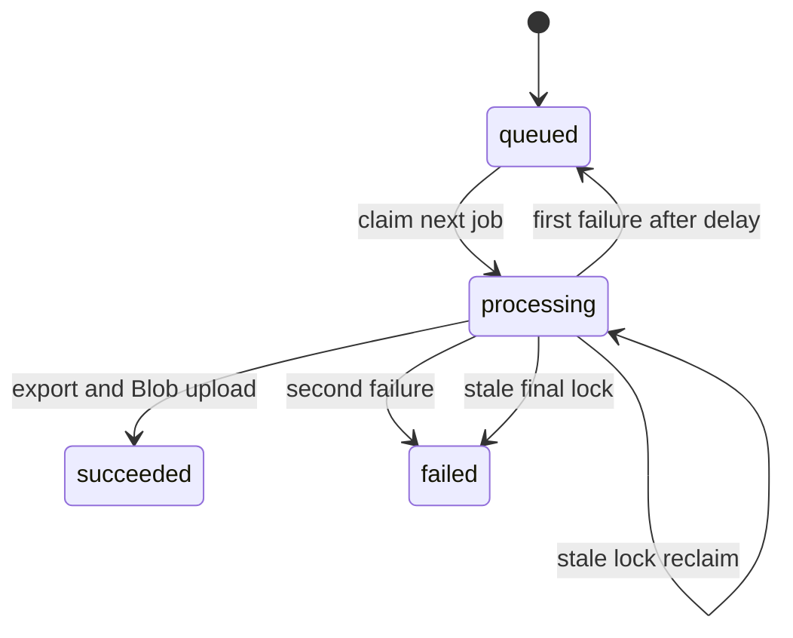

# PPT Master asynchronous deck generation

PPT Master is the third document-area workflow: unlike the editable fixed-company-template export in [AI generation](ai-generation.md), it creates a new native PowerPoint deck from a topic or optional source document. The Node API owns BFF authorization, durable job state, outline/SVG authoring, tenant-model illustrations, and generated-output storage. The Python [PPT Master sidecar](../operations/development-deployment.md) owns source-conversion fallback, temporary deck workspaces, the authoritative SVG quality gate, and deterministic SVG-to-PPTX compilation.

## Public job and template contract

`POST /api/deck-jobs` is session- and CSRF-protected, rate-limited, and returns `202` with `jobId`. It resolves identity before inserting a job, so every subsequent `GET /api/deck-jobs/:id` and `GET /api/deck-jobs/:id/download` query is scoped by both `tenant_id` and `user_id`; UUID syntax is required. A request accepts a topic or `documentUrl`, optional file name and selected `styleId`/`layoutId`, and `slideCount`. A document URL takes precedence as the input kind; topic-only requests need 4–2,000 characters. `normalizeSlideCount` defaults to 8 and clamps requests to 4–12.

A status response contains input kind, count, phase, current/total progress and timestamps. Only `succeeded` responses contain a filename and download path; failure responses contain an error. Download before success is `409 not_ready`; a ready response is an Office PPTX attachment with `no-store` and Blob-backed bytes. The adapter registrations and OpenAPI binary declaration are owned by [HTTP API](http-api.md).

`GET /api/ppt-templates` is also authenticated and rate-limited. It gets the sidecar catalog, exposes sorted style/layout summaries and keywords, and caches it in process for ten minutes. Brands are omitted unless `PPT_MASTER_INCLUDE_BRANDS` is exactly `true`.



This is the durable browser-to-PPTX flow. Uploading the optional input document occurs before job creation in [creation workflows](../frontend/create-workflows.md).

## Worker lifecycle and authoring boundary

`startDeckJobWorker` runs only in the standalone `api/server.js` process and does nothing if the sidecar URL/key is absent. One process runs one cycle at a time, polls every `DECK_JOB_POLL_MS` milliseconds (default 5,000), and immediately starts a cycle. `claimNextDeckJob` uses a transaction plus `FOR UPDATE SKIP LOCKED`; a processing lock older than `DECK_JOB_TIMEOUT_MINUTES` (default 40) can be reclaimed while fewer than two attempts have occurred. A timed-out final attempt is failed. Other failures are requeued after 15 seconds once, then become failed.



The state machine is persisted in `deck_generation_jobs`, described in [schema](../data/schema.md); cancellation in the browser only aborts upload/polling and cannot cancel a queued or processing server job.

`processDeckJob` reads a document through the normal parser where possible, then falls back to the sidecar converter. It asks Azure OpenAI for a normalized outline, gets installed fonts and selected template specifications, creates a sidecar workspace, optionally generates Gemini illustrations, authors slides, exports, uploads `decks/<job id>.pptx` through `uploadGeneratedBlob`, marks success, and attempts workspace deletion even after failure. An illustration failure is logged and leaves that slide without an image rather than failing the deck.

## SVG and sidecar contract

`deckContract.js` is a cheap local preflight boundary, not a substitute for the Python gate. It normalizes outline slide numbers and page roles (`cover`, `toc`, `section`, `content`, `ending`), limits each slide to five key points, and zero-pads SVG filenames so sidecar ordering matches presentation order. It rejects malformed author output such as a wrong `1280x720` viewBox, missing/unknown page role, root transform, forbidden SVG constructs, named HTML entities, duplicate root-group IDs, or absent/out-of-canvas `data-pptx-bounds`.

`deckAuthor.js::authorDeck` generates each SVG, locally repairs preflight failures up to `DECK_MAX_REPAIR_ROUNDS` (3), writes it to the sidecar, then calls `checkDeck`. The sidecar quality report decides whether the deck passes; rejected individual slides receive the gate's errors as repair feedback for up to three more whole-deck rounds. `exportDeck` runs only after a passing report. Do not relax local checks to bypass an export failure: inspect the sidecar rule and prompt contract first.

The sidecar client uses `PPT_MASTER_SERVICE_URL` and `PPT_MASTER_SERVICE_KEY`, sends the key only as `X-Pixora-Service-Key`, and applies `PPT_MASTER_TIMEOUT_MS` (default 900,000 ms) per call. It must not receive model credentials: Node retains the model-policy boundary and calls the shared `geminiImage.js` adapter used by `/generate-images` as well.

## Change and validation guide

Consult this page for the async job API, job lifecycle, tenant isolation, SVG authoring/repair, template catalog, sidecar client, or generated-deck Blob path. Start according to the change:

- **Request/status/download policy:** `api/deck-jobs/index.js`; preserve `requireAuth` then rate limit then `resolveIdentity`, user-and-tenant predicates, binary headers, and `not_ready` behavior. Update the matching route/OpenAPI entries in [HTTP API](http-api.md).
- **Queue, retry, progress, or result storage:** `api/_shared/deckJobs.js` and [schema](../data/schema.md). Keep status, lock, attempt, and result updates coherent; test stale-lock and first/second failure behavior with a new worker test before altering them.
- **Outline or SVG grammar:** `deckContract.js`, `deckAuthor.js`, and `svgAuthoringPrompt.js`. `deckContract.test.js` has retrievable suites for slide-count clamping, malformed-outline fallback, deterministic filenames, and rejected SVG canvas/role/bounds/forbidden constructs.
- **Sidecar HTTP or compilation behavior:** `pptMasterClient.js` and `services/ppt-master-service/app/main.py`. The public API is not a browser surface; retain the service-key boundary and workspace cleanup.
- **Template visibility/metadata:** `api/ppt-templates/index.js`, then the browser picker in [creation workflows](../frontend/create-workflows.md). Template IDs are constrained to 1–64 ASCII alphanumeric, dot, underscore, or hyphen characters.

Run the narrow contract check first:

```sh
pnpm test --run api/_shared/__tests__/deckContract.test.js
```

For route wiring, additionally run `cd api && node --check server.js && node --check openapi.js`. There are no focused handler, worker, client-hook, component, sidecar-unit, or end-to-end tenant/download tests. Add the narrow missing test before changing their behavioral contracts. The sidecar's source-backed, no-AI integration check is conditional on Docker or a sidecar change: build the container and run `python smoke.py` inside it as documented in [development, migrations, and deployment](../operations/development-deployment.md). Do not run provider work for a grammar-only change.