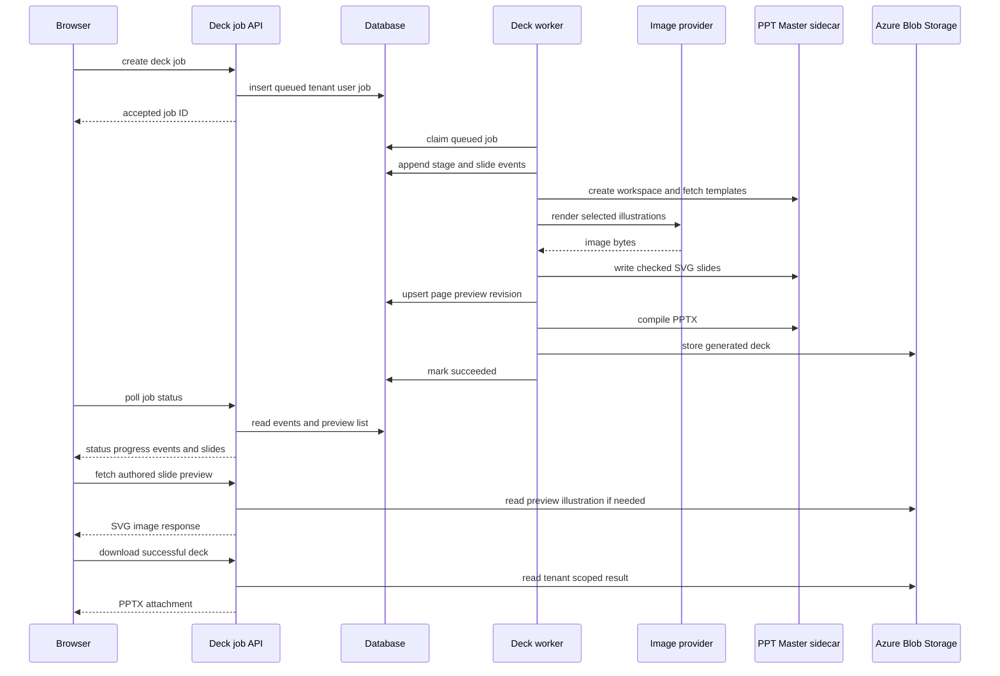
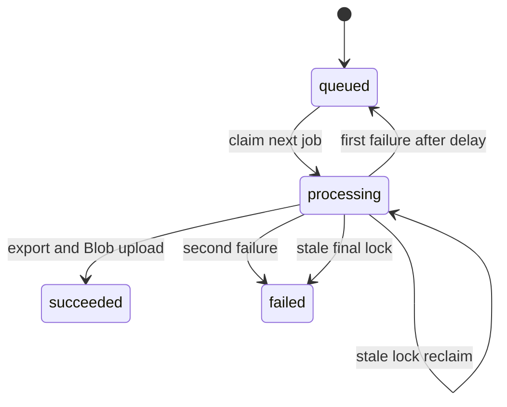

# PPT Master asynchronous deck generation

PPT Master is the dedicated native-PowerPoint workflow in the document area. It is distinct from the storyboard analysis described in [AI generation](ai-generation.md): it creates a new deck from a topic or optional source document rather than returning scenes for image generation. The Node API owns BFF authorization, durable job state, outline/SVG authoring, tenant-model illustrations, and generated-output storage. The Python [PPT Master sidecar](../operations/development-deployment.md) owns source-conversion fallback, temporary deck workspaces, the authoritative SVG quality gate, and deterministic SVG-to-PPTX compilation.

## Public job and template contract

`POST /api/deck-jobs` is session- and CSRF-protected, rate-limited, and returns `202` with `jobId`. It resolves identity before inserting a job, so every subsequent `GET /api/deck-jobs/:id` and `GET /api/deck-jobs/:id/download` query is scoped by both `tenant_id` and `user_id`; UUID syntax is required. A request accepts a topic or `documentUrl`, optional file name and selected `styleId`/`layoutId`, `slideCount`, and `imageDensity` (`none`, `key`, or `every`). A document URL takes precedence as the input kind; topic-only requests need 4–2,000 characters. `normalizeSlideCount` defaults to 8 and clamps requests to 4–12; `normalizeImageDensity` defaults unknown or absent values to `key`. The persisted status body includes `imageDensity`.

A status response contains input kind, count, phase, current/total progress, timestamps, an ordered `events` trace, and a lightweight ordered `slides` list. Each event has its database `id`, one of the shared `source`, `outline`, `images`, `slides`, `quality`, or `export` steps, a `running`/`succeeded`/`failed`/`skipped` status, optional `slideNumber` and detail, and its creation time. Each preview-list item has `slideNumber`, `revision`, and title; it deliberately omits SVG bytes. `GET /api/deck-jobs/:id/slides/:slideNumber` returns one authorized authored page as `image/svg+xml` with `no-store`; an unavailable page is `404`. The handler resolves the tenant-and-user-scoped job before either preview query. Only `succeeded` responses contain a filename and download path; failure responses contain an error. Download before success is `409 not_ready`; a ready response is an Office PPTX attachment with `no-store` and Blob-backed bytes. The adapter registrations and OpenAPI binary declaration are owned by [HTTP API](http-api.md).

`GET /api/ppt-templates` is also authenticated and rate-limited. It gets the sidecar catalog and caches it in process for ten minutes. Styles are normalized to nonempty ID, trimmed summary, stringified keywords, and ID order. Layouts receive the same normalization plus `pageCount`, but are exposed only when their upstream `canvas_format` exactly matches `deckContract.js::DECK_CANVAS_FORMAT` (`ppt169`). This prevents a 4:3, square, or vertical layout specification from conflicting with the fixed 1280x720 authoring contract and failing the quality gate. Brands are omitted unless `PPT_MASTER_INCLUDE_BRANDS` is exactly `true`. The browser picker adds local display copy with an upstream fallback in [creation workflows](../frontend/create-workflows.md); it must not weaken this server filter.



This is the durable browser-to-PPTX and preview flow. Uploading the optional input document occurs before job creation in [creation workflows](../frontend/create-workflows.md).

## Worker lifecycle and authoring boundary

`startDeckJobWorker` runs only in the standalone `api/server.js` process and does nothing if the sidecar URL/key is absent. One process runs one cycle at a time, polls every `DECK_JOB_POLL_MS` milliseconds (default 5,000), and immediately starts a cycle. `claimNextDeckJob` uses a transaction plus `FOR UPDATE SKIP LOCKED`; a processing lock older than `DECK_JOB_TIMEOUT_MINUTES` (default 40) can be reclaimed while fewer than two attempts have occurred. A timed-out final attempt is failed. Other failures are requeued after 15 seconds once, then become failed.



The state machine is persisted in `deck_generation_jobs`, described in [schema](../data/schema.md); cancellation in the browser only aborts upload/polling and cannot cancel a queued or processing server job.

### Durable step trace

`processDeckJob` uses one reporter for the job-row headline/counter and the append-only `deck_job_events` trace. The trace records the six `DECK_STEPS` from `deckContract.js`: source parsing (or a skipped source for topic-only jobs), outline, illustration work, slide authoring, quality repair, and export. A step-level event updates the readable `phase`; a per-slide event updates only the counter, preventing the headline from oscillating page by page. Per-slide image failures are recorded but intentionally do not fail the deck: authoring continues without that illustration. Any terminal processing exception adds a failed event for the most recently active step before normal retry/failure handling proceeds. `recordDeckJobEvent` catches its own database errors, so observability failure cannot stop generation.

`GET /api/deck-jobs/:id` obtains the authorized job first, then reads the trace by `job_id` ordered by its monotonically increasing ID and the preview list ordered by page. The browser therefore receives both a replayable chronology and preview cache keys after a tab switch; `012_deck_job_events.sql` and `013_deck_slide_previews.sql` must exist before this handler is deployed. The event and preview tables are documented in [schema](../data/schema.md), while client-side reduction, cache, and rendering are documented in [creation workflows](../frontend/create-workflows.md).

`processDeckJob` reads a document through the normal parser where possible, then falls back to the sidecar converter. It concurrently resolves the tenant's deck-authoring assignment, installed fonts, selected template specifications, and model policy. It asks the provider-neutral runtime for a normalized outline whose prompt includes the selected template specifications, applies the persisted image-density policy, creates a sidecar workspace, renders selected illustrations through the policy's default image model, authors slides, exports, uploads `decks/<job id>.pptx` through `uploadGeneratedBlob`, marks success, and attempts workspace deletion even after failure. An unavailable image model or an individual illustration failure is recorded and leaves affected pages without images rather than failing the deck.

## Illustration density and provider boundary

The browser's `DeckImageDensityPicker` exposes three choices and forwards the selection through `PptMasterStudio` -> `usePptMasterDeck::generate` -> `aiService.createDeckJob`; its local copy describes a range, not specific slide numbers. The actual policy belongs to `deckContract.js::applyImagePolicy` in the worker path and is persisted by `015_deck_image_density.sql` before it is reported back by the status API. The browser behavior and focused UI/hook checks are documented in [creation workflows](../frontend/create-workflows.md); the column and migration order are canonical in [schema](../data/schema.md).

| Density | Deterministic selection | Image-step outcome |
|---|---|---|
| `none` | No pages; image prompts are cleared. | `skipped`; the deck uses only layout. |
| `key` (default) | Approximately one third, never fewer than two or more than five: rank cover, section pages, outline-nominated pages, then other non-ending pages. | Generates only selected pages; the ending is excluded. |
| `every` | Every page, including the ending. | Generates up to the requested 4–12 pages. |

The outline supplies `art_direction`, candidate image briefs, and optional `image_role`; it cannot override the selected count. Missing or invalid roles fall back by page role (`cover` -> `background`, `section` -> `hero`, otherwise `accent`). If policy selects a page with no brief, `synthesizeImagePrompt` combines the deck title, page title, and first two key points and `processDeckJob` records a per-slide outline event. This makes the selection explainable and avoids silently producing an unillustrated selected page.

`generateDeckImages` combines that shared art direction, role-specific composition guidance, a crop-safe/no-text instruction, and the page brief. Rendering requests a `16:9` aspect ratio. The `gpt-image-2` size mapping returns a 3:2 frame, and the SVG uses `preserveAspectRatio="slice"`; its important content must therefore remain centered with safe margins. The worker records a failed `images` step if its policy-selected model is unconfigured, or failed per-slide events when individual rendering fails, then continues authoring a pure-layout page. It does not fall back to a different image provider. These best-effort image semantics are consumed by the durable trace described above and by preview inlining in the next section.

For a density, selection ranking, prompt, or image-provider change, treat this as a cross-boundary change: `DeckImageDensityPicker.jsx`, `pptTemplateCopy.js`, `PptMasterStudio.jsx`, `usePptMasterDeck.js`, `aiService.js`, `deck-jobs/index.js`, `deckJobs.js`, `deckContract.js`, `deckAuthor.js`, `deckImages.js`, `imageProviders.js`, and `015_deck_image_density.sql` are the relevant surface. Do not hand-edit an existing migration. Start with the policy/provider checks, then the UI/hook forwarding checks:

```sh
pnpm test --run api/_shared/__tests__/deckContract.test.js api/_shared/__tests__/deckImages.test.js api/_shared/__tests__/imageProviders.test.js src/components/create/__tests__/PptMasterStudio.test.jsx src/hooks/__tests__/usePptMasterDeck.test.jsx
```

`deckContract.test.js` has retrievable suites for `none`, key ranking, `every`, synthesized briefs, page-role defaults, and short-deck minimums. `deckImages.test.js` covers role/art-direction/crop prompt content, fixed concurrency, skipped density, and missing credentials; `imageProviders.test.js` covers credential predicates and unsupported models. `PptMasterStudio.test.jsx` covers the default selection and `every` forwarding, while `usePptMasterDeck.test.jsx` covers service forwarding. These tests do not cover the authenticated handler, database serialization, real provider calls, or worker persistence; add the narrow missing test before changing those contracts.

## SVG and sidecar contract

`deckContract.js` is a cheap local preflight boundary, not a substitute for the Python gate. It normalizes outline slide numbers and page roles (`cover`, `toc`, `section`, `content`, `ending`), limits each slide to five key points, and zero-pads SVG filenames so sidecar ordering matches presentation order. It rejects malformed author output such as a wrong `1280x720` viewBox, missing/unknown page role, root transform, forbidden SVG constructs, named HTML entities, duplicate root-group IDs, or absent/out-of-canvas `data-pptx-bounds`.

`deckAuthor.js::authorDeck` generates each SVG, locally repairs preflight failures up to `DECK_MAX_REPAIR_ROUNDS` (3), writes it to the sidecar, and calls `saveDeckSlidePreview` through its `onSlidePreview` callback before the progress event, then calls `checkDeck`. The sidecar quality report decides whether the deck passes; rejected individual slides receive the gate's errors as repair feedback for up to three more whole-deck rounds. Each repaired SVG is saved again, incrementing that page's preview revision. `exportDeck` runs only after a passing report. Do not relax local checks to bypass an export failure: inspect the sidecar rule and prompt contract first.

A preview SVG may contain a relative `../images/<name>` illustration from the temporary sidecar workspace. `generateDeckImages` writes the same generated bytes there and best-effort copies them to `decks/<job id>/images/<name>` in Blob Storage because the workspace is deleted after export. `handleSlidePreview` uses `inlineSlideImages` to replace only recognized workspace-image references (`href` or `xlink:href`) with data URLs before returning the SVG. It leaves an unresolved image reference untouched, so a missing illustration produces an empty region rather than failing preview or generation. The browser renders this model-authored SVG only through ``, which keeps it out of the document DOM; this preview-specific asset copy must not change the final sidecar/PPTX input.

The sidecar client uses `PPT_MASTER_SERVICE_URL` and `PPT_MASTER_SERVICE_KEY`, sends the key only as `X-Pixora-Service-Key`, and applies `PPT_MASTER_TIMEOUT_MS` (default 900,000 ms) per call. It must not receive model credentials: Node retains the model-policy boundary and calls the shared `geminiImage.js` adapter used by `/generate-images` as well.

When `processDeckJob` falls back to `pptMasterClient.js::convertSource`, `sidecarFileName` converts the upload filename to the sidecar's conservative ASCII-safe form. It preserves a sanitized lowercase extension for sidecar format detection, replaces unsupported stem characters with underscores, limits the stem to 60 characters, and uses `source` if no usable stem remains. This only changes the multipart filename sent to `/sources/convert`; keep the user-visible `source_file_name` and job metadata unchanged. `api/_shared/__tests__/pptMasterClient.test.js` covers accepted names, non-Latin replacement, fallback stems, extensionless names, and extension normalization.

`processDeckJob` resolves the job tenant's `deck_authoring` assignment before outline authoring, then passes that primary/fallback pair through `generateOutline` and every `authorSlideSvg`/repair call. `generateOutline` starts with `maxOutputTokens: 16000`; `deckAuthor.js` calls `llmRuntime.js::generateJson`, which dispatches each active model to Azure Responses or Gemini, can fail over across providers after a retryable status, and retries a recognized output truncation on the same model with a larger budget. This background SVG-authoring path accepts higher latency for stricter layout reasoning, but it no longer selects `AZURE_OPENAI_DECK_DEPLOYMENT` or any Azure deployment environment default. Its budget and retry invariants are canonical in [AI generation](ai-generation.md). A missing role assignment is a terminal `llm_not_configured` job failure, not a queue retry. Configure model records and assignments on the Node/API administration surface only—not on the sidecar.

## Change and validation guide

Consult this page for the async job API, job lifecycle, tenant isolation, SVG authoring/repair, template catalog, sidecar client, generated-deck Blob path, or its durable trace. Start according to the change:

- **Request/status/download policy:** `api/deck-jobs/index.js`; preserve `requireAuth` then rate limit then `resolveIdentity`, user-and-tenant predicates, binary headers, event response shape, and `not_ready` behavior. Update matching route/OpenAPI entries in [HTTP API](http-api.md).
- **Queue, retry, progress, event trace, or result storage:** `api/_shared/deckJobs.js` and [schema](../data/schema.md). Keep status, lock, attempt, result, and append-only event updates coherent. Only no-slide events may change the headline phase; recording must remain best-effort. Test stale-lock and first/second failure behavior with a new worker test before altering them; add handler/database coverage before changing event authorization, ordering, or migration compatibility.
- **Outline or SVG grammar:** `deckContract.js`, `deckAuthor.js`, and `svgAuthoringPrompt.js`. `deckContract.test.js` has retrievable suites for slide-count clamping, malformed-outline fallback, deterministic filenames, and rejected SVG canvas/role/bounds/forbidden constructs.
- **Sidecar HTTP, source-conversion filename, or compilation behavior:** `pptMasterClient.js` and `services/ppt-master-service/app/main.py`. The public API is not a browser surface; retain the service-key boundary, workspace cleanup, and `sidecarFileName` extension-preservation contract. Run `pnpm test --run api/_shared/__tests__/pptMasterClient.test.js` for filename normalization; run the conditional sidecar smoke pipeline only when container or sidecar behavior changes.
- **Template visibility/metadata:** `api/ppt-templates/index.js`, then `PptTemplatePicker.jsx` and `pptTemplateCopy.js` in [creation workflows](../frontend/create-workflows.md). Preserve the `ppt169` filter; changing canvas support is a cross-boundary change to `DECK_CANVAS_FORMAT`, SVG authoring, sidecar validation, and client copy, not a catalog-only edit. Template IDs are constrained to 1–64 ASCII alphanumeric, dot, underscore, or hyphen characters.
- **Browser continuation, polling, timeline, or slide previews:** `usePptMasterDeck.js`, `aiService.js::waitForDeckJob`, `aiService.js::getDeckSlidePreview`, `DeckProgress.jsx`, `DeckTimeline.jsx`, `DeckSlideRail.jsx`, `deckSteps.js`, and `apiClient.js::parseResponse`; see [creation workflows](../frontend/create-workflows.md). Preserve the distinction between a missing/terminal job, which clears `genpic_deck_job`, and a transient polling failure, which retains it for recovery. The timeline reducer must use event-ID order and retain the newest state per step and slide. Preview requests are keyed by page revision; revoke replaced object URLs and let preview failure remain non-fatal. `stopWatching` is local only.
- **Preview persistence or SVG response:** `deckJobs.js::{saveDeckSlidePreview,listDeckSlidePreviews,getDeckSlidePreview}`, `deckAuthor.js`, `deckImages.js`, `deckPreview.js`, `deck-jobs/index.js`, and `013_deck_slide_previews.sql`. Preserve authorization before the slide lookup, one row per job/page, revision bump on a quality rewrite, recognized-path-only inlining, and best-effort behavior for both image copies and preview saves. This crosses migration, worker callback, status serialization, protected SVG endpoint, client cache, and component tests.

Run the narrow contract check first for SVG/geometry work:

```sh
pnpm test --run api/_shared/__tests__/deckContract.test.js api/_shared/__tests__/deckPreview.test.js
```

For browser continuation, polling, or timeline rendering, run:

```sh
pnpm test --run src/hooks/__tests__/usePptMasterDeck.test.jsx src/services/__tests__/aiService.test.js src/components/create/__tests__/deckSteps.test.js src/components/create/__tests__/DeckTimeline.test.jsx src/components/create/__tests__/DeckSlideRail.test.jsx src/components/create/__tests__/PptMasterStudio.test.jsx
```

The hook/service tests cover mocked resumption, terminal/missing-job cleanup, transient-error retention, stop tracking, preview fetch/revision replacement/object-URL release, and five-failure polling exhaustion. `deckSteps.test.js` covers all-pending initialization, newest step/per-slide state, ID ordering, skipped state, unknown steps, and the active authoring page; `DeckTimeline.test.jsx` covers default expansion and collapse. `deckPreview.test.js` covers recognized-image extraction, `href`/`xlink:href` inlining, unresolved-image preservation, and refusal to resolve outside the workspace image path. `DeckSlideRail.test.jsx` covers planned-page placeholders and authored-page selection, while `PptMasterStudio.test.jsx` covers rail visibility, selected-page enlargement, the default `key` density, and `every` forwarding. `pptMasterClient.test.js` covers source-conversion filename preservation and normalization; `llmRuntime.test.js` covers the shared provider dispatch/retry boundary and `azureOpenAI.test.js` covers its Azure payload adapter, so run both when a deck authoring provider or retry behavior changes. These do not prove authenticated API, actual persistence across a browser reload, Blob transport, event/preview persistence, or worker/sidecar behavior. There is no focused template-catalog handler, deck-job handler/database, worker, sidecar-unit, or end-to-end tenant/download/preview test. Add the narrow missing test before changing those behavioral contracts. For route wiring, additionally run `cd api && node --check server.js && node --check openapi.js`. The sidecar's source-backed, no-AI integration check is conditional on Docker or a sidecar change: build the container and run `python smoke.py` inside it as documented in [development, migrations, and deployment](../operations/development-deployment.md). Do not run provider work for a grammar-only change.n `python smoke.py` inside it as documented in [development, migrations, and deployment](../operations/development-deployment.md). Do not run provider work for a grammar-only change.lopment-deployment.md). Do not run provider work for a grammar-only change.