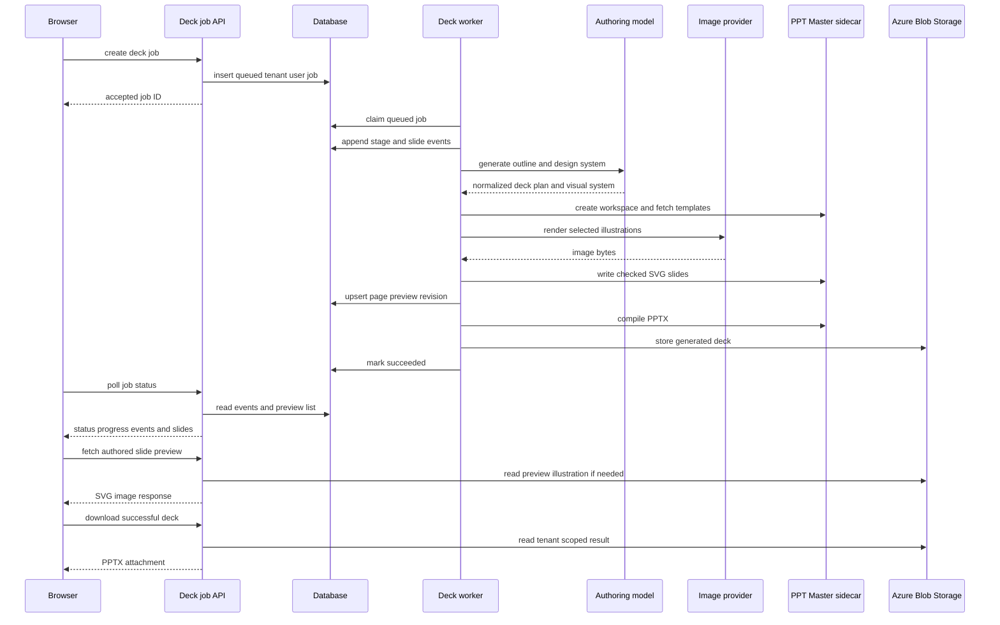
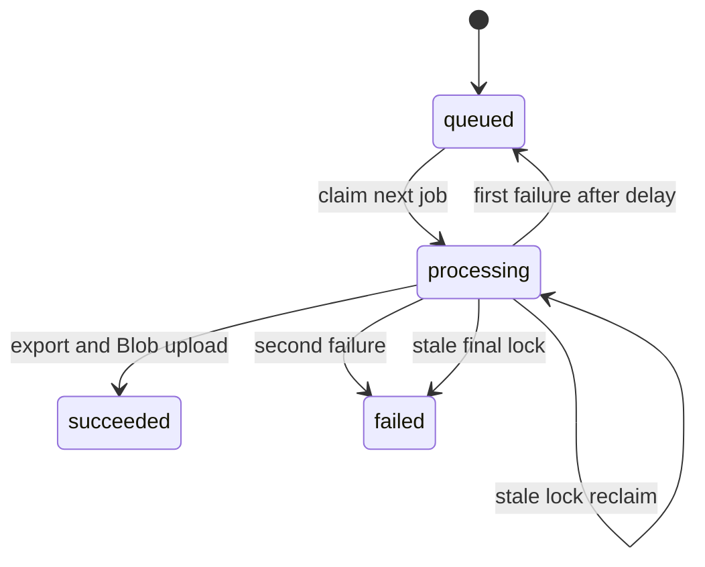

# PPT Master asynchronous deck generation

PPT Master is the dedicated native-PowerPoint workflow in the document area. It is distinct from the storyboard analysis described in [AI generation](ai-generation.md): it creates a new deck from a topic or optional source document rather than returning scenes for image generation. The Node API owns BFF authorization, durable job state, outline/SVG authoring, tenant-model illustrations, and generated-output storage. The Python [PPT Master sidecar](../operations/development-deployment.md) owns source-conversion fallback, temporary deck workspaces, the authoritative SVG quality gate, and deterministic SVG-to-PPTX compilation.

## Public job and template contract

`POST /api/deck-jobs` is session- and CSRF-protected, rate-limited, and returns `202` with `jobId`. It resolves identity before inserting a job, so every subsequent `GET /api/deck-jobs/:id` and `GET /api/deck-jobs/:id/download` query is scoped by both `tenant_id` and `user_id`; UUID syntax is required. A request accepts a topic or `documentUrl`, optional file name and selected `styleId`/`layoutId`, `slideCount`, and `imageDensity` (`none`, `key`, or `every`). It can also supply `recipeId` and optional `briefPurpose`, `briefAudience`, and `briefOutcome`. The handler collapses an unknown recipe to `general` and normalizes each brief field to one whitespace-normalized line capped at 200 characters. A document URL takes precedence as the input kind; topic-only requests need 4–2,000 characters. `normalizeSlideCount` defaults to 8 and clamps requests to 4–20; `normalizeImageDensity` defaults unknown or absent values to `key`. The persisted status body includes `imageDensity` and `recipeId`; the brief remains worker input rather than response surface.

A status response contains input kind, count, phase, current/total progress, timestamps, an ordered `events` trace, and a lightweight ordered `slides` list. Each persisted event has its database `id`, one of `source`, `outline`, `design`, `images`, `slides`, `quality`, or `export`, a `running`/`succeeded`/`failed`/`skipped` status, optional `slideNumber` and detail, and its creation time. `023_deck_event_design_step.sql` replaces the original event-step check constraint to include `design`; apply it with the worker change so the durable/browser timeline receives the design-system stage. Each preview-list item has `slideNumber`, `revision`, and title; it deliberately omits SVG bytes. `GET /api/deck-jobs/:id/slides/:slideNumber` returns one authorized authored page as `image/svg+xml` with `no-store`; an unavailable page is `404`. The handler resolves the tenant-and-user-scoped job before either preview query. Only `succeeded` responses contain a filename and download path; failure responses contain an error. Download before success is `409 not_ready`; a ready response is an Office PPTX attachment with `no-store` and Blob-backed bytes. The adapter registrations and OpenAPI binary declaration are owned by [HTTP API](http-api.md).

`GET /api/ppt-templates` is also authenticated and rate-limited. It gets the sidecar catalog and caches it in process for ten minutes. Styles are normalized to nonempty ID, trimmed summary, stringified keywords, and ID order. Layouts receive the same normalization plus `pageCount`, but are exposed only when their upstream `canvas_format` exactly matches `deckContract.js::DECK_CANVAS_FORMAT` (`ppt169`). This prevents a 4:3, square, or vertical layout specification from conflicting with the fixed 1280x720 authoring contract and failing the quality gate. Brands are omitted unless `PPT_MASTER_INCLUDE_BRANDS` is exactly `true`. The browser picker adds local display copy with an upstream fallback in [creation workflows](../frontend/create-workflows.md); it must not weaken this server filter.



This is the durable browser-to-PPTX and preview flow. Uploading the optional input document occurs before job creation in [creation workflows](../frontend/create-workflows.md).

## Worker lifecycle and authoring boundary

`startDeckJobWorker` runs only in the standalone `api/server.js` process and does nothing if the sidecar URL/key is absent. One process runs one cycle at a time, polls every `DECK_JOB_POLL_MS` milliseconds (default 5,000), and immediately starts a cycle. `claimNextDeckJob` uses a transaction plus `FOR UPDATE SKIP LOCKED`; a processing lock older than `DECK_JOB_TIMEOUT_MINUTES` (default 60) can be reclaimed while fewer than two attempts have occurred. A timed-out final attempt is failed. Other failures are requeued after 15 seconds once, then become failed.



The state machine is persisted in `deck_generation_jobs`, described in [schema](../data/schema.md); cancellation in the browser only aborts upload/polling and cannot cancel a queued or processing server job.

### Durable step trace

`processDeckJob` uses one reporter for the job-row headline/counter and the append-only `deck_job_events` trace. The worker reports the seven `DECK_STEPS` from `deckContract.js`: source parsing (or a skipped source for topic-only jobs), outline, design-system generation, illustration work, slide authoring, quality repair, and export. `023_deck_event_design_step.sql` makes `design` legal in the database constraint; deploy that migration before this worker so the durable trace and browser timeline retain the new stage. A step-level event updates the readable `phase`; a per-slide event updates only the counter, preventing the headline from oscillating page by page. Per-slide image failures are recorded but intentionally do not fail the deck: authoring continues without that illustration. Any terminal processing exception adds a failed event for the most recently active step before normal retry/failure handling proceeds. `recordDeckJobEvent` catches its own database errors, so observability failure cannot stop generation.

`GET /api/deck-jobs/:id` obtains the authorized job first, then reads the trace by `job_id` ordered by its monotonically increasing ID and the preview list ordered by page. The browser therefore receives both a replayable chronology and preview cache keys after a tab switch; `012_deck_job_events.sql`, `013_deck_slide_previews.sql`, and `023_deck_event_design_step.sql` must exist before the design-aware worker/handler path is deployed. The event and preview tables are documented in [schema](../data/schema.md), while client-side reduction, cache, and rendering are documented in [creation workflows](../frontend/create-workflows.md).

`processDeckJob` reads a document through the normal parser where possible, then falls back to the sidecar converter. It concurrently resolves the tenant's deck-authoring assignment, installed fonts, selected template specifications, and model policy. It asks the provider-neutral runtime for a normalized outline whose prompt includes the selected template specifications, recipe spine, and brief; applies the persisted image-density policy; then generates a deck-wide design system. The design call is best effort: `generateDesignSystem` records a `design` failure and uses `DEFAULT_DESIGN_SYSTEM` rather than failing a usable deck. Its normalized `artDirection` drives illustrations, while its palette, type scale, and grid drive every page authoring call. The worker then creates a sidecar workspace, renders selected illustrations through the policy's default image model, authors slides, exports, uploads `decks/<job id>.pptx` through `uploadGeneratedBlob`, marks success, and attempts workspace deletion even after failure. An unavailable image model or an individual illustration failure is recorded and leaves affected pages without images rather than failing the deck.

## Recipe, brief, and design-system boundary

`deckRecipes.js` separates narrative shape from visual templates. A non-`general` recipe supplies an exact page-role spine for the requested count: shortening drops lower-priority body sections but retains cover and ending; lengthening inserts supplementary content before the ending. `normalizeOutline` applies that spine after model output, preserving titles and points while re-resolving a frame if the corrected role no longer supports the model choice. The selected `styleId`/`layoutId` still influences tone and specification; it does not replace the recipe.

The three brief fields tell the outline and design calls the deck purpose, audience, and intended outcome. They are optional, bounded request input—not a generic user-profile store—and are persisted with `recipe_id` by migration `022_deck_recipe_brief.sql` so a claimed job has the same plan the browser submitted. The durable fields and deployment order are canonical in [schema](../data/schema.md); the studio controls and forwarding path are in [creation workflows](../frontend/create-workflows.md).

After outline normalization, `deckDesign.js` produces the one shared visual constitution for independently authored pages. `normalizeDesignSystem` rejects an incomplete or unreadable palette as a whole, requires `ink` contrast against background and surface, clamps and forces a descending display-to-caption scale, and confines the grid to the slide safe area. This protects every page from a bad global model response. `describeDesignSystem` sends concrete colors, font sizes, column grid, title baseline, decoration, rules, and illustration art direction to the author; templates refine narrative tone but cannot override those values.

## Illustration density and provider boundary

The browser's `DeckImageDensityPicker` exposes three choices and forwards the selection through `PptMasterStudio` -> `usePptMasterDeck::generate` -> `aiService.createDeckJob`; its local copy describes a range, not specific slide numbers. The actual policy belongs to `deckContract.js::applyImagePolicy` in the worker path and is persisted by `015_deck_image_density.sql` before it is reported back by the status API. The browser behavior and focused UI/hook checks are documented in [creation workflows](../frontend/create-workflows.md); the column and migration order are canonical in [schema](../data/schema.md).

| Density | Deterministic selection | Image-step outcome |
|---|---|---|
| `none` | No pages; image prompts are cleared. | `skipped`; the deck uses only layout. |
| `key` (default) | Approximately one third, never fewer than two or more than seven: rank cover, section pages, outline-nominated pages, then other non-ending pages. | Generates only selected pages; the ending is excluded. |
| `every` | Every page, including the ending. | Generates up to the requested 4–20 pages. |

The outline supplies candidate image briefs and a `frame` identifier; it cannot override the selected count or choose an `image_role`. Illustration art direction comes from the normalized deck design system. `deckFrames.js::normalizeFrameId` rejects unknown or page-role-incompatible choices in favor of a role default. The resulting frame caps `key_points` to its own capacity and declares whether a picture is a `background` or `hero` and exactly which module holds it. If policy selects a page with no brief, `synthesizeImagePrompt` combines the deck title, page title, and first two key points and `processDeckJob` records a per-slide outline event. This makes selection explainable and avoids silently producing an unillustrated selected page.

`applyImagePolicy` reconciles density selection with geometry after normalizing the outline. It moves an illustrated frame to its declared image-free fallback when no picture is wanted, and moves a text-only frame to its illustrated sibling when a picture is wanted. A structural frame such as a matrix or timeline has no illustrated sibling: it keeps its structure and becomes image-free, so density is a target rather than a per-page guarantee. `generateDeckImages` combines shared art direction, the frame-derived role-specific composition guidance, a crop-safe/no-text instruction, and the page brief. Rendering requests a `16:9` aspect ratio. The sole supported `gpt-image-2` size mapping returns a 3:2 frame, and the SVG uses `preserveAspectRatio="slice"`; its important content must therefore remain centered with safe margins. The worker records a failed `images` step if its policy-selected model is unconfigured, or failed per-slide events when individual rendering fails, then continues authoring a pure-layout page. It does not fall back to a different image provider. These best-effort image semantics are consumed by the durable trace described above and by preview inlining in the next section.

For a density, selection ranking, prompt, or image-provider change, treat this as a cross-boundary change: `DeckImageDensityPicker.jsx`, `pptTemplateCopy.js`, `PptMasterStudio.jsx`, `usePptMasterDeck.js`, `aiService.js`, `deck-jobs/index.js`, `deckJobs.js`, `deckContract.js`, `deckAuthor.js`, `deckImages.js`, `imageProviders.js`, `modelPolicy.js`, `015_deck_image_density.sql`, and `025_gpt_image_only.sql` are the relevant surface. Do not hand-edit an existing migration. Start with the policy/provider checks, then the UI/hook forwarding checks:

```sh
pnpm test --run api/_shared/__tests__/deckContract.test.js api/_shared/__tests__/deckImages.test.js api/_shared/__tests__/imageProviders.test.js src/components/create/__tests__/PptMasterStudio.test.jsx src/hooks/__tests__/usePptMasterDeck.test.jsx
```

`deckContract.test.js` has retrievable suites for `none`, key ranking, `every`, synthesized briefs, page-role defaults, frame reconciliation, structural-frame image suppression, and short-deck minimums. `deckFrames.test.js` checks catalog coverage, frame/page-role compatibility, safe-area and non-overlap geometry, image-module/fallback integrity, and catalog-versus-per-page geometry descriptions. `svgAuthoringPrompt.test.js` verifies that outline planning receives the catalog but not coordinate data, while authoring and repair receive only the selected frame's exact geometry. `deckImages.test.js` covers role/art-direction/crop prompt content, fixed concurrency, skipped density, and missing credentials; `imageProviders.test.js` covers credential predicates and unsupported models. `PptMasterStudio.test.jsx` covers the default selection and `every` forwarding, while `usePptMasterDeck.test.jsx` covers service forwarding. These tests do not cover the authenticated handler, database serialization, real provider calls, or worker persistence; add the narrow missing test before changing those contracts.

## SVG and sidecar contract

`deckFrames.js` is the per-page structural vocabulary. A frame serves page roles, declares a point-capacity range, image role/sibling behavior, and—where applicable—native chart/table intent and drawing guidance. In normal authoring, `describeFrameIntent` gives the model that meaning but not coordinates; the deck-wide design system supplies a common grid. The retained `describeFrameGeometry` is a retreat only: it supplies solved bounds after a page exhausts its local free-form repair loop. This is deliberately separate from `layout_id`: template specifications set narrative tone, the design system owns visual constants, and a frame describes page structure.

`deckContract.js` is a cheap local preflight boundary, not a substitute for the Python gate. It normalizes outline slide numbers, roles (`cover`, `toc`, `section`, `content`, `ending`), compatible frame choices, point capacity, bounded table data (at most 5 columns × 6 rows), bounded category-chart data (six supported types, at most six categories and three series), and zero-padded SVG filenames. It rejects malformed author output such as a wrong `1280x720` viewBox, missing/unknown page role, root transform, forbidden SVG constructs, named HTML entities, duplicate root-group IDs, missing/out-of-canvas or undersized bounds, and non-bleed modules outside the safe area. It also compares all ordinary direct root modules: if their bounds intersect by more than one pixel on both axes, the SVG is rejected. Only `background`, `chrome`, `decoration`, `footer`, `header`, `logo`, `page-number`, and `watermark` structural roles are exempt; `data-pptx-role` is not an escape hatch for cards, panels, or images. A native `chart` or `table` marker must include parseable JSON metadata plus a visible SVG fallback; metadata alone cannot be exported.

`svgAuthoringPrompt.js::SVG_GRAMMAR` mirrors that local overlap contract: put text and the panel/image/decorative material it overlays in one ordinary root group, keep ordinary sibling groups separate, and reserve structural roles for genuine page infrastructure. Its text guidance now uses average halfwidth advance of `0.55 × font-size` and asks authors to reserve a `1.06` width margin for PowerPoint wrapping. It adds visual constraints that are deliberately more specific than root-group bounds. Decorative rules, borders, dividers, and underlines must clear a text element's estimated glyph band—not merely its `data-pptx-bounds`; broad color blocks and images behind text remain allowed. The grammar estimates the band from baseline and font size, so a design must calculate clearance from the text metrics rather than infer it from a typically larger group box. For a native chart fallback, the author must reserve separate category-label, plotting, and value-label regions; scale the plot using the maximum across all series; align each value label with its own bar; and keep categories as distinct bar groups rather than a continuous or accidental stacked bar. These are authoring-prompt safeguards: the local contract confirms marker metadata and visible fallback existence but does not prove those intra-group layout semantics.

`deckAuthor.js::authorDeck` authors freely, locally repairs preflight failures up to `DECK_MAX_REPAIR_ROUNDS` (3), and then retreats that page to fixed frame geometry if problems remain. It records the retreat in the event trace; a page that still fails is terminal. Passing pages are written to the sidecar and saved through `onSlidePreview` before their progress event. `checkDeck` remains authoritative: rejected individual slides receive its errors for up to three whole-deck quality rounds, and each rewrite increments preview revision. `exportDeck` runs only after a passing report. Do not relax local checks to bypass an export failure: inspect the sidecar rule, design system, frame intent/retreat, and prompt contract first.

A preview SVG may contain a relative `../images/<name>` illustration from the temporary sidecar workspace. `generateDeckImages` writes the same generated bytes there and best-effort copies them to `decks/<job id>/images/<name>` in Blob Storage because the workspace is deleted after export. `handleSlidePreview` uses `inlineSlideImages` to replace only recognized workspace-image references (`href` or `xlink:href`) with data URLs before returning the SVG. It leaves an unresolved image reference untouched, so a missing illustration produces an empty region rather than failing preview or generation. The browser renders this model-authored SVG only through ``, which keeps it out of the document DOM; this preview-specific asset copy must not change the final sidecar/PPTX input.

The sidecar client uses `PPT_MASTER_SERVICE_URL` and `PPT_MASTER_SERVICE_KEY`, sends the key only as `X-Pixora-Service-Key`, and applies `PPT_MASTER_TIMEOUT_MS` (default 900,000 ms) per call. It must not receive model credentials: Node retains the model-policy boundary and calls the shared `imageProviders.js` GPT Image adapter used by deck illustrations.

When `processDeckJob` falls back to `pptMasterClient.js::convertSource`, `sidecarFileName` converts the upload filename to the sidecar's conservative ASCII-safe form. It preserves a sanitized lowercase extension for sidecar format detection, replaces unsupported stem characters with underscores, limits the stem to 60 characters, and uses `source` if no usable stem remains. This only changes the multipart filename sent to `/sources/convert`; keep the user-visible `source_file_name` and job metadata unchanged. `api/_shared/__tests__/pptMasterClient.test.js` covers accepted names, non-Latin replacement, fallback stems, extensionless names, and extension normalization.

`processDeckJob` resolves the job tenant's `deck_authoring` assignment before outline authoring, then passes that primary/fallback pair through `generateOutline` and every `authorSlideSvg`/repair call. `generateOutline` starts with `maxOutputTokens: 16000`; `deckAuthor.js` calls `llmRuntime.js::generateJson`, which dispatches each active model to Azure Responses or Gemini, can fail over across providers after a retryable status, and retries a recognized output truncation on the same model with a larger budget. This background SVG-authoring path accepts higher latency for stricter layout reasoning, but it no longer selects `AZURE_OPENAI_DECK_DEPLOYMENT` or any Azure deployment environment default. Its budget and retry invariants are canonical in [AI generation](ai-generation.md). A missing role assignment is a terminal `llm_not_configured` job failure, not a queue retry. Configure model records and assignments on the Node/API administration surface only—not on the sidecar.

## Repair-cost report

`api/scripts/deck-repair-stats.cjs` is an operator-run read-only report over terminal `deck_generation_jobs` joined to the append-only event trace. It compares jobs by their start time on either side of `--split` (default is the frame deployment boundary), optionally limits the population with `--since`, and emits a table or `--json`. The pure `deckRepairStats.js::buildRepairReport` counts local rewrites from successful per-slide `slides` details, gate rewrites from successful per-slide `quality` events, hard slide failures, and deck failure rate. Jobs that straddle the boundary remain in their start-time cohort and are reported.

The parser deliberately does **not** treat an unfamiliar event detail as a clean slide: it reports `unparsedSlideDetails` and excludes those rows. Comparisons with fewer than 30 authored slides in either cohort are explicitly directional. Because this command reads database history and relies on detail-string wording, run it only for a deliberate operational investigation with approved non-production or production access—not as routine validation. The focused pure check is `pnpm test --run api/scripts/__tests__/deckRepairStats.test.js`.

## Change and validation guide

Consult this page for the async job API, job lifecycle, tenant isolation, SVG authoring/repair, template catalog, sidecar client, generated-deck Blob path, or its durable trace. Start according to the change:

- **Request/status/download policy:** `api/deck-jobs/index.js`; preserve `requireAuth` then rate limit then `resolveIdentity`, user-and-tenant predicates, binary headers, event response shape, and `not_ready` behavior. Update matching route/OpenAPI entries in [HTTP API](http-api.md).
- **Queue, retry, progress, event trace, or result storage:** `api/_shared/deckJobs.js` and [schema](../data/schema.md). Keep status, lock, attempt, result, and append-only event updates coherent. Only no-slide events may change the headline phase; recording must remain best-effort. Test stale-lock and first/second failure behavior with a new worker test before altering them; add handler/database coverage before changing event authorization, ordering, or migration compatibility.
- **Recipe, brief, design system, frame catalog, outline normalization, density reconciliation, or SVG grammar:** `deckRecipes.js`, `deckDesign.js`, `deckFrames.js`, `deckContract.js`, `svgAuthoringPrompt.js`, and `deckAuthor.js`; include `deck-jobs/index.js`, `deckJobs.js`, `022_deck_recipe_brief.sql`, `023_deck_event_design_step.sql` when the lifecycle step list changes, and the browser forwarding paths for persisted request fields. Preserve recipe cover/ending and role-correction behavior, bounded brief input, readable all-or-nothing palette, descending type hierarchy, safe grid, free-form intent-first authoring, fixed-geometry retreat, glyph-band clearance for decorative lines, chart fallback region/scaling/label association, native marker-plus-visible-fallback rules, frame-derived image role, and sibling reconciliation. `deckDesign.test.js` retrieves palette/contrast/type/grid fallback behavior; `deckRecipes.test.js` retrieves spine length, ordering, and opening/close invariants; `deckContract.test.js` covers chart/table normalization, root-module overlap and structural-role exemptions, markers, recipe correction, density, filenames, and SVG preflight; `deckEventSteps.test.js` compares the final SQL event-step constraint across migrations with `DECK_STEPS`; `svgAuthoringPrompt.test.js` covers prompt scope, the ordinary-root-group repair instruction, repair ordering, decorative-rule glyph-band clearance, and chart bar/label geometry guidance.
- **Sidecar HTTP, source-conversion filename, or compilation behavior:** `pptMasterClient.js` and `services/ppt-master-service/app/main.py`. The public API is not a browser surface; retain the service-key boundary, workspace cleanup, and `sidecarFileName` extension-preservation contract. Run `pnpm test --run api/_shared/__tests__/pptMasterClient.test.js` for filename normalization; run the conditional sidecar smoke pipeline only when container or sidecar behavior changes.
- **Template visibility/metadata:** `api/ppt-templates/index.js`, then `PptTemplatePicker.jsx` and `pptTemplateCopy.js` in [creation workflows](../frontend/create-workflows.md). Preserve the `ppt169` filter; changing canvas support is a cross-boundary change to `DECK_CANVAS_FORMAT`, SVG authoring, sidecar validation, and client copy, not a catalog-only edit. Template IDs are constrained to 1–64 ASCII alphanumeric, dot, underscore, or hyphen characters.
- **Browser continuation, polling, timeline, or slide previews:** `usePptMasterDeck.js`, `aiService.js::waitForDeckJob`, `aiService.js::getDeckSlidePreview`, `PptMasterStudio.jsx`, `DeckPreviewStage.jsx`, `DeckSlideRail.jsx`, `DeckProgress.jsx`, `DeckTimeline.jsx`, `deckSteps.js`, and `apiClient.js::parseResponse`; see [creation workflows](../frontend/create-workflows.md). Preserve the distinction between a missing/terminal job, which clears `genpic_deck_job`, and a transient polling failure, which retains it for recovery. The timeline reducer must use event-ID order and retain the newest state per step and slide. Preview requests are keyed by page revision; revoke replaced object URLs and let preview failure remain non-fatal. The stage follows the highest authored page unless the user explicitly pins a page, and `stopWatching` is local only.
- **Preview persistence or SVG response:** `deckJobs.js::{saveDeckSlidePreview,listDeckSlidePreviews,getDeckSlidePreview}`, `deckAuthor.js`, `deckImages.js`, `deckPreview.js`, `deck-jobs/index.js`, and `013_deck_slide_previews.sql`. Preserve authorization before the slide lookup, one row per job/page, revision bump on a quality rewrite, recognized-path-only inlining, and best-effort behavior for both image copies and preview saves. This crosses migration, worker callback, status serialization, protected SVG endpoint, client cache, and component tests.

Run the narrow contract check first for SVG/geometry work:

```sh
pnpm test --run api/_shared/__tests__/deckFrames.test.js api/_shared/__tests__/deckContract.test.js api/_shared/__tests__/deckEventSteps.test.js api/_shared/__tests__/svgAuthoringPrompt.test.js
```

For browser continuation, polling, or timeline rendering, run:

```sh
pnpm test --run src/hooks/__tests__/usePptMasterDeck.test.jsx src/services/__tests__/aiService.test.js src/components/create/__tests__/deckSteps.test.js src/components/create/__tests__/DeckTimeline.test.jsx src/components/create/__tests__/DeckSlideRail.test.jsx src/components/create/__tests__/PptMasterStudio.test.jsx
```

The frame/contract/prompt command above is the focused validation for geometry or authoring-prompt changes; it does not invoke the Python gate. The hook/service tests cover mocked resumption, terminal/missing-job cleanup, transient-error retention, stop tracking, preview fetch/revision replacement/object-URL release, and five-failure polling exhaustion. `deckSteps.test.js` covers all-pending initialization, newest step/per-slide state, ID ordering, skipped state, unknown steps, and the active authoring page; `DeckTimeline.test.jsx` covers default expansion and collapse. `deckPreview.test.js` covers recognized-image extraction, `href`/`xlink:href` inlining, unresolved-image preservation, and refusal to resolve outside the workspace image path. `DeckSlideRail.test.jsx` covers planned-page placeholders and authored-page selection, while `PptMasterStudio.test.jsx` covers the idle blueprint, stage/rail composition, latest-page following, explicit page selection and return-to-latest, the default `key` density, and `every` forwarding. `pptMasterClient.test.js` covers source-conversion filename preservation and normalization; `llmRuntime.test.js` covers the shared provider dispatch/retry boundary and `azureOpenAI.test.js` covers its Azure payload adapter, so run both when a deck authoring provider or retry behavior changes. These do not prove authenticated API, actual persistence across a browser reload, Blob transport, event/preview persistence, or worker/sidecar behavior. There is no focused template-catalog handler, deck-job handler/database, worker, sidecar-unit, or end-to-end tenant/download/preview test. Add the narrow missing test before changing those behavioral contracts. For route wiring, additionally run `cd api && node --check server.js && node --check openapi.js`. The sidecar's source-backed, no-AI integration check is conditional on Docker or a sidecar change: build the container and run `python smoke.py` inside it as documented in [development, migrations, and deployment](../operations/development-deployment.md). Do not run provider work for a grammar-only change.