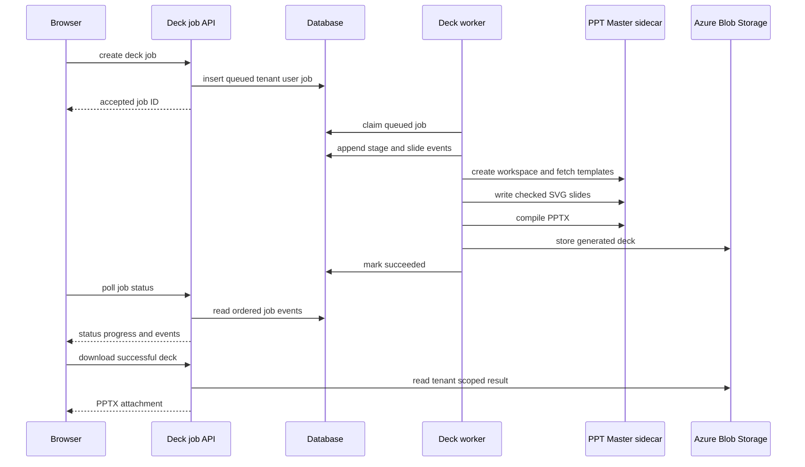
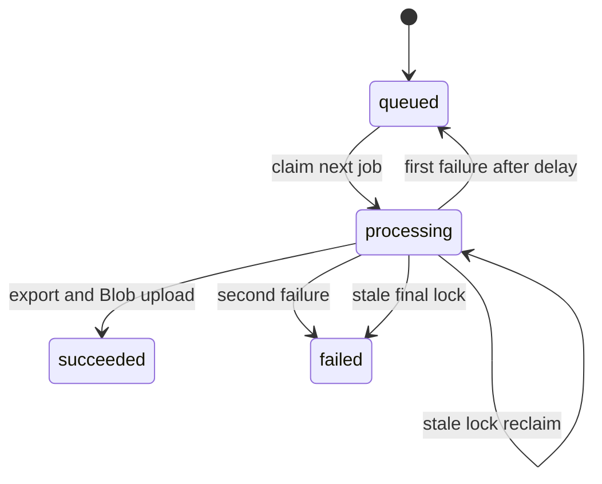

# PPT Master asynchronous deck generation

PPT Master is the third document-area workflow: unlike the editable fixed-company-template export in [AI generation](ai-generation.md), it creates a new native PowerPoint deck from a topic or optional source document. The Node API owns BFF authorization, durable job state, outline/SVG authoring, tenant-model illustrations, and generated-output storage. The Python [PPT Master sidecar](../operations/development-deployment.md) owns source-conversion fallback, temporary deck workspaces, the authoritative SVG quality gate, and deterministic SVG-to-PPTX compilation.

## Public job and template contract

`POST /api/deck-jobs` is session- and CSRF-protected, rate-limited, and returns `202` with `jobId`. It resolves identity before inserting a job, so every subsequent `GET /api/deck-jobs/:id` and `GET /api/deck-jobs/:id/download` query is scoped by both `tenant_id` and `user_id`; UUID syntax is required. A request accepts a topic or `documentUrl`, optional file name and selected `styleId`/`layoutId`, and `slideCount`. A document URL takes precedence as the input kind; topic-only requests need 4–2,000 characters. `normalizeSlideCount` defaults to 8 and clamps requests to 4–12.

A status response contains input kind, count, phase, current/total progress, timestamps, and an ordered `events` trace. Each event has its database `id`, one of the shared `source`, `outline`, `images`, `slides`, `quality`, or `export` steps, a `running`/`succeeded`/`failed`/`skipped` status, optional `slideNumber` and detail, and its creation time. Only `succeeded` responses contain a filename and download path; failure responses contain an error. Download before success is `409 not_ready`; a ready response is an Office PPTX attachment with `no-store` and Blob-backed bytes. The adapter registrations and OpenAPI binary declaration are owned by [HTTP API](http-api.md).

`GET /api/ppt-templates` is also authenticated and rate-limited. It gets the sidecar catalog and caches it in process for ten minutes. Styles are normalized to nonempty ID, trimmed summary, stringified keywords, and ID order. Layouts receive the same normalization plus `pageCount`, but are exposed only when their upstream `canvas_format` exactly matches `deckContract.js::DECK_CANVAS_FORMAT` (`ppt169`). This prevents a 4:3, square, or vertical layout specification from conflicting with the fixed 1280x720 authoring contract and failing the quality gate. Brands are omitted unless `PPT_MASTER_INCLUDE_BRANDS` is exactly `true`. The browser picker adds local display copy with an upstream fallback in [creation workflows](../frontend/create-workflows.md); it must not weaken this server filter.



This is the durable browser-to-PPTX flow. Uploading the optional input document occurs before job creation in [creation workflows](../frontend/create-workflows.md).

## Worker lifecycle and authoring boundary

`startDeckJobWorker` runs only in the standalone `api/server.js` process and does nothing if the sidecar URL/key is absent. One process runs one cycle at a time, polls every `DECK_JOB_POLL_MS` milliseconds (default 5,000), and immediately starts a cycle. `claimNextDeckJob` uses a transaction plus `FOR UPDATE SKIP LOCKED`; a processing lock older than `DECK_JOB_TIMEOUT_MINUTES` (default 40) can be reclaimed while fewer than two attempts have occurred. A timed-out final attempt is failed. Other failures are requeued after 15 seconds once, then become failed.



The state machine is persisted in `deck_generation_jobs`, described in [schema](../data/schema.md); cancellation in the browser only aborts upload/polling and cannot cancel a queued or processing server job.

### Durable step trace

`processDeckJob` uses one reporter for the job-row headline/counter and the append-only `deck_job_events` trace. The trace records the six `DECK_STEPS` from `deckContract.js`: source parsing (or a skipped source for topic-only jobs), outline, illustration work, slide authoring, quality repair, and export. A step-level event updates the readable `phase`; a per-slide event updates only the counter, preventing the headline from oscillating page by page. Per-slide image failures are recorded but intentionally do not fail the deck: authoring continues without that illustration. Any terminal processing exception adds a failed event for the most recently active step before normal retry/failure handling proceeds. `recordDeckJobEvent` catches its own database errors, so observability failure cannot stop generation.

`GET /api/deck-jobs/:id` obtains the authorized job first, then reads the trace by `job_id` ordered by its monotonically increasing ID. The browser therefore receives a replayable chronology after a tab switch; `012_deck_job_events.sql` must exist before this handler is deployed. The event table and constraints are documented in [schema](../data/schema.md), while client-side reduction/rendering is documented in [creation workflows](../frontend/create-workflows.md).

`processDeckJob` reads a document through the normal parser where possible, then falls back to the sidecar converter. It asks Azure OpenAI for a normalized outline, gets installed fonts and selected template specifications, creates a sidecar workspace, optionally generates Gemini illustrations, authors slides, exports, uploads `decks/<job id>.pptx` through `uploadGeneratedBlob`, marks success, and attempts workspace deletion even after failure. An illustration failure is logged and leaves that slide without an image rather than failing the deck.

## SVG and sidecar contract

`deckContract.js` is a cheap local preflight boundary, not a substitute for the Python gate. It normalizes outline slide numbers and page roles (`cover`, `toc`, `section`, `content`, `ending`), limits each slide to five key points, and zero-pads SVG filenames so sidecar ordering matches presentation order. It rejects malformed author output such as a wrong `1280x720` viewBox, missing/unknown page role, root transform, forbidden SVG constructs, named HTML entities, duplicate root-group IDs, or absent/out-of-canvas `data-pptx-bounds`.

`deckAuthor.js::authorDeck` generates each SVG, locally repairs preflight failures up to `DECK_MAX_REPAIR_ROUNDS` (3), writes it to the sidecar, then calls `checkDeck`. The sidecar quality report decides whether the deck passes; rejected individual slides receive the gate's errors as repair feedback for up to three more whole-deck rounds. `exportDeck` runs only after a passing report. Do not relax local checks to bypass an export failure: inspect the sidecar rule and prompt contract first.

The sidecar client uses `PPT_MASTER_SERVICE_URL` and `PPT_MASTER_SERVICE_KEY`, sends the key only as `X-Pixora-Service-Key`, and applies `PPT_MASTER_TIMEOUT_MS` (default 900,000 ms) per call. It must not receive model credentials: Node retains the model-policy boundary and calls the shared `geminiImage.js` adapter used by `/generate-images` as well.

`deckAuthor.js::generateOutline` and `authorSlideSvg` explicitly select `azureOpenAI.js::getDeckDeployment`. That resolver uses `AZURE_OPENAI_DECK_DEPLOYMENT`, or `gpt-5.6-sol` when it is unset; it is intentionally independent of `AZURE_OPENAI_DEPLOYMENT`, which powers interactive/document-analysis Responses work described in [AI generation](ai-generation.md). This background SVG-authoring and repair path accepts higher latency for stricter layout reasoning. Keep this explicit deployment argument when changing the shared `generateJsonCompletion` adapter, and configure the deck deployment on the Node API only—not on the sidecar.

## Change and validation guide

Consult this page for the async job API, job lifecycle, tenant isolation, SVG authoring/repair, template catalog, sidecar client, generated-deck Blob path, or its durable trace. Start according to the change:

- **Request/status/download policy:** `api/deck-jobs/index.js`; preserve `requireAuth` then rate limit then `resolveIdentity`, user-and-tenant predicates, binary headers, event response shape, and `not_ready` behavior. Update matching route/OpenAPI entries in [HTTP API](http-api.md).
- **Queue, retry, progress, event trace, or result storage:** `api/_shared/deckJobs.js` and [schema](../data/schema.md). Keep status, lock, attempt, result, and append-only event updates coherent. Only no-slide events may change the headline phase; recording must remain best-effort. Test stale-lock and first/second failure behavior with a new worker test before altering them; add handler/database coverage before changing event authorization, ordering, or migration compatibility.
- **Outline or SVG grammar:** `deckContract.js`, `deckAuthor.js`, and `svgAuthoringPrompt.js`. `deckContract.test.js` has retrievable suites for slide-count clamping, malformed-outline fallback, deterministic filenames, and rejected SVG canvas/role/bounds/forbidden constructs.
- **Sidecar HTTP or compilation behavior:** `pptMasterClient.js` and `services/ppt-master-service/app/main.py`. The public API is not a browser surface; retain the service-key boundary and workspace cleanup.
- **Template visibility/metadata:** `api/ppt-templates/index.js`, then `PptTemplatePicker.jsx` and `pptTemplateCopy.js` in [creation workflows](../frontend/create-workflows.md). Preserve the `ppt169` filter; changing canvas support is a cross-boundary change to `DECK_CANVAS_FORMAT`, SVG authoring, sidecar validation, and client copy, not a catalog-only edit. Template IDs are constrained to 1–64 ASCII alphanumeric, dot, underscore, or hyphen characters.
- **Browser continuation, polling, or timeline data:** `usePptMasterDeck.js`, `aiService.js::waitForDeckJob`, `DeckProgress.jsx`, `DeckTimeline.jsx`, `deckSteps.js`, and `apiClient.js::parseResponse`; see [creation workflows](../frontend/create-workflows.md). Preserve the distinction between a missing/terminal job, which clears `genpic_deck_job`, and a transient polling failure, which retains it for recovery. The timeline reducer must use event-ID order and retain the newest state per step and slide. `stopWatching` is local only.

Run the narrow contract check first for SVG/geometry work:

```sh
pnpm test --run api/_shared/__tests__/deckContract.test.js
```

For browser continuation, polling, or timeline rendering, run:

```sh
pnpm test --run src/hooks/__tests__/usePptMasterDeck.test.jsx src/services/__tests__/aiService.test.js src/components/create/__tests__/deckSteps.test.js src/components/create/__tests__/DeckTimeline.test.jsx
```

The hook/service tests cover mocked resumption, terminal/missing-job cleanup, transient-error retention, stop tracking, and five-failure polling exhaustion. `deckSteps.test.js` covers all-pending initialization, newest step/per-slide state, ID ordering, skipped state, and unknown steps; `DeckTimeline.test.jsx` covers default expansion and collapse. These do not prove authenticated API, actual persistence across a browser reload, Blob transport, event persistence, or worker/sidecar behavior. There is no focused template-catalog handler, worker, sidecar-unit, or end-to-end tenant/download test. Add the narrow missing test before changing those behavioral contracts. For route wiring, additionally run `cd api && node --check server.js && node --check openapi.js`. The sidecar's source-backed, no-AI integration check is conditional on Docker or a sidecar change: build the container and run `python smoke.py` inside it as documented in [development, migrations, and deployment](../operations/development-deployment.md). Do not run provider work for a grammar-only change.