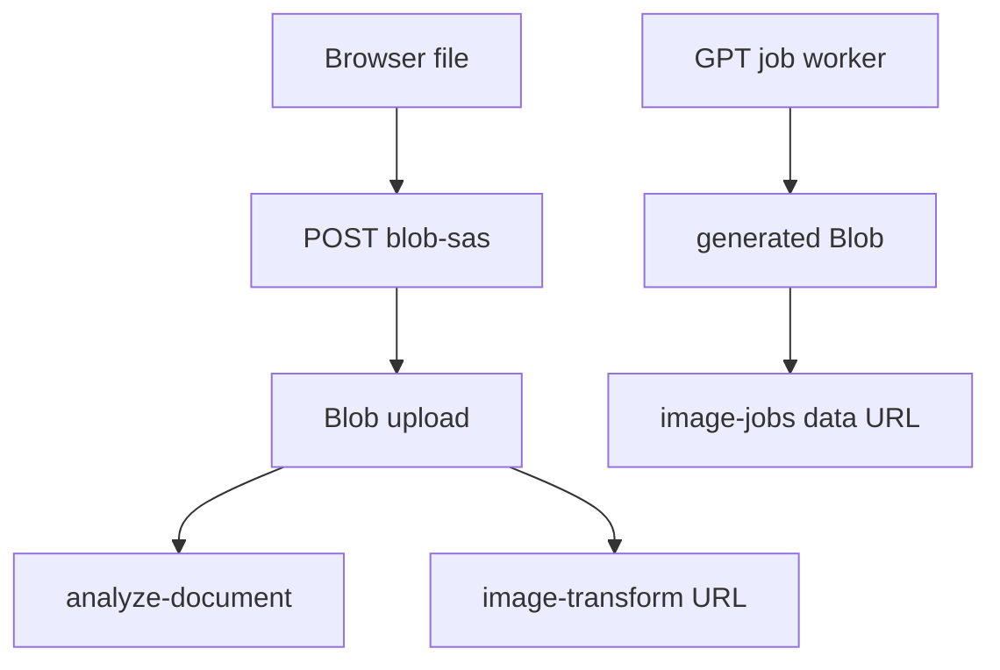

# Resource APIs, Blob assets, and LINE sharing

## Persistent resource APIs

`/styles` normalizes tags to trimmed arrays, categories to `social`, `presentation`, `poster`, `ecommerce`, `education`, `document`, `brand`, or `general`, and visibility to `private|shared`. Creation requires nonempty name/prompt and sets `published_at` immediately for shared styles. `mine` means tenant + owner, `shared` means tenant + shared visibility, and `all` means either; all support category/tag/text filters and updated/newest/popular/curated ordering. Read/use allows own or shared; update, delete, publish, and unpublish require creator ownership. A shared source can be copied to a new private owner record and increments source `copy_count`; `use` increments `usage_count`. Deletion first clears matching tenant `history.style_id` then deletes the owner record.

`/styles/search` searches only the caller's own embedded styles by pgvector distance. `/styles/backfill-embeddings` processes at most 100 missing embeddings per request; it supports dry run and reports per-record failures. History lists/creates/deletes tenant+user records; templates list/create/update/delete tenant+creator records. Their frontend adapters live in `storageService.js` and hooks.

## Blob asset lifecycle

`POST /blob-sas` runs `requireAuth` and the in-memory `rateLimit` before minting. The limiter keys by token `oid`/`sub` or forwarded/client/real IP and permits `RATE_LIMIT_PER_MINUTE` (default 60) requests in a 60-second process-local window; excess receives `429 { error: { code: "rate_limited" } }`. It rejects names with `..`, backslash, leading slash, or length above 200 with `400 bad_request`; an unsupported/unresolvable MIME likewise returns `400 bad_request`. Its `SUPPORTED_MIME_TYPES` and filename inference come from `_shared/documentParser.js`: PDF; Word, PowerPoint, and Excel variants; OpenDocument; RTF; EPUB; CSV; plain text/Markdown; and PNG/JPEG are accepted. An absent or unaccepted content type is replaced only when a recognized filename suffix can infer one; `application/octet-stream` alone is not a sufficient accepted type. The requested `container` is used verbatim, falling back to `BLOB_CONTAINER_DEFAULT` or `uploads`; Blob URL is account/container/encoded filename. It returns a 15-minute `crw` SAS and a separate one-year `r` SAS/read URL. Missing storage configuration returns `500 storage_config_missing`; SAS failures return `500 internal_error`. The browser directly PUTs via `uploadFileToBlob`; documents feed [AI generation](ai-generation.md), transform sources are fetched only after `isUrlAllowed`, and the durable job worker uses a separate generated container helper.

The browser's extension policy is a parallel implementation in `src/lib/documentFormats.js`, not an imported server module. Add or remove formats in both places deliberately, then run `pnpm test --run src/lib/__tests__/documentFormats.test.js api/_shared/__tests__/documentParser.test.js`. That focused coverage proves MIME policy and parser behavior, not Blob authorization or a live SAS upload.

**Current authorization boundary:** the API authenticates but accepts a caller-selected container and un-namespaced original filename. It grants `crw` permissions and does not check tenant/user/object ownership, prevent same-name collisions, or clean up/expire objects. The long-lived `readUrl` is a bearer URL. Preserve these facts when changing access/retention; do not infer isolation from database tenancy. `isUrlAllowed` is SSRF protection for server fetches, not object authorization.

## LINE configuration and sharing

`line_configs` is one row per user+tenant. `/line-config?action=verify` calls LINE bot info and returns `{ valid: true, channelName, pictureUrl }` or `200 { valid: false, message }`; GET never returns credentials. POST AES-256-GCM encrypts supplied credentials, preserves existing encrypted fields when UI sends `********`, and upserts target/name; DELETE removes it. `/send-line-image` first requires the caller's active configuration and target, decrypts its access token, then POSTs `{ to: targetId, messages: [{ type: "image", originalContentUrl: imageUrl, previewImageUrl: imageUrl }] }` to Messaging API. It returns `{ track: "bot", success: true }`, or errors for missing binding, disabled config, missing target, malformed target, and provider failures. Although the request accepts `message`, current payload construction ignores it: it never delivers text.

`ShareToLineButton` uploads a data URL to Blob first, then invokes bot push. It rejects an unbound user. `{ success: true }` means the LINE Messaging API accepted the push request; the repository does not receive a delivery receipt and makes no guarantee about recipient delivery after acceptance (for example, recipient/network/platform outcomes). Although `@line/liff` and LIFF deployment configuration exist, no `src` code consumes LIFF and no implemented LIFF fallback exists; do not document one as runtime behavior.

Focused frontend tests cover `storageService`; no dedicated handler/LINE tests were found. The schema invariant is documented in [schema](../data/schema.md).