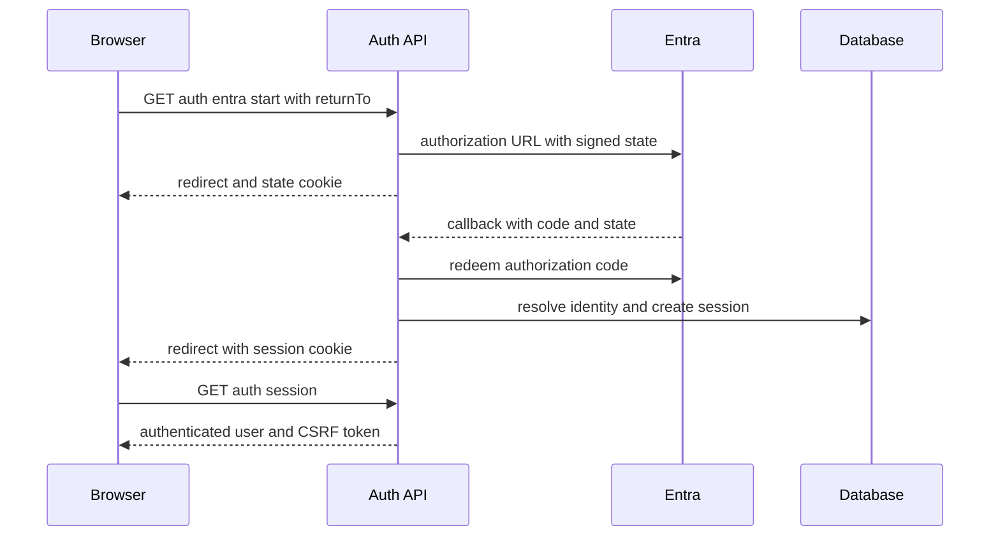

# Server sessions and BFF sign-in

The API is the authentication boundary. The browser does not retain Entra or Google tokens after sign-in: it uses `credentials: "include"` and the `pixora_session` HttpOnly cookie. The browser bootstrap and in-memory CSRF handling are documented in [browser application and authentication](../frontend/application.md); persistent rows and their migration belong to [schema](../data/schema.md).

## Sign-in and session lifecycle



This sequence shows the Entra authorization-code exchange and subsequent BFF session bootstrap.

This is the Entra route. Google instead posts its credential once to `POST /api/auth/google`; `handleGoogleLogin` verifies it, resolves identity, creates the same session, and returns the CSRF token in JSON plus the session cookie. `handleEntraStart`, `handleEntraCallback`, and `handleGoogleLogin` first apply the shared in-memory `rateLimit` by forwarded/client/real IP (or `unknown`) with `RATE_LIMIT_PER_MINUTE` or a default of 60 requests per minute; a limit breach returns `429` with `Retry-After`. This limiter is process-local, so deployment-scale rate limiting is outside this implementation.

`handleEntraStart` calls `buildEntraAuthorizationUrl`; it signs a random nonce, sanitized `returnTo`, and issue time with `AUTH_SESSION_SECRET`, then puts the complete state value in a ten-minute HttpOnly `pixora_oauth_state` cookie. `redeemEntraAuthorizationCode` requires a timing-safe equality match between callback state and that cookie, validates the signature and lifetime, and uses the configured confidential MSAL client to redeem the code. `normalizeReturnTo` accepts only single-slash, non-`/api/` local paths, preventing an external or API redirect target.

`createSession` creates a 32-byte opaque token, stores only its HMAC hash and a separate derived CSRF-token hash, and returns the raw values only to the browser response. The session cookie is `HttpOnly`, `SameSite=Lax`, path `/`, and `Secure` in production. It has a 30-day browser max age; server enforcement also expires an inactive session after eight hours and never extends its absolute 30-day expiry. `touchSession` renews idle expiry only after at least five minutes, avoiding a database write on every request.

## Protected request contract

`requireAuth` first honors the non-production `AUTH_DISABLED` local bypass. Otherwise it loads the opaque cookie, rejects missing, revoked, expired, or inactive-user sessions, and clears a bad session cookie where appropriate. For every method except `GET`, `HEAD`, and `OPTIONS`, it compares `X-CSRF-Token` against the stored hash using `timingSafeEqual`; only then does it touch the session and return the normalized identity to the handler. Thus a client must call `GET /api/auth/session` after load or sign-in before it can mutate resources.

Logout loads the cookie, validates CSRF when the session is still live, revokes its row, clears the cookie, and returns `{ authenticated: false }`. It does not sign the person out of Entra or Google. A 401 from another protected endpoint causes the browser context to clear its in-memory CSRF token and show the session-expiry UI.

The flow shares tenant/user resolution with [authentication, tenancy, and administration](auth-tenancy-admin.md), and its CORS credential requirements are configured through [development, migrations, and deployment](../operations/development-deployment.md).

## Change and validation guide

Consult this page for login providers, session persistence, cookies, CSRF, expiry, logout, or Entra callback changes. The complete public seam is:

1. `api/auth/index.js` dispatches the five auth endpoints and issues/clears cookies.
2. `api/_shared/entra.js` owns signed state, `returnTo` normalization, confidential-client setup, and code redemption.
3. `api/_shared/session.js` owns token hashing, cookie serialization, database storage, expiry, touching, revocation, and conversion to the handler identity.
4. `api/_shared/auth.js` applies session and CSRF checks to protected handlers.
5. `api/server.js` registers routes and `api/openapi.js` advertises them; update both as required by [HTTP API](http-api.md).
6. `db/migrations/010_auth_sessions.sql` is the durable contract; add a migration rather than editing an applied migration.

Keep these invariants: raw session and CSRF tokens never enter the database, client code cannot substitute a token header for cookie authentication, unsafe requests cannot bypass CSRF, and `returnTo` remains an internal browser route. A bad cookie token is cleared because it has no row to revoke; expired or inactive persisted sessions are revoked and cleared. Credentialed cross-origin requests require an exact allowed origin: development may use the built-in local-origin allow-list, but `*` never works.

Run the focused suites after changing helpers or middleware:

```sh
pnpm test --run api/_shared/__tests__/auth.test.js api/_shared/__tests__/session.test.js
```

`session.test.js` covers cookie parsing/attributes, CSRF hash comparison, and idle expiry. `auth.test.js` covers missing-session 401, unsafe-request CSRF rejection, and valid-session touch behavior. Also run `src/services/__tests__/authService.test.js` and `src/services/__tests__/apiClient.test.js` when the browser session endpoint, CSRF response, or 401 behavior changes. A provider callback change requires a local end-to-end login and logout smoke test with non-production configuration; a migration change additionally requires a disposable-database migration. Do not use real production secrets for either check.
