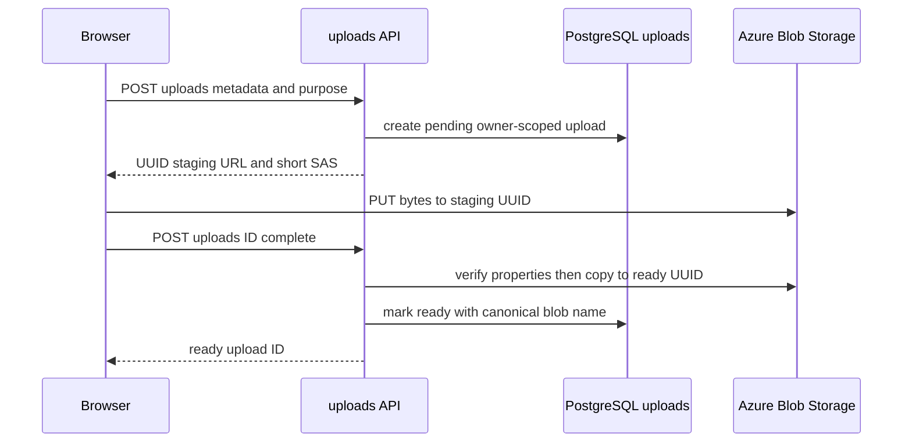

# Owner-scoped uploads and staged Blob storage

This page is the canonical upload boundary. It replaces the former arbitrary Blob SAS model: `/api/blob-sas` remains only to return `410 upload_api_replaced` to stale bundles. The browser adapter in [creation workflows](../frontend/create-workflows.md) creates an upload record before a direct Blob PUT; downstream document, image, deck, and LINE paths must consume an `uploadId`, not a caller-provided Blob URL.

## Lifecycle and authorization



`POST /uploads` requires the normal BFF session, rate limit, and resolved tenant/user identity. Its allowlist is exactly `fileName`, `contentType`, `sizeBytes`, and `purpose`. `purpose` is `document` (up to 50 MiB and the shared document MIME set) or `image` (up to 10 MiB and JPEG, PNG, or WebP). It creates a `pending` row with a 48-hour database retention time and `staging/<lowercase UUID>`; neither the client container nor a filename becomes a Blob path.

`issueUploadGrant` uses `BLOB_CONTAINER_UPLOADS` (default `uploads`) and issues an HTTPS `cw` SAS for that one staging object for 15 minutes. `POST /uploads/:id/complete` re-loads the record with both owner dimensions, accepts only pending or already-ready state, rejects expiry/invalid persisted metadata, and calls `promoteUpload`. Promotion verifies Blob length and normalized content type, copies with `ifNoneMatch: "*"` to `ready/<UUID>`, waits up to 30 seconds for copy completion, verifies the destination again, and only then deletes staging and marks the row ready. A concurrent completion can reuse a correctly completed destination; it must not promote a different object.

`getOwnedUpload` is the shared persistence predicate. Consumers additionally check purpose, ready status, expiry, and where applicable the canonical ready name. `imageUploads.js::resolveOwnedImageUpload` is the image-specific seam used by style analysis, generation, and transformation. Document analysis and deck jobs similarly load owned ready document rows before `downloadUploadBuffer`; [AI generation](ai-generation.md) and [PPT Master deck jobs](ppt-master-decks.md) describe their queue contracts.

## Browser and consumer change surface

`storageService.js::uploadFile` is the only current browser sequence: `createUpload` -> `putUploadBytes` -> `completeUpload`. It rejects malformed grants and requires an HTTPS Azure Blob host before it PUTs. Pass the returned `uploadId` to `analyzeStyle`, `generateImage`, document analysis, transform, deck creation, or sharing according to the owning feature; do not persist SAS tokens, signed URLs, or caller-selected blob names in new request shapes.

When extending a consumer, start with the appropriate resolver rather than adding URL fetch logic:

- **Image input:** use `resolveOwnedImageUpload` and `downloadOwnedImage`; preserve image MIME, owner, ready, expiry, and canonical-name checks.
- **Document input:** query `getOwnedUpload` with `purpose: "document"`, `status: "ready"`, then use `downloadUploadBuffer`; queues must retain the owner and recheck it at work time.
- **New upload purpose:** update the server parser/allowlist, purpose size limit, schema check migration, browser adapter, affected consumer, OpenAPI, and route/consumer tests together. A UI accept attribute alone is not authorization.

The focused route test covers authentication/rate-limit order, strict create metadata, limits and MIME validation, owner-scoped completion, and promotion errors. `uploadStorage.test.js` covers fixed container/UUID naming, grants, copy outcomes, and verification; it is the narrowest test for storage semantics. Run:

```sh
pnpm test --run api/uploads/__tests__/index.test.js api/_shared/__tests__/uploadStorage.test.js api/_shared/__tests__/uploads.test.js
```

## Expiry cleanup and rollout

`startUploadCleanupWorker` starts from `api/server.js`. Cleanup is enabled unless `UPLOAD_CLEANUP_ENABLED` is one of `false`, `0`, `no`, or `off`; its default interval is one hour, its default batch is 100, and batches are capped at 500. A transaction claims only expired pending rows with `FOR UPDATE SKIP LOCKED`; a 15-minute stale lease is reclaimable. For each claimed row, cleanup deletes only its canonical staging object and then marks it `expired`. A missing Blob is a successful cleanup; a deletion failure records `blob_delete_failed`, releases the lease, and continues the batch. Ready objects are not cleanup candidates.

Migration `020_owner_scoped_uploads.sql`, documented in [schema](../data/schema.md), is required before this contract. It also adds `deck_generation_jobs.source_upload_id`; drain queued/processing legacy deck URL rows before removing their compatibility path using `db/queries/deck_job_legacy_drain.sql`.

The Azure policy artifact `infra/azure/storage-lifecycle-policy.json` is a second safety net, not a substitute for database-aware cleanup: it targets only `uploads/staging/` block blobs and deletes after two days. Follow [development, migrations, and deployment](../operations/development-deployment.md) and `docs/upload-lifecycle-operations.md` for the ordered rollout and approved Azure-policy application. Validate local policy JSON and the narrow cleanup behavior first; applying or reading an Azure management policy is a conditional external operation, not a normal test.

```sh
pnpm test --run api/_shared/__tests__/uploadCleanup.test.js api/_shared/__tests__/uploadLifecyclePolicy.test.js
```

## Legacy flat-blob remediation

`api/scripts/cleanup-legacy-upload-blobs.cjs` is a one-off operator command for flat objects left by the retired `/api/blob-sas` endpoint. It is not part of `startUploadCleanupWorker`: the ongoing worker only claims expired `pending` database rows and deletes their canonical `staging/<UUID>` objects. The remediation command protects both lifecycle-managed prefixes (`staging/`, `ready/`) and any legacy object whose exact raw, URI-encoded, or component-encoded name appears after `/<configured container>/` in a text or `character varying` value in any public database table. All other flat names are classified as orphaned candidates.

The command requires the configured Blob client and `DATABASE_URL`. By default it is read-only: it discovers candidate text columns through `information_schema`, lists the configured uploads container, prints managed/referenced/orphaned counts and bytes, and optionally writes the complete classification with `--manifest <path>`. Only `--apply` calls Blob deletion, including snapshots. Blob-account soft-delete settings determine whether deleted objects remain recoverable; the script itself has no rollback. Because reference discovery intentionally scans all current text columns, do not replace it with a hand-maintained list of tables when adding a URL-bearing column.

Use this only as an approved storage-remediation operation, after reviewing a dry-run manifest and confirming backup/soft-delete policy. A partial deletion failure exits nonzero and reports each failed blob; rerun a new dry run before any further apply attempt. The pure classifier is the narrow validation and covers managed prefixes, raw/encoded references, JSON-contained URLs, false-prefix avoidance, and byte accounting:

```sh
pnpm test --run api/scripts/__tests__/legacyUploadBlobs.test.js
```

For the conditional external operation, consult [development, migrations, and deployment](../operations/development-deployment.md); it owns the safe execution sequence. This command protects legacy references but cannot prove that an unreferenced object has no business value outside the database.

Do not use the legacy `/api/blob-sas` route for new work, manually make ready object names, or treat a signed URL as an ownership proof.