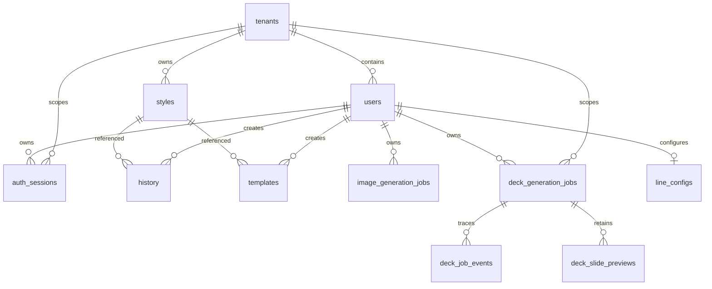

# PostgreSQL schema and migrations

Migrations in `db/migrations` are the schema authority. With no arguments, `api/scripts/migrate.cjs` sorts and executes every `.sql` file. Supplying one or more exact migration filenames limits that run to the selected files, still in lexicographic order; an unknown filename exits with an error. Migrations therefore must be idempotent (`IF NOT EXISTS`) or safely repeatable.

This diagram includes the durable session relationship used by [server sessions and BFF sign-in](../backend/sessions.md).

`001_init.sql` creates tenants, users, projects, styles, scenes, and history. All primary operational records carry `tenant_id`; user-scoped records also carry an owner. Styles contain `vector(1536)` embedding and a cosine ivfflat index. `002` adds prompt snapshots to history, `003` adds templates, `005` evolves styles into shared/private catalog records, `006` adds tenant model settings and history model audit data, and `009` adds durable image jobs with `queued|processing|succeeded|failed`, attempts, lock/timing fields, and queue/user indexes.

`004_line_config.sql` defines encrypted credential text columns and a unique `(user_id, tenant_id)` binding. Encryption happens in application code, never SQL. `008` adds `users.is_active`.

## PPT Master deck jobs

`011_deck_generation_jobs.sql` adds the durable queue behind [PPT Master deck jobs](../backend/ppt-master-decks.md). Every row has tenant and user foreign keys with cascade deletion, an `input_kind` of `topic` or `document`, optional source/topic/template fields, and a requested slide count. Its status constraint permits only `queued`, `processing`, `succeeded`, or `failed`; phase, progress, attempts, availability/lock timestamps, output Blob/file names, and terminal error fields support asynchronous processing rather than browser-held work.

The worker claims in creation order with `FOR UPDATE SKIP LOCKED`; the `(status, available_at, created_at)` index supports that query, while `(tenant_id, user_id, created_at DESC)` supports authorized status/download lookup. Do not add an externally observable status without changing the SQL constraint, `deckJobs.js` transitions, handler response, and polling client together. These rows contain Blob names and source URLs, not the deck bytes; the generated container remains the output owner.

`012_deck_job_events.sql` adds the replayable progress trace used by [PPT Master deck jobs](../backend/ppt-master-decks.md). Every event belongs to one job through an `ON DELETE CASCADE` foreign key; its `step` is constrained to `source`, `outline`, `images`, `slides`, `quality`, or `export`, and its status is constrained to `running`, `succeeded`, `failed`, or `skipped`. `slide_number` and `detail` are optional, so a step-level event describes the headline while a per-slide event provides nested detail. The `(job_id, id)` index supports the handler's `ORDER BY id` chronology. Events are intentionally append-only: `deckJobs.js::recordDeckJobEvent` may fail without interrupting deck generation, but the deployed API must not query this table before the migration has been applied. Altering steps, statuses, or ordering crosses this SQL constraint, server reporter/serializer, and the client timeline reducer/tests.

`013_deck_slide_previews.sql` adds the page-by-page preview state used by [PPT Master deck jobs](../backend/ppt-master-decks.md) and rendered by [creation workflows](../frontend/create-workflows.md). The composite primary key `(job_id, slide_number)` means one row represents the current authored SVG for each page. It cascades with its parent job and stores an integer `revision` (initially 1), optional title, SVG, and update time. `saveDeckSlidePreview` upserts this row and increments `revision` on conflict when a quality repair rewrites the page; unlike the append-only trace, this is deliberately replaceable current state. Both status and SVG-preview handlers query it, so deploy this migration before the API code that reads `deck_slide_previews`.

## Opaque session records

`010_auth_sessions.sql` adds `auth_sessions` for the BFF. A row belongs to a tenant and user, records provider (`entra` or `google`) and provider subject, and stores unique `session_token_hash` and `csrf_token_hash` values. It tracks creation, last activity, idle and absolute expiry, and revocation. The migration provides active-user, provider-subject, and non-revoked expiry indexes alongside the unique session-token lookup. Raw cookie and CSRF values are generated and HMAC-hashed in `api/_shared/session.js`; they are not persistent data.

Cascading tenant/user foreign keys remove sessions when their owner is deleted. Runtime middleware revokes expired or inactive persisted sessions; an unknown cookie has no row to revoke and is simply cleared. The table does not itself implement expiration. Do not change session constraints, hashes, or retention assumptions without also changing [server sessions](../backend/sessions.md) and its focused tests.

## Identity canonicalization

`007_dedupe_users.sql` is transactional. It lowercases/trims email, chooses the earliest user per tenant/email as canonical, removes colliding LINE configs while preferring the canonical row, rewrites references in line configs, projects, styles, scenes, history, templates, and model-settings updater, then deletes duplicates and creates the normalized unique index. Do not reorder it or add new user foreign keys without extending this migration strategy.

## Change and validation guide

Consult this page for tables, constraints, migrations, or persistence behind authentication, resources, jobs, and model policy. Add a new migration rather than changing an already-applied numbered migration. A session schema change crosses `010_auth_sessions.sql`, `api/_shared/session.js`, auth middleware, and the browser/API flow; see [server sessions](../backend/sessions.md).

There are no migration integration tests. Run the migration against a disposable database, check compatibility with existing rows and foreign-key rewrites, then exercise the owning API behavior. For a newly deployed migration, select only its exact filename—for example `node api/scripts/migrate.cjs 012_deck_job_events.sql`—rather than replaying the full directory as a routine check. Use `cd api && npm run migrate` only when validating full ordered replay. For session changes, run `api/_shared/__tests__/session.test.js` and `auth.test.js`; for resource ownership, use [resources](../backend/resources.md) to identify handler checks. Production database credentials are never needed for ordinary validation.
