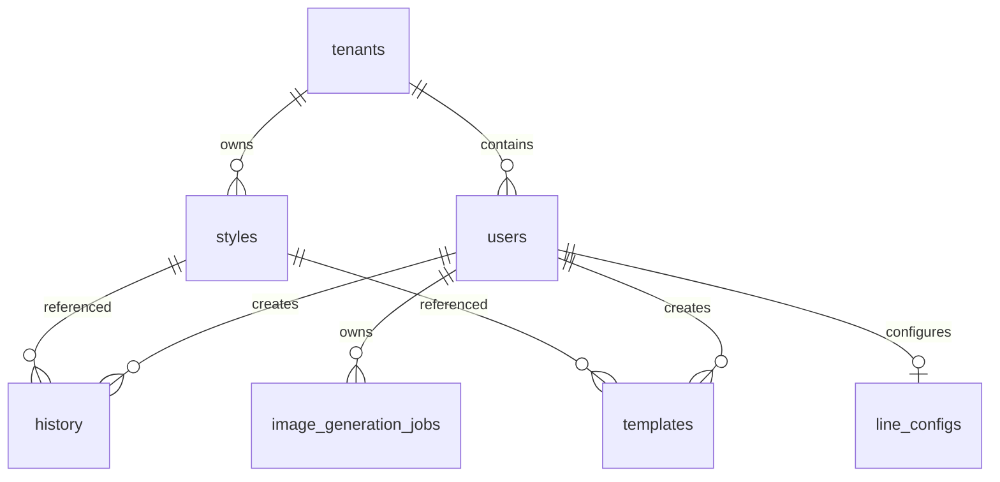

# PostgreSQL schema and migrations

Migrations in `db/migrations` are the schema authority. `api/scripts/migrate.cjs` sorts and executes every `.sql` file on each run; migrations therefore must be idempotent (`IF NOT EXISTS`) or safely repeatable.

`001_init.sql` creates tenants, users, projects, styles, scenes, and history. All primary operational records carry `tenant_id`; user-scoped records also carry their owner. Styles contain `vector(1536)` embedding and a cosine ivfflat index. `002` adds prompt snapshots to history, `003` adds templates, `005` evolves styles into shared/private catalog records, and `006` adds tenant model settings and history model audit data. `009` adds durable image jobs with `queued|processing|succeeded|failed`, attempts, lock/timing fields and queue/user indexes.

`004_line_config.sql` defines encrypted credential text columns and a unique `(user_id, tenant_id)` binding. Encryption happens in application code, never SQL. `008` adds `users.is_active`.

## Identity canonicalization

`007_dedupe_users.sql` is transactional. It lowercases/trims email, chooses the earliest user per tenant/email as canonical, removes colliding LINE configs while preferring the canonical row, rewrites references in line configs, projects, styles, scenes, history, templates, and model-settings updater, then deletes duplicates and creates the normalized unique index. Do not reorder it or add new user foreign keys without extending this migration strategy.

There are no migration integration tests. Before schema changes, run migrations against a disposable database, check old data compatibility and foreign-key rewrites, then exercise API ownership queries. [Resources](../backend/resources.md) explains the currently incomplete Blob-object ownership boundary.