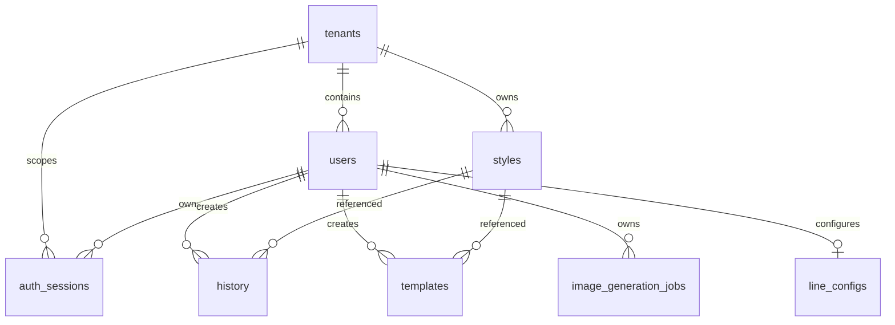

# PostgreSQL schema and migrations

Migrations in `db/migrations` are the schema authority. `api/scripts/migrate.cjs` sorts and executes every `.sql` file on each run; migrations therefore must be idempotent (`IF NOT EXISTS`) or safely repeatable.

This diagram includes the durable session relationship used by [server sessions and BFF sign-in](../backend/sessions.md).

`001_init.sql` creates tenants, users, projects, styles, scenes, and history. All primary operational records carry `tenant_id`; user-scoped records also carry an owner. Styles contain `vector(1536)` embedding and a cosine ivfflat index. `002` adds prompt snapshots to history, `003` adds templates, `005` evolves styles into shared/private catalog records, `006` adds tenant model settings and history model audit data, and `009` adds durable image jobs with `queued|processing|succeeded|failed`, attempts, lock/timing fields, and queue/user indexes.

`004_line_config.sql` defines encrypted credential text columns and a unique `(user_id, tenant_id)` binding. Encryption happens in application code, never SQL. `008` adds `users.is_active`.

## Opaque session records

`010_auth_sessions.sql` adds `auth_sessions` for the BFF. A row belongs to a tenant and user, records provider (`entra` or `google`) and provider subject, and stores unique `session_token_hash` and `csrf_token_hash` values. It tracks creation, last activity, idle and absolute expiry, and revocation. The migration provides active-user, provider-subject, and non-revoked expiry indexes alongside the unique session-token lookup. Raw cookie and CSRF values are generated and HMAC-hashed in `api/_shared/session.js`; they are not persistent data.

Cascading tenant/user foreign keys remove sessions when their owner is deleted. Runtime middleware revokes expired or inactive persisted sessions; an unknown cookie has no row to revoke and is simply cleared. The table does not itself implement expiration. Do not change session constraints, hashes, or retention assumptions without also changing [server sessions](../backend/sessions.md) and its focused tests.

## Identity canonicalization

`007_dedupe_users.sql` is transactional. It lowercases/trims email, chooses the earliest user per tenant/email as canonical, removes colliding LINE configs while preferring the canonical row, rewrites references in line configs, projects, styles, scenes, history, templates, and model-settings updater, then deletes duplicates and creates the normalized unique index. Do not reorder it or add new user foreign keys without extending this migration strategy.

## Change and validation guide

Consult this page for tables, constraints, migrations, or persistence behind authentication, resources, jobs, and model policy. Add a new migration rather than changing an already-applied numbered migration. A session schema change crosses `010_auth_sessions.sql`, `api/_shared/session.js`, auth middleware, and the browser/API flow; see [server sessions](../backend/sessions.md).

There are no migration integration tests. Run the migration against a disposable database, check compatibility with existing rows and foreign-key rewrites, then exercise the owning API behavior. For session changes, run `api/_shared/__tests__/session.test.js` and `auth.test.js`; for resource ownership, use [resources](../backend/resources.md) to identify handler checks. Production database credentials are never needed for ordinary validation.
