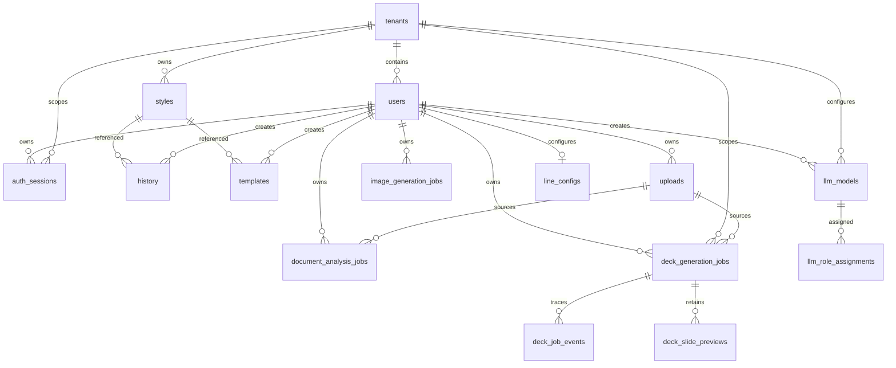

# PostgreSQL schema and migrations

Migrations in `db/migrations` are the schema authority. With no arguments, `api/scripts/migrate.cjs` sorts and executes every `.sql` file. Supplying one or more exact migration filenames limits that run to the selected files, still in lexicographic order; an unknown filename exits with an error. Migrations therefore must be idempotent (`IF NOT EXISTS`) or safely repeatable.



This diagram includes the durable session relationship used by [server sessions and BFF sign-in](../backend/sessions.md).

`001_init.sql` creates tenants, users, projects, styles, scenes, and history. All primary operational records carry `tenant_id`; user-scoped records also carry an owner. Styles contain `vector(1536)` embedding and a cosine ivfflat index. `002` adds prompt snapshots to history, `003` adds templates, `005` evolves styles into shared/private catalog records, `006` adds tenant model settings and history model audit data, and `009` adds durable image jobs with `queued|processing|succeeded|failed`, attempts, lock/timing fields, and queue/user indexes.

`004_line_config.sql` defines encrypted credential text columns and a unique `(user_id, tenant_id)` binding. Encryption happens in application code, never SQL. `008` adds `users.is_active`.

### GPT image job quality

`019_image_job_quality.sql` adds `image_generation_jobs.quality` as non-null text with a `medium` default and a check constraint limited to `low`, `medium`, or `high`. The default makes existing rows and unspecified new jobs valid; the constraint prevents a queued job from preserving an unsupported rendering-effort value. `api/_shared/imageJobs.js::createImageJob` stores the normalized value, and its claim/worker path forwards the persisted value to `gptImage.js`; this prevents a later browser preference change from affecting queued work. The provider and handler contract is canonical in [AI generation](../backend/ai-generation.md).

Apply `019_image_job_quality.sql` before deploying code that inserts or selects job quality. Test only this migration against a disposable database with:

```sh
node api/scripts/migrate.cjs 019_image_job_quality.sql
```

`016_admin_list_indexes.sql` aligns PostgreSQL indexes with the management-list and style-delete query shapes owned by [authentication, tenancy, and administration](../backend/auth-tenancy-admin.md). It adds `history (tenant_id, created_at DESC, id DESC)` for unfiltered history pagination and `history (tenant_id, user_id, created_at DESC, id DESC)` for its user-filtered variant, `styles (tenant_id, updated_at DESC, created_at DESC, id DESC)` for style-list ordering, and a partial `history (style_id) WHERE style_id IS NOT NULL` index for clearing references before administrative style deletion. The migration drops the now-covered single-column tenant/user indexes. Apply it before relying on management-list performance; do not reintroduce those prefix indexes without a query plan that demonstrates a different workload.

## Owner-scoped uploads and document analysis jobs

`020_owner_scoped_uploads.sql` adds `uploads`, the durable identity record behind [Owner-scoped uploads and staged Blob storage](../backend/uploads.md). A row has a UUID primary key; tenant/user ownership, with a composite foreign key to a user in that tenant; purpose constrained to `document|image`; declared filename/MIME/positive size; a unique canonical Blob name; `pending|ready|expired` state; expiry; and cleanup lease/error fields. The owner index supports access checks. The partial pending-expiry index supports lease-safe cleanup without scanning ready data. `source_upload_id` is also an optional restrict-delete foreign key on deck jobs, allowing legacy URL jobs to drain while new deck inputs bind to this record.

`021_document_analysis_jobs.sql` adds the document queue used by [AI generation](../backend/ai-generation.md). Each job references a non-deletable source upload and the same tenant/user pair, stores `auto` or requested scene count, and moves through `queued|processing|succeeded|failed`; attempts, availability/lock/start/completion timestamps, normalized JSON result, and safe error fields support retry and polling. Its `(status, available_at, created_at)` index is the worker claim order, while `(tenant_id, user_id, created_at DESC)` is the authorized status lookup. Apply `020` before `021` and before code that creates/consumes upload IDs; deploy `021` before starting the document worker or registering the job API.

The lifecycle state is deliberately split: a successful Blob copy is not authoritative until `markUploadReady` updates the owned row, and an analysis result is not public until its job reaches `succeeded`. Cleanup only claims expired `pending` records, so it never targets ready inputs. See the upload page for the storage and cleanup behavior, and [development, migrations, and deployment](../operations/development-deployment.md) for rollout order.

For either migration, use a disposable database and apply the exact files in order:

```sh
node api/scripts/migrate.cjs 020_owner_scoped_uploads.sql 021_document_analysis_jobs.sql
```

## History source attribution

`018_history_source.sql` adds nullable `history.source`, constrained to `general`, `document`, or `image-transform`, and adds `history (tenant_id, source, created_at DESC)` for tenant history filtered by source. It intentionally does **not** backfill existing rows: null means the workflow was not recorded. `api/_shared/historySource.js::normalizeHistorySource` is the corresponding application boundary; invalid or absent POST values resolve to null instead of failing history persistence.

The field is display/filter metadata, not an authorization predicate. The ordinary history handler still requires both tenant and user; management history still starts with tenant scope, may additionally filter by user, and maps the special query `source=unknown` to `source IS NULL`. The writing call sites and management/browser behavior are documented in [resources](../backend/resources.md) and [administrator panel and history preview](../frontend/admin-panel.md). Apply `018_history_source.sql` before deploying any code that selects or writes `history.source`.

## Tenant analysis-model configuration

`014_llm_models.sql` adds the per-tenant model catalog used by [AI generation](../backend/ai-generation.md). `llm_models` belongs to a tenant, records a case-insensitively unique label, fixed provider (`azure-openai` or `google-gemini`), model/deployment name, optional endpoint, encrypted API-key ciphertext, creator, and timestamps. Its API key is encrypted/decrypted only in `api/_shared/secretCrypto.js`; no plaintext key belongs in SQL responses or browser state.

`llm_role_assignments` has one `(tenant_id, role)` row and references a required primary and optional fallback `llm_models` row. The fallback differs at the database constraint level; primary deletion is restricted while a fallback becomes null if deleted, with application-level deletion refusal used to make reassignment explicit. Both tables cascade when the tenant is removed, while creator/updater references become null when a user is removed. The database and `setRoleAssignment` require tenant-local model IDs but deliberately do not require provider matching: `llmRuntime.js` dispatches each resolved model by its own provider, including cross-provider fallback. Apply `014_llm_models.sql` before deploying any caller that invokes `resolveRoleModel`; an unassigned role returns `llm_not_configured` rather than using a legacy environment default.

## PPT Master deck jobs

`011_deck_generation_jobs.sql` adds the durable queue behind [PPT Master deck jobs](../backend/ppt-master-decks.md). Every row has tenant and user foreign keys with cascade deletion, an `input_kind` of `topic` or `document`, optional source/topic/template fields, and a requested slide count. Its status constraint permits only `queued`, `processing`, `succeeded`, or `failed`; phase, progress, attempts, availability/lock timestamps, output Blob/file names, and terminal error fields support asynchronous processing rather than browser-held work.

The worker claims in creation order with `FOR UPDATE SKIP LOCKED`; the `(status, available_at, created_at)` index supports that query, while `(tenant_id, user_id, created_at DESC)` supports authorized status/download lookup. Do not add an externally observable status without changing the SQL constraint, `deckJobs.js` transitions, handler response, and polling client together. These rows contain Blob names and source URLs, not the deck bytes; the generated container remains the output owner.

`015_deck_image_density.sql` adds a non-null `image_density` column to `deck_generation_jobs`, defaulting to `key` and constrained to `none`, `key`, or `every`. It records the user's generation choice durably so a resumed/status-read job describes the same policy the worker applies; `deckContract.js::normalizeImageDensity` provides the matching API boundary. Apply this new migration before deploying code that inserts or reads the column. The policy and image-provider behavior are canonical in [PPT Master deck jobs](../backend/ppt-master-decks.md).

`022_deck_recipe_brief.sql` adds non-null `recipe_id`, defaulting to `general`, and nullable `brief_purpose`, `brief_audience`, and `brief_outcome` to `deck_generation_jobs`. It deliberately has no recipe check constraint: `deckRecipes.js::normalizeRecipeId` maps unknown client values to `general`, so the application can add recognized recipes without a migration. The default preserves the behavior of jobs queued before deployment. `deckJobs.js` stores these fields at creation and includes them in claimed worker rows; the request/worker semantics are canonical in [PPT Master deck jobs](../backend/ppt-master-decks.md). Apply `022_deck_recipe_brief.sql` before API/worker code that inserts or selects those columns.

`012_deck_job_events.sql` adds the replayable progress trace used by [PPT Master deck jobs](../backend/ppt-master-decks.md). Every event belongs to one job through an `ON DELETE CASCADE` foreign key. `023_deck_event_design_step.sql` replaces its original step constraint with `source`, `outline`, `design`, `images`, `slides`, `quality`, or `export`; it must be applied with the design-aware worker so design events persist rather than being swallowed by best-effort recording. Its status is constrained to `running`, `succeeded`, `failed`, or `skipped`. `slide_number` and `detail` are optional, so a step-level event describes the headline while a per-slide event provides nested detail. The `(job_id, id)` index supports the handler's `ORDER BY id` chronology. Events are intentionally append-only: `deckJobs.js::recordDeckJobEvent` may fail without interrupting deck generation, but the deployed API must not query this table before the migration has been applied. Altering steps, statuses, or ordering crosses this SQL constraint, server reporter/serializer, and the client timeline reducer/tests.

`013_deck_slide_previews.sql` adds the page-by-page preview state used by [PPT Master deck jobs](../backend/ppt-master-decks.md) and rendered by [creation workflows](../frontend/create-workflows.md). The composite primary key `(job_id, slide_number)` means one row represents the current authored SVG for each page. It cascades with its parent job and stores an integer `revision` (initially 1), optional title, SVG, and update time. `saveDeckSlidePreview` upserts this row and increments `revision` on conflict when a quality repair rewrites the page; unlike the append-only trace, this is deliberately replaceable current state. Both status and SVG-preview handlers query it, so deploy this migration before the API code that reads `deck_slide_previews`.

## Authentication-provider attribution

`017_user_auth_provider.sql` adds nullable `users.auth_provider`, constrained to `entra` or `google`, plus `(tenant_id, auth_provider, created_at DESC)` to support provider-aware tenant user views. It backfills each user from the `provider` of that user's latest `auth_sessions.created_at` row. Users without historical sessions remain null; this is expected for accounts predating `010_auth_sessions.sql`, not an inferred provider identity.

The migration represents an administrative display/filter capability rather than authorization. At runtime, `api/auth/index.js::createSessionForIdentity` calls `api/_shared/identity.js::recordAuthProvider` only after it has resolved an active user and immediately before it creates a session. That function permits only the two constrained values and performs no write if the recorded value already agrees. [Authentication, tenancy, and administration](../backend/auth-tenancy-admin.md) owns the login, tenant-scoped management API, and search contract; do not use this column to accept a client-selected provider or to grant access.

## Opaque session records

`010_auth_sessions.sql` adds `auth_sessions` for the BFF. A row belongs to a tenant and user, records provider (`entra` or `google`) and provider subject, and stores unique `session_token_hash` and `csrf_token_hash` values. It tracks creation, last activity, idle and absolute expiry, and revocation. The migration provides active-user, provider-subject, and non-revoked expiry indexes alongside the unique session-token lookup. Raw cookie and CSRF values are generated and HMAC-hashed in `api/_shared/session.js`; they are not persistent data.

Cascading tenant/user foreign keys remove sessions when their owner is deleted. Runtime middleware revokes expired or inactive persisted sessions; an unknown cookie has no row to revoke and is simply cleared. The table does not itself implement expiration. Do not change session constraints, hashes, or retention assumptions without also changing [server sessions](../backend/sessions.md) and its focused tests.

## Identity canonicalization

`007_dedupe_users.sql` is transactional. It lowercases/trims email, chooses the earliest user per tenant/email as canonical, removes colliding LINE configs while preferring the canonical row, rewrites references in line configs, projects, styles, scenes, history, templates, and model-settings updater, then deletes duplicates and creates the normalized unique index. Do not reorder it or add new user foreign keys without extending this migration strategy.

## Change and validation guide

Consult this page for tables, constraints, migrations, or persistence behind authentication, resources, jobs, and model policy. Add a new migration rather than changing an already-applied numbered migration. A session schema change crosses `010_auth_sessions.sql`, `api/_shared/session.js`, auth middleware, and the browser/API flow; see [server sessions](../backend/sessions.md).

There are no migration integration tests. Run the migration against a disposable database, check compatibility with existing rows and foreign-key rewrites, then exercise the owning API behavior. For a newly deployed migration, select only its exact filename—for example `node api/scripts/migrate.cjs 019_image_job_quality.sql`—rather than replaying the full directory as a routine check. Use `cd api && npm run migrate` only when validating full ordered replay. For session changes, run `api/_shared/__tests__/session.test.js` and `auth.test.js`; for resource ownership, use [resources](../backend/resources.md) to identify handler checks. Production database credentials are never needed for ordinary validation.
