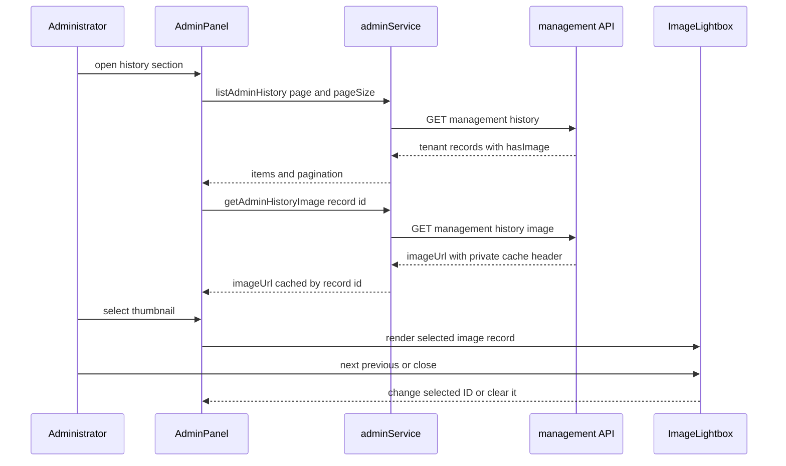

# Administrator panel and history preview

`/admin` is the administrator browser workspace. `AdminPage` is a thin wrapper around `AdminPanel`; `ProtectedAdminRoute` in [browser application and authentication](application.md) waits for profile loading and redirects non-admin users to `/`. On mount, the panel loads only its active **users** section. Opening history, styles, or models loads that section once and retains it in memory; changing the user filter invalidates history and styles but refetches only the section currently on screen. `LlmModelSettings` remains the separate composition for encrypted analysis-model settings. The panel also exposes section-specific pagination, user role/status changes, image-model-policy saves, administrator style deletion, and analysis-model CRUD/role assignment. The server-side authorization, tenant scope, list/image contract, and management endpoints are canonical in [authentication, tenancy, and administration](../backend/auth-tenancy-admin.md).

## Analysis-model settings

The **analysis models** section is a separate composition component, `LlmModelSettings`. It loads `{ models, assignments, roles, providers }` through `listAdminLlmModels`, then delegates create/update/delete, role assignment, and a deliberate live connection test to the corresponding `adminService` calls. The API returns `hasApiKey`, never the key itself; an edit with an empty `apiKey` preserves the stored ciphertext. Azure entries require a public HTTPS endpoint while Gemini entries omit one.

Assignments select a required primary and optional distinct fallback from the full tenant model catalog. The role catalog identifies the function, not a provider: any role can use Azure OpenAI or Google Gemini, and a fallback may cross providers. The selectors include the provider in each option label; when no models exist, the UI explains that no assignment selector is available. Configuration, encryption, and assignment authorization are detailed in [authentication, tenancy, and administration](../backend/auth-tenancy-admin.md); the provider-neutral runtime and failure behavior are detailed in [AI generation](../backend/ai-generation.md). The connection-test action is intentionally an admin-initiated provider call, not a normal browser startup request.

For this section, begin at `src/components/admin/LlmModelSettings.jsx` and `src/services/adminService.js`. `LlmModelSettings.test.jsx` covers the empty-catalog explanation, settings load, secret-free rendering, model creation payload, all-model role selection, cross-provider assignment, delete rejection, and connection-test UI. Run it together with the model-domain/runtime checks from [AI generation](../backend/ai-generation.md); use a live connection test only when changing real credentials or provider connectivity.

## History image inspection

The history list returns `hasImage`, not `imageUrl`, so records without that flag remain a noninteractive **no preview** state. `AdminRemoteImage` calls `getAdminHistoryImage` for each image-bearing thumbnail. `loadAdminImage` stores resolved URLs in the module-local `adminImageCache`, so a thumbnail and a later preview reuse the same record-ID entry for the lifetime of the browser module. Selecting a thumbnail sets `previewHistoryId`; `viewableHistoryItems` filters the currently loaded `historyItems` to image-bearing records, and `previewIndex` resolves the selected ID in that filtered list. The preview effect fetches the selected record through the same cache boundary. If the ID no longer resolves, no dialog is rendered.



This sequence shows separate tenant-scoped image retrieval over the already loaded page. It does not add an item-detail endpoint or navigate across server pages.

The dialog receives the selected image URL, an accessible image description, and record details for the user display name/email, model, style name, timestamp, full prompt, and user script. It exposes the image URL as a download link named `pixora-<history-id>.png`. Previous/next controls and left/right-arrow keyboard handling move only among image-bearing items in the loaded page. At the boundaries, the unavailable direction is disabled. Escape, the backdrop, and the close control dismiss the dialog.

The dialog is the shared `ImageLightbox` used by [Asset Center](asset-center.md). Its optional `details`, download, position, and navigation props are what make this management use case richer than the style preview; the component, not `AdminPanel`, owns document scroll locking, close-button autofocus, focus restoration, and document-level Escape/arrow listeners. Keep those lifecycle responsibilities centralized when adding another consumer.

## Change and validation guide

Consult this page for `/admin` loading, presentation, history/style thumbnails, preview, or use of the shared lightbox. Start at `src/components/admin/AdminPanel.jsx`: `requestedSectionsRef` controls once-per-section initial loads, `loadUsersSection`/`loadHistorySection`/`loadStylesSection`/`loadSettingsSection` own independent fetches, and `runRefresh` owns explicit pagination refreshes. `AdminRemoteImage`, `loadAdminImage`, and `adminImageCache` are the protected-image seam; keep the list's availability flags separate from image URL retrieval. `previewHistoryId`, `viewableHistoryItems`, `previewIndex`, and `previewDetails` form the preview composition seam. Change `src/components/common/ImageLightbox.jsx` for modal behavior shared with the style library; update [Asset Center](asset-center.md) at the same time if the minimal-preview contract changes. Change `src/services/adminService.js` and [authentication, tenancy, and administration](../backend/auth-tenancy-admin.md) together when the management request contract changes.

Preserve these rules:

1. Route guarding is not a visual concern: retain `ProtectedAdminRoute` and do not make the panel itself the authorization boundary.
2. Keep the initial load narrow: users load on mount; an unvisited history, styles, or models section must not request data. A failed first load is retryable because its section is removed from `requestedSectionsRef`.
3. A filter change invalidates history and styles but reloads only the active one; do not restore the former parallel fetch.
4. The preview list is the loaded history page filtered by `hasImage`; it must not include empty-image records or invent cross-page navigation. URLs are fetched on thumbnail/preview demand through the tenant-scoped endpoint and may be reused from `adminImageCache`.
5. Details are display data from the management-list response. Do not treat optional fields as required; `ImageLightbox` omits empty detail values.
6. Do not add a browser-side storage credential or direct provider request. The authorized admin image endpoints return `{ imageUrl }` and use `Cache-Control: private, max-age=3600`.
7. Keyboard arrows are meaningful only when a predecessor or successor callback exists; Escape must remain a close path.

`AdminPanelSectionLoading.test.jsx` verifies mount-only users loading, once-only section loading, and active-section filter reload. `AdminHistoryPreview.test.jsx` mocks `adminService` and verifies remote image retrieval, details/download, navigation that skips an image-less record, Escape close, and the noninteractive missing-image state. `ImageLightbox.test.jsx` covers the reusable optional-control and keyboard behavior. Run the focused browser checks:

```sh
pnpm test --run src/components/admin/__tests__/AdminPanelSectionLoading.test.jsx src/components/admin/__tests__/AdminHistoryPreview.test.jsx src/components/common/__tests__/ImageLightbox.test.jsx
```

These are internal UI checks, not proof of the shipped management contract. `api/admin/__tests__/adminResources.test.js` now verifies the no-URL list contract plus tenant-scoped history/style image responses, cache header, and missing-resource paths. An API response shape, tenant-filter, authorization, or pagination change needs that handler suite as well as the consumer tests. Use the broader `pnpm lint && pnpm build` only when changing route wiring, aliases, shared imports, or production styling.
