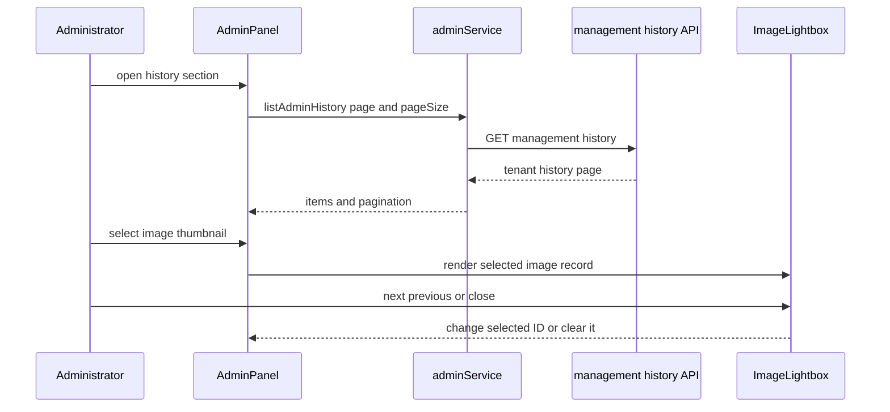

# Administrator panel and history preview

`/admin` is the administrator browser workspace. `AdminPage` is a thin wrapper around `AdminPanel`; `ProtectedAdminRoute` in [browser application and authentication](application.md) waits for profile loading and redirects non-admin users to `/`. The panel uses `adminService` to load the first page of users, generation history, and styles along with model settings, then exposes the existing section-specific pagination, user filtering, user role/status changes, model-policy saves, and administrator style deletion. The server-side authorization, tenant scope, and management endpoints are canonical in [authentication, tenancy, and administration](../backend/auth-tenancy-admin.md).

## History image inspection

The history table leaves records without `imageUrl` as a noninteractive **no preview** state. For each image-bearing row, the thumbnail is a labeled button. Selecting it stores the record ID in `previewHistoryId`; `viewableHistoryItems` filters the currently loaded `historyItems` to image-bearing records, and `previewIndex` resolves the selected ID in that filtered list. If the ID no longer resolves, no dialog is rendered.



This sequence shows a preview over the already loaded page; it does not add an item-detail endpoint or navigate across server pages.

The dialog receives the selected image URL, an accessible image description, and record details for the user display name/email, model, style name, timestamp, full prompt, and user script. It exposes the image URL as a download link named `pixora-<history-id>.png`. Previous/next controls and left/right-arrow keyboard handling move only among image-bearing items in the loaded page. At the boundaries, the unavailable direction is disabled. Escape, the backdrop, and the close control dismiss the dialog.

The dialog is the shared `ImageLightbox` used by [Asset Center](asset-center.md). Its optional `details`, download, position, and navigation props are what make this management use case richer than the style preview; the component, not `AdminPanel`, owns document scroll locking, close-button autofocus, focus restoration, and document-level Escape/arrow listeners. Keep those lifecycle responsibilities centralized when adding another consumer.

## Change and validation guide

Consult this page for `/admin` presentation, its history-table preview, or use of the shared lightbox. Start at `src/components/admin/AdminPanel.jsx`: state fetches and table pagination remain there, while `previewHistoryId`, `viewableHistoryItems`, `previewIndex`, and `previewDetails` form the preview composition seam. Change `src/components/common/ImageLightbox.jsx` for modal behavior shared with the style library; update [Asset Center](asset-center.md) at the same time if the minimal-preview contract changes. Change `src/services/adminService.js` and then the server owner page only when the management request contract changes.

Preserve these rules:

1. Route guarding is not a visual concern: retain `ProtectedAdminRoute` and do not make the panel itself the authorization boundary.
2. The preview list is the loaded history page filtered by `imageUrl`; it must not include empty-image records, invent cross-page navigation, or refetch on selection.
3. Details are display data from the management-list response. Do not treat optional fields as required; `ImageLightbox` omits empty detail values.
4. Image preview and download URLs come from the authorized tenant-scoped history response. Do not add a browser-side storage credential or direct provider request.
5. Keyboard arrows are meaningful only when a predecessor or successor callback exists; Escape must remain a close path.

`AdminHistoryPreview.test.jsx` mocks `adminService` and verifies opening details/download, navigation that skips an image-less record, Escape close, and the noninteractive missing-image state. `ImageLightbox.test.jsx` covers the reusable optional-control and keyboard behavior. Run the focused browser checks:

```sh
pnpm test --run src/components/admin/__tests__/AdminHistoryPreview.test.jsx src/components/common/__tests__/ImageLightbox.test.jsx
```

These are internal UI checks, not proof of the shipped management contract. There is no focused management-handler test: an API response shape, tenant-filter, authorization, or pagination change needs server-side coverage around `api/admin/index.js` as well as this consumer test. Use the broader `pnpm lint && pnpm build` only when changing route wiring, aliases, shared imports, or production styling.
