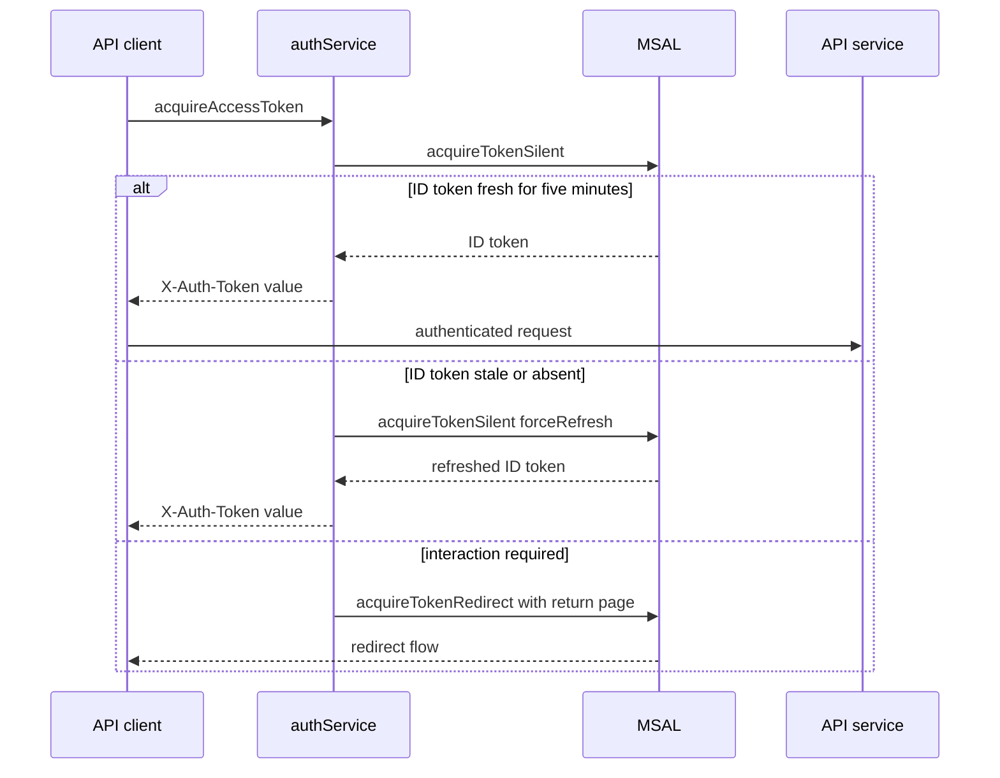

# Browser application and authentication

`src/main.jsx` is the browser composition root. It waits for `msalInstance.initialize()` and `handleRedirectPromise()`, selects an active account when one exists, then renders providers and `App`. This ordering prevents a redirect reload from briefly being treated as logged out.

`App` has public `/login`, authenticated creation/styles/history routes, and an admin route. `ProtectedRoute` waits for provider initialization; `ProtectedAdminRoute` also waits for profile loading and redirects non-admins to `/`. `ErrorBoundary` wraps the router.

## Identity lifecycle

`AuthProvider` merges three sources: local bypass (`VITE_AUTH_BYPASS`), Google credentials in `localStorage.google_user`, and MSAL accounts. It loads `/api/me` whenever an authenticated user is available and derives `isAdmin` from `profile.role`. The API, rather than the client, validates the token and resolves the persisted identity; see [authentication, tenancy, and administration](../backend/auth-tenancy-admin.md).

Google JWT expiry is checked on startup and visibility changes. A timer tries Google One Tap silent refresh two minutes before expiry; if that fails, the context shows a re-authentication warning. A Google token returned by `acquireAccessToken` must still have more than five minutes remaining, otherwise `authService` removes the stored session.

Microsoft uses redirect login and logout. Both `loginWithMicrosoft` and interaction-required re-authentication save `window.location.href` as `redirectStartPage`; `msalConfig.auth.navigateToLoginRequestUrl` is `true`, so MSAL returns to that page after redirect handling. The shared five-minute `TOKEN_EXPIRY_BUFFER_SECONDS` / `TOKEN_RENEWAL_OFFSET_SECONDS` is intentional: it gives the browser and MSAL the same early-renewal window.



This flow shows the Microsoft path used before the API client sends `X-Auth-Token`; a redirect unloads the page rather than returning a usable token.

### Microsoft renewal invariants

`acquireAccessToken` prefers a valid Google token. Otherwise it obtains an active MSAL account through `getActiveAccount` and delegates to `acquireMicrosoftToken`.

- `acquireMicrosoftTokenSilently` calls `acquireTokenSilent` with the configured `MSAL_REDIRECT_URI`, the active account, the five-minute refresh-token offset, and the caller's `forceRefresh` value.
- The API consumes the **ID** token, not the access token. MSAL cache validity alone is therefore insufficient: when a normal silent result has no ID token or an ID token expiring within five minutes, the service performs one forced silent refresh and rejects a still-stale result.
- One module-level `microsoftTokenRequest` promise coalesces concurrent Microsoft requests. `microsoftRedirectInProgress` prevents a second redirect request while re-authentication is being initiated; both guards reset after settlement so recoverable failures do not permanently block renewal.
- Only `InteractionRequiredAuthError` and the enumerated MSAL interaction error codes cause `acquireTokenRedirect`. Other silent-acquisition failures become a re-login error. `AuthProvider` preserves the Microsoft MSAL session and displays its warning; it clears Google state instead.

## API client contract

`src/services/apiClient.js` is the common JSON client. `buildHeaders` calls `acquireAccessToken` and sends its result in `X-Auth-Token` unless bypassed or explicitly `auth: false`; it parses `{ error: { message } }`, returns `null` for 204, and exposes `AuthExpiredError`. A 401 for Microsoft triggers one `forceRefresh` retry, while a Google 401 invokes the context expiry callback. Abort errors propagate unchanged, which generation hooks depend on.

## Change and validation guide

Consult this page when changing login redirects, token headers, token freshness, 401 recovery, or provider bootstrap. The Microsoft change surface is `src/services/authService.js` (`acquireAccessToken`, `acquireMicrosoftTokenSilently`, `redirectForMicrosoftReauthentication`), `src/services/msalClient.js` (`msalConfig`), `src/services/apiClient.js` (`buildHeaders`, `requestWithRetry`), and `src/context/AuthContext.jsx` (`AuthProvider`). Keep the API verification contract in [authentication, tenancy, and administration](../backend/auth-tenancy-admin.md) aligned; changing client renewal must not weaken server-side verification.

The narrow behavioral regression suite is `src/services/__tests__/authService.test.js`: `acquireAccessToken uses silent first`, `acquireAccessToken redirects when interaction is required`, `refreshes a stale ID token even when MSAL returns a cached result`, and `acquireAccessToken can force a cache refresh`. Run:

```sh
pnpm test -- --run src/services/__tests__/authService.test.js
```

Also run `src/services/__tests__/apiClient.test.js` when changing request headers or the 401 retry. A browser redirect smoke test is warranted only when changing `MSAL_REDIRECT_URI`, redirect navigation, scopes, or Entra registration; its deployment/setup constraints belong in [development, migrations, and deployment](../operations/development-deployment.md). Domain workflow state is intentionally outside this page: use [creation workflows](create-workflows.md).