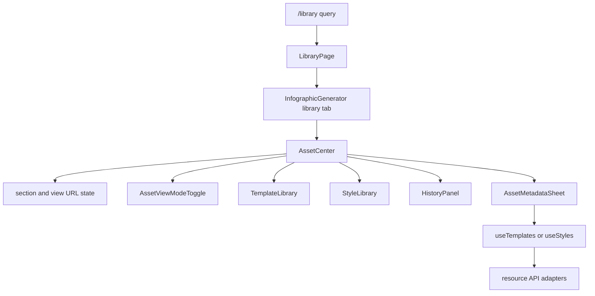

# Asset Center

`/library` is the protected browser route for reusable templates, saved styles, and generated-history records. `LibraryPage` reads `?section=` and renders `InfographicGenerator` with `initialTab="library"`; `AssetCenter` then owns the live `section` and `view` query state. Valid sections are `overview`, `templates`, `styles`, and `history`; valid views are `grid`, `list`, and `table`. Invalid or absent values fall back to `overview` and `grid`. Section and view changes replace the current history entry while preserving unrelated query parameters. Route protection and session initialization remain owned by [browser application and authentication](application.md), while the underlying tenant-scoped resource contracts remain owned by [resource APIs](../backend/resources.md).

## Composition and user flow

`InfographicGenerator` remains the stateful composition root. It loads templates with `useTemplates`, styles with `useStyles`, and history with `useHistory`, then supplies lists plus mutation callbacks to `AssetCenter`. The library does not introduce another cache or API client. In the creation workspace, `StyleSourceTabs` uses React Router navigation to send template or style management to `/library?section=templates` or `/library?section=styles`; it is an entry point to this system, not a second manager.



This flow shows browser composition and URL-backed presentation state only; `storageService` carries the authenticated PUT requests, and the server enforces ownership and tenant scope.

`AssetCenter` offers four sections:

- **Overview** normalizes all three list types into recent asset cards, filters their title, description, tags, or style prompt with its local search state, and shows at most three per type. A primary action applies a template, applies a style, or loads a history item; opening a card switches to its category rather than opening an editor.
- **Templates** gives `TemplateLibrary` a controlled local search query and suppresses that component's internal search field. Existing apply, single/batch delete, and selection behavior remain in `TemplateLibrary`.
- **Styles** passes the `useStyles` query, scope, sort, loading, and mutation state into `StyleLibrary`, again with the child search UI suppressed. Publishing, unpublishing, copying, and deletion remain the existing style operations.
- **History** passes the existing history query and callbacks to `HistoryPanel` with its internal search suppressed. Existing loading, comparison, and deletion behavior remain there.

The shared header search writes only the active section's query: overview and templates keep local state; styles and history retain their hook/root state. Do not merge those scopes without deciding whether a query should survive a category switch.

`AssetViewModeToggle` changes the shared presentation mode for every section. `normalizeViewMode` permits only `grid`, `list`, or `table`; `AssetCenter` writes the normalized value to `?view=` alongside the active `section`. The overview renders its own cards, rows, or table, while each child library receives `viewMode` and remains responsible for its category-specific rendering. Treat this as URL-backed presentation state, not another resource filter or a server query parameter.

## Template and style metadata edits

`StyleCard` and `TemplateLibrary` surface edit actions that call `AssetCenter::handleEdit`. `AssetMetadataSheet` edits only `name`, `description`, and comma- or full-width-comma-separated `tags`; it trims and removes empty tags. On save, `handleSaveMetadata` dispatches by asset type:

- templates merge the selected template's current `userScript`, `stylePrompt`, `styleId`, `previewUrl`, and `category` with the edited metadata, then call `useTemplates.updateTemplate(id, data)`, which PUTs through `storageService.updateTemplate` and reloads the template list;
- styles call `useStyles.updateStyle(id, data)`, which PUTs through `storageService.updateStyle` and refreshes the style list.

The sheet stays open and shows the thrown error if either operation fails. It closes only after the awaited callback succeeds. History is deliberately not editable through this sheet. These browser calls use the resource API update paths documented in [resource APIs](../backend/resources.md); do not add local metadata persistence or assume the UI bypasses the server's creator-ownership checks.

### Replacement-style template update contract

`api/templates/index.js` implements `PUT /templates/:id` as a replacement of `user_script`, `style_prompt`, `style_id`, `preview_url`, and `category` as well as the edited metadata; omitted fields become `null` or `general`. The Asset Center therefore copies those retained fields from the selected template into its update payload. A metadata edit through the current UI preserves the loaded template's script/style linkage, preview, and category. In contrast, `PUT /styles/:id` selectively updates only fields present in its payload. This distinction is part of the current cross-system contract documented in [resource APIs](../backend/resources.md), not a client-side cache issue.

Keep the client payload complete while the handler has replacement semantics. If the handler becomes a partial update, simplify the caller deliberately and add coverage for omitted-field behavior; if a new replacement field is added, include it in `handleSaveMetadata` before exposing metadata editing for that resource. There is no focused handler or component test for a template metadata edit, so add coverage for preservation of script, style, preview, and category rather than relying on the local list reload.

## Change and validation guide

Consult this page when changing `/library`, its `section` or `view` query behavior, the library tab, overview aggregation/search, category composition, or template/style metadata editing. Start at `src/components/library/AssetCenter.jsx`; trace initial route setup through `src/pages/LibraryPage.jsx`, URL view validation through `src/components/library/viewMode.js` and `AssetViewModeToggle.jsx`, and state/callback wiring through `src/InfographicGenerator.jsx`. For a child behavior, change the owning component (`TemplateLibrary`, `StyleLibrary`, or `HistoryPanel`) rather than duplicating it in the center.

Preserve these boundaries:

1. `AssetCenter` may coordinate views and callback dispatch but must not independently fetch or mutate resources.
2. The overview is a bounded presentation of current in-memory lists, not a server-wide search or pagination result.
3. Metadata editing is limited to templates and styles and must await the hook update before closing. Template updates must retain every replacement field from the selected template because the server clears omitted values.
4. Applying an asset and navigating to the create tab are distinct callbacks; preserve the existing caller behavior for each.

`src/components/library/__tests__/AssetViewModeToggle.test.jsx` verifies the toggle's three choices and pressed state. `src/services/__tests__/storageService.test.js` covers the style PUT adapter, including its method and path. Neither imports `AssetCenter` or exercises `updateTemplate`; URL query synchronization, template replacement semantics, and the metadata-sheet flow have no focused automated coverage. Run both narrow checks after changing the toggle, style persistence adapter, or edit payloads:

```sh
pnpm test --run src/components/library/__tests__/AssetViewModeToggle.test.jsx src/services/__tests__/storageService.test.js
```

There is no focused component test for `AssetCenter` or `AssetMetadataSheet`, and no template-update adapter or handler test. For route/query state, search state, callback wiring, dialog, accessibility, or layout changes, add focused component coverage or perform an interactive check of `/library` with each valid `section` and `view`, an invalid query fallback, a successful and failed template/style edit, category-specific search, and an overview primary action. A full frontend `pnpm lint && pnpm build` is conditional on changes that cross routing, shared imports, or production styling; it is not the narrow default for a resource-adapter change.
