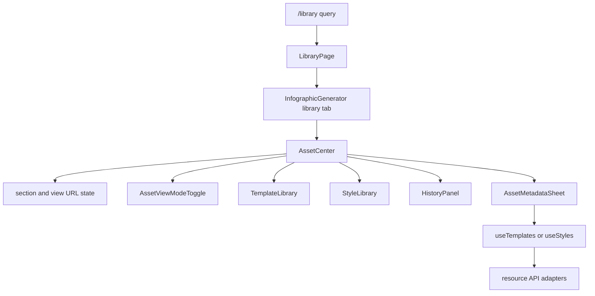

# Asset Center

`/library` is the protected browser route for reusable templates, saved styles, and generated-history records. `LibraryPage` reads `?section=` and `?view=` and renders `InfographicGenerator` with `initialTab="library"`; `AssetCenter` then owns the live `section` and `view` query state through `useSearchParams`. Valid sections are `overview`, `templates`, `styles`, and `history`; valid views are `grid`, `list`, and `table`. Invalid or absent sections fall back to `overview`; invalid or absent views fall back to `table`. Section and view changes replace the current history entry, write both normalized keys, and preserve unrelated query parameters. Route protection and session initialization remain owned by [browser application and authentication](application.md), while the underlying tenant-scoped resource contracts remain owned by [resource APIs](../backend/resources.md).

## Composition and user flow

`InfographicGenerator` remains the stateful composition root. It loads templates with `useTemplates`, styles with `useStyles`, and history with `useHistory`, then supplies lists plus mutation callbacks to `AssetCenter`. The library does not introduce another cache or API client. In the creation workspace, `StyleSourceTabs` uses React Router navigation to send template or style management to `/library?section=templates` or `/library?section=styles`; it is an entry point to this system, not a second manager.



This flow shows browser composition and URL-backed presentation state only; `storageService` carries the authenticated PUT requests, and the server enforces ownership and tenant scope.

`AssetCenter` offers four sections:

- **Overview** normalizes all three list types into recent asset cards, filters their title, description, tags, or style prompt with its local search state, and shows at most three per type. A primary action applies a template, applies a style, or loads a history item; opening a card switches to its category rather than opening an editor.
- **Templates** gives `TemplateLibrary` a controlled local search query and suppresses that component's internal search field. Existing apply, single/batch delete, and selection behavior remain in `TemplateLibrary`.
- **Styles** passes the `useStyles` query, scope, sort, loading, and mutation state into `StyleLibrary`, again with the child search UI suppressed. Publishing, unpublishing, copying, and deletion remain the existing style operations.
- **History** passes the existing history query and callbacks to `HistoryPanel` with its internal search suppressed. Existing loading, comparison, and deletion behavior remain there.

The shared header search writes only the active section's query: overview and templates keep local state; styles and history retain their hook/root state. Do not merge those scopes without deciding whether a query should survive a category switch.

`AssetViewModeToggle` changes the shared presentation mode for every section. `normalizeViewMode` permits only `grid`, `list`, or `table` and defaults absent or invalid input to `table`; `AssetCenter` writes the normalized value to `?view=` alongside the active `section`. `ViewModeGlyph` presents that active mode, while the selectable buttons retain text labels. The overview renders its own cards, rows, or table, while each child library receives `viewMode` and remains responsible for its category-specific rendering. Table is therefore the initial library presentation, not a server query parameter or another resource filter. The animated glyph implementation and reduced-motion behavior belong to [shared UI motion, theme, and semantic icon styling](design-system.md), not this URL-state contract.

Grid density is presentation-owned: overview cards use an auto-fill grid with a 220px minimum, while `TemplateLibrary`, `StyleLibrary`, and `HistoryPanel` define their own progressively denser breakpoint grids and cards. Keep that responsive layout in the category renderer when changing a category’s card; do not move it into resource hooks, URL state, or server queries.

## Template and style metadata edits

`StyleCard` and `TemplateLibrary` surface edit actions that call `AssetCenter::handleEdit`. `AssetMetadataSheet` edits only `name`, `description`, and comma- or full-width-comma-separated `tags`; it trims and removes empty tags. For a style only, its **AI optimize** action sends the current trimmed description (or, if empty, name) plus name and tags as `styleContext` to `optimizePrompt`. That browser adapter POSTs to `/api/optimize-prompt`, whose provider behavior is owned by [AI generation](../backend/ai-generation.md). A successful result replaces the unsaved description with `optimizedPromptZh` and displays the returned explanation; it does not save, change the name/tags, or apply a template optimization. A missing usable result and request failures remain sheet-local errors. While optimization is pending, the sheet blocks both save and close, including Escape and backdrop close. On save, `handleSaveMetadata` dispatches by asset type:

- templates merge the selected template's current `userScript`, `stylePrompt`, `styleId`, `previewUrl`, and `category` with the edited metadata, then call `useTemplates.updateTemplate(id, data)`, which PUTs through `storageService.updateTemplate` and reloads the template list;
- styles call `useStyles.updateStyle(id, data)`, which PUTs through `storageService.updateStyle` and refreshes the style list.

The sheet stays open and shows the thrown error if either operation fails. It closes only after the awaited callback succeeds. History is deliberately not editable through this sheet. These browser calls use the resource API update paths documented in [resource APIs](../backend/resources.md); do not add local metadata persistence or assume the UI bypasses the server's creator-ownership checks.

### Replacement-style template update contract

`api/templates/index.js` implements `PUT /templates/:id` as a replacement of `user_script`, `style_prompt`, `style_id`, `preview_url`, and `category` as well as the edited metadata; omitted fields become `null` or `general`. The Asset Center therefore copies those retained fields from the selected template into its update payload. A metadata edit through the current UI preserves the loaded template's script/style linkage, preview, and category. In contrast, `PUT /styles/:id` selectively updates only fields present in its payload. This distinction is part of the current cross-system contract documented in [resource APIs](../backend/resources.md), not a client-side cache issue.

Keep the client payload complete while the handler has replacement semantics. If the handler becomes a partial update, simplify the caller deliberately and add coverage for omitted-field behavior; if a new replacement field is added, include it in `handleSaveMetadata` before exposing metadata editing for that resource. `AssetMetadataSheet.test.jsx` focuses on style optimization: it verifies the adapter payload, replacement of the description, and explanatory note. There is still no focused handler or component test for a template metadata save, so add coverage for preservation of script, style, preview, and category rather than relying on the local list reload.

## Style image preview

`StyleLibrary` owns `previewStyle` and renders the shared `ImageLightbox` only while the selected style has a `previewUrl`. The grid's `StyleCard` and the list/table thumbnail renderers expose the same image-preview action; each action stops propagation before setting that state. This makes previewing a style image distinct from applying it, editing it, and selecting it for batch deletion. Selection mode deliberately suppresses the preview action so image clicks retain their selection semantics.

`ImageLightbox` in `src/components/common/` is a modal dialog rather than a navigated asset route. With only `src`, `alt`, and `onClose`, the style library uses its minimal preview mode: no metadata, download, position, or navigation controls are rendered. It locks document scrolling, focuses its close button, restores the previously active element when unmounted, and closes through Escape, its backdrop, or its close button. The same component accepts optional `details`, `downloadUrl`, `downloadName`, `position`, `onPrev`, and `onNext` for the administrator history workflow documented in [administrator panel](admin-panel.md). Preserve the lifecycle rules and optional-control boundary if changing the component; styles with no preview URL must not attempt to render it.

`StyleCard` keeps its action layout presentation-local. Its primary apply action spans the card; edit, one of copy/publish/unpublish, and delete are secondary actions. `secondaryActionColumns` selects a one-, two-, or three-column grid from the enabled secondary-action groups, and the compact buttons retain a minimum height, title, and truncating label. Do not move this responsive policy into `StyleLibrary`, URL state, or resource hooks. Preview remains an image-only action outside selection mode, so changing a card layout must not restore preview clicks while batch selection owns the card interaction.

## Change and validation guide

Consult this page when changing `/library`, its `section` or `view` query behavior, the library tab, overview aggregation/search, category composition, template/style metadata editing, style prompt optimization, or style image preview. For the `ProductGlyph`/`ViewModeGlyph` shapes, shared size classes, or their motion behavior, consult [shared UI motion, theme, and semantic icon styling](design-system.md); retain semantic labels and the existing `viewMode` state contract here. Start at `src/components/library/AssetCenter.jsx`; trace initial route setup through `src/pages/LibraryPage.jsx`, URL view validation through `src/components/library/viewMode.js` and `AssetViewModeToggle.jsx`, and state/callback wiring through `src/InfographicGenerator.jsx`. `AssetMetadataSheet` owns unsaved edit/optimization state and calls `src/services/aiService.js::optimizePrompt`; `StyleLibrary` owns preview state and `src/components/common/ImageLightbox.jsx` owns the shared modal lifecycle. For other child behavior, change the owning component (`TemplateLibrary`, `StyleLibrary`, or `HistoryPanel`) rather than duplicating it in the center.

Preserve these boundaries:

1. `AssetCenter` may coordinate views and callback dispatch but must not independently fetch or mutate resources.
2. The overview is a bounded presentation of current in-memory lists, not a server-wide search or pagination result.
3. Metadata editing is limited to templates and styles and must await the hook update before closing. Template updates must retain every replacement field from the selected template because the server clears omitted values. Style optimization only changes the unsaved description; it must not save or permit a concurrent close/save.
4. A style-preview click opens a modal only outside selection mode. The modal must retain scroll-lock, focus-restoration, and all close paths.
5. Applying an asset and navigating to the create tab are distinct callbacks; preserve the existing caller behavior for each.

`src/components/library/__tests__/AssetViewModeToggle.test.jsx` verifies the toggle's three choices and pressed state and that absent or invalid view values normalize to `table`. `src/components/icons/__tests__/KineticGlyphs.test.jsx` confirms the view-mode glyph state marker; it is a focused rendering test, not a URL-state test. `AssetMetadataSheet.test.jsx` verifies a style optimization request's source/context payload and result presentation. `StyleCard.test.jsx` verifies that a grid card emits its preview action. `ImageLightbox.test.jsx` verifies Escape close plus the optional-control contract: minimal style mode has no details, download, or navigation; supplied values render nonempty details, a download link, position, and keyboard/button navigation with unavailable directions disabled. `src/services/__tests__/storageService.test.js` covers the style PUT adapter, including its method and path. None imports `AssetCenter` or exercises `updateTemplate`; URL query synchronization, template replacement semantics, save failure handling, and complete lightbox focus/backdrop behavior still lack focused coverage. Run these narrow checks after changing the toggle/default policy, metadata optimization, style preview, shared modal, persistence adapter, or edit payloads:

```sh
pnpm test --run src/components/library/__tests__/AssetViewModeToggle.test.jsx src/components/library/__tests__/AssetMetadataSheet.test.jsx src/components/styles/__tests__/StyleCard.test.jsx src/components/common/__tests__/ImageLightbox.test.jsx src/services/__tests__/storageService.test.js
```

There is no focused component test for `AssetCenter` and no template-update adapter or handler test. For route/query state, search state, callback wiring, dialog accessibility, or layout changes, add focused component coverage or perform an interactive check of `/library` with each valid `section` and `view`, an invalid query fallback, a successful and failed template/style edit, style optimization success/failure, preview opening and closing, category-specific search, and an overview primary action. A full frontend `pnpm lint && pnpm build` is conditional on changes that cross routing, shared imports, or production styling; it is not the narrow default for a resource-adapter change.
