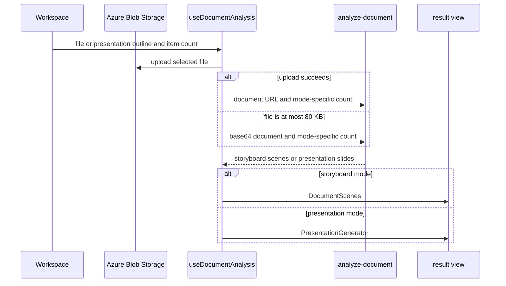
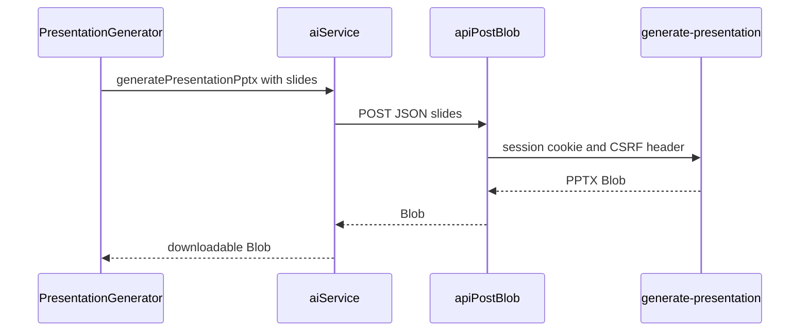

# Creation workspace, documents, and exports

`InfographicGenerator.jsx` is the creation composition point. It combines general generation, document analysis, transforms, settings, sharing, and the library tab. Hooks isolate remote interactions: `useImageGeneration`, `useDocumentAnalysis`, `useImageTransform`, `useStyles`, `useTemplates`, and `useHistory`. Templates, saved styles, and history compose through [Asset Center](asset-center.md), while server provider and document contracts are canonical in [AI generation](../backend/ai-generation.md).

## Generation and persistence

`useImageGeneration.runGeneration` requires a script, aborts an earlier browser wait, concurrently asks for a filename, builds a style/content/language prompt, calls `generateImage`, and polls a returned job. The server owns model policy. `useHistory` compresses images to max 800px JPEG before saving; history deletion is optimistic and restores only failed deletions. Styles use a 300 ms debounced server search, and saving compresses preview images.

`useImageTransform` limits source files to 10 MB, requests Blob SAS, uploads with XHR progress, retains preview plus SAS URL, and merges user prompt, palette tags, and saved-style prompt before `/image-transform`. Cancellation aborts browser waiting, not necessarily remote work. See [AI generation](../backend/ai-generation.md) and [resources](../backend/resources.md).

`ImageGeneratingState` provides the normal/compact visual feedback used by `ImagePreview`, `DocumentScenes`, and `SceneModal`. It owns presentation only: callers still own their generation states. Preserve that split when changing feedback. There is no focused component test; lint the affected components and interactively check normal/compact placement only for styling, accessibility, or aspect-ratio work.

## Document input and mode boundary

The document area now has three independent paths: **Document analysis** fixes `DocumentUploader` to `storyboard`; **Presentation generation** fixes it to `presentation`; and **PPT Master** renders `PptMasterStudio` without `useDocumentAnalysis`. `InfographicGenerator` renders an analyzed result only when `documentResult.analysis_mode` matches the selected tab, so switching storyboard/presentation tabs cannot reinterpret a previous response. It renders `DocumentScenes` only for storyboard results and `PresentationGenerator` only for presentation results. PPT Master owns separate local job state, and the general bottom `GenerateBar` is excluded from both presentation-oriented tabs.

`DocumentUploader` permits pasted outlines only in presentation mode and resets an open outline tab to file input when its parent mode changes. It and `useDocumentAnalysis` enforce the same 50 MB browser limit and `src/lib/documentFormats.js` extension allow-list: PDF; Word, PowerPoint, and Excel variants; OpenDocument; RTF; EPUB; CSV; TXT/Markdown; and PNG/JPEG. The shared module supplies the input `accept` value, validates extensions, and determines a MIME fallback; `storageService.uploadFileToBlob` also uses it.



This flow shows the client-side transport fallback and the mode split. Parsing, SSRF checks, server response normalization, and provider adaptation remain server responsibilities in [AI generation](../backend/ai-generation.md).

The hook uploads first to avoid Static Web App body limits. If upload fails, it sends base64 only for a file at most 80 KB. It passes `sceneCount` only in storyboard mode and `slideCount` only in presentation mode. It requires a nonempty matching `scenes` or `slides` result before it commits document state. `AnalysisProgress` remains elapsed-time/coarse-phase user feedback, capped at 95%; it is not server telemetry.

For browser format support, update `documentFormats.js`, then align server recognition in [AI generation](../backend/ai-generation.md). `src/lib/__tests__/documentFormats.test.js` covers extension acceptance, MIME fallback, and the accept list. `src/services/__tests__/aiService.test.js` covers the presentation request payload. Run both when request construction or format support changes:

```sh
pnpm test --run src/lib/__tests__/documentFormats.test.js src/services/__tests__/aiService.test.js
```

## Storyboard workflow and browser exports

Storyboard responses contain scenes and a required AI recommended style. `DocumentScenes` uses that style by default; a saved style becomes local `documentStyleOverride`, clearing it restores the recommendation, and clearing/replacing the document clears the override. Scene generation passes the selected prompt as `analyzedStyle`, saves it to history, and calls `markStyleUsed` only for a saved-style override. This selection never changes the general workspace's style.

Edited/deleted storyboard scenes retain order and are re-numbered with `scene_number`. `DocumentScenes::exportToPptx()` passes valid object scenes through `src/utils/pptxExport.js::getPptxScenes`, dynamically loads `pptxgenjs`, fetches/base64-embeds available images, and downloads a 16:9 browser-generated deck. PDF is also browser output. These actions appear only after at least one generated image, though the pure exporter retains image-less valid scenes once an export is available.

`getPptxTables` and `getPptxCharts` re-normalize locally editable visual data: at most one table/chart, eight table columns, ten table rows, twelve chart labels, and four chart series. Valid native visuals take precedence over a generated image or placeholder. This repeats the server boundary because scene objects can be edited. `extractPptxBullets` removes empty values then falls back to nonempty `scene_description`; `sanitizePptxFilename` allows word/CJK/space/hyphen characters with a `presentation` fallback.

For a browser PPTX rule change, begin with the pure helper for selection, bullet, filename, or visual normalization; change render helpers/`exportToPptx` only for deck layout, browser I/O, embedding, or download behavior. `src/utils/__tests__/pptxExport.test.js` covers valid scene selection including image-less scenes, bullet fallback, filename sanitization, table limits, and chart aliases/numbers. Run:

```sh
pnpm test --run src/utils/__tests__/pptxExport.test.js
```

Do not use the company-template route as a storyboard fallback: it accepts a different `slides` contract and no longer appears in `DocumentScenes`.

## Company-template presentation workflow

Presentation mode is a document-to-editable-deck workflow, not a storyboard with optional export. The server returns `slides` with schema version 2; no recommended image style is used, and no per-slide image generation or batch-generation controls appear. `PresentationGenerator.jsx` displays each slide card, including read-only table/chart summaries, and supports edits to title, subtitle, body, newline-separated bullets, and speaker notes.

`useDocumentAnalysis::updateSlide` merges edits at the selected index. `removeSlide` removes the selected item, reassigns `slide_number` in display order, and synchronizes `total_slides`. These are local draft changes: no analysis result is persisted before export. Table/chart values and `slide_type` are displayed but not edited by this component.



This is the browser side of the binary export; the renderer's fixed company-template mapping is documented in [AI generation](../backend/ai-generation.md). `PresentationGenerator::exportPresentation` downloads `<sanitized-title>-公司範本.pptx`, exposes request errors in the panel, and revokes the object URL after invoking the download. `aiService.generatePresentationPptx` delegates to `apiClient.apiPostBlob`, so the normal credential and CSRF contract applies.

Change the client contract through `PresentationGenerator.jsx`, `useDocumentAnalysis.js`, and `aiService.js`; change renderer/template behavior in [AI generation](../backend/ai-generation.md), not in this UI. Focused shipped-boundary checks are:

```sh
pnpm test --run src/services/__tests__/aiService.test.js src/services/__tests__/apiClient.test.js
```

`aiService.test.js` verifies `slides` reaches `/api/generate-presentation`; `apiClient.test.js` verifies the credentialed binary parser and serialized payload. There is no focused `PresentationGenerator` test for editable fields, deletion/re-numbering, disabled export, or a download error. Add one before changing those behaviors. Run the server schema/renderer tests from [AI generation](../backend/ai-generation.md) when changing slide fields or template rendering; service tests alone do not prove the public download works.

## PPT Master design-deck workflow

`PptMasterStudio` is a topic-or-document deck generator, distinct from the editable company-template presentation flow. It accepts a topic of at least four characters or an optional supported file, limits the file to 50 MB using the shared document-format rules, lets the user select a sidecar-provided style and layout, selects an image density, and permits 4–12 slides. The selected file is uploaded to `uploads` before the job request. `PptTemplatePicker` is controlled: a null style/layout means AI selection, not a default client template.

`DeckImageDensityPicker` is controlled. Its default is `key`; its `none`, `key`, and `every` options describe total illustration coverage and call `PptMasterStudio` with the selected ID. The studio includes the label in its collapsed setup summary and passes it to `usePptMasterDeck::generate`, which forwards it to `aiService.createDeckJob`. It must not offer a per-page selection or provider choice: the durable server policy selects pages and the tenant model policy selects the renderer, as explained in [PPT Master deck jobs](../backend/ppt-master-decks.md).

The catalog consumer renders `pptTemplateCopy.js` copy for known style/layout IDs and falls back to the sidecar summary and keywords for unknown IDs, so an upstream template remains selectable before localized copy is added. In that client copy, the known `editorial_bleed` layout is labeled `滿版大圖` and describes a full-page image with overlaid title text; update this localized label, description, and tags together when its selection guidance changes. Layout entries carry `pageCount`; the API supplies only `ppt169` entries, making the picker’s 16:9 claim a server-enforced contract rather than a display preference. The filtering and shared SVG canvas are defined in [PPT Master deck jobs](../backend/ppt-master-decks.md).


This is the browser portion of the durable deck workflow. Its queue, tenant authorization, SVG authoring, sidecar quality gate, output Blob behavior, and template-canvas contract are canonical in [PPT Master deck jobs](../backend/ppt-master-decks.md).

`usePptMasterDeck` loads the template catalog on mount and persists a created job ID under `genpic_deck_job`. On mount it looks up that ID: a queued/processing job resumes polling; a succeeded job restores the download card; a `404` clears the stored ID without surfacing an error; and a failed server job clears it with the server message. Local-storage failures only remove continuation capability, not server work.

While a job is active or has authored pages, `PptMasterStudio` computes the planned rail length from server progress, available slide records, or the completed deck count and renders `DeckSlideRail`. It reserves a skeleton row for every planned page, marks the page whose latest `slides` or `quality` event is `running`, and only permits selecting a page whose SVG preview has loaded. Selecting a thumbnail shows the same object URL beside the progress/result surface; generate and start-over clear the selection. This UI consumes the status `slides` records and protected SVG endpoint documented in [PPT Master deck jobs](../backend/ppt-master-decks.md), not the event trace as a preview substitute.

When `isGenerating` or a completed `deck` locks the submitted setup, `PptMasterStudio` renders `DeckSetupSummary` instead of the two full setup cards. The summary exposes the topic or source filename plus slide count, selected style/layout names (or AI defaults), and the reference filename when both topic and file exist. It is collapsed initially; its accessible toggle can re-open the same cards for inspection without removing the progress or result card. Starting a generation and starting over both reset the expansion state. Long setup titles and metadata may occupy up to two lines, rather than being hidden after one truncated line; the completed-deck title has the same two-line limit. While an event trace exists, `DeckProgress` uses one job-wide title and leaves step-specific wording to `DeckTimeline`; before events, it continues to display the local `phase` such as preparation or upload. On narrow screens its title row stacks the elapsed-time/page-count metadata below the spinner and title; from the `sm` breakpoint it returns to one row. This responsive ordering is presentational only. It must not change the hook's polling, local-storage, or server-job lifecycle documented in [PPT Master deck jobs](../backend/ppt-master-decks.md).

`waitForDeckJob` polls every 4 seconds for at most 40 minutes. It immediately propagates `AbortError`, `AuthExpiredError`, and `404`; other poll errors are retried until five consecutive failures. A server `failed` status becomes an error marked `jobFailed`. The hook retains the ID after transient/network failure so a later mount can resume, but clears it after a missing or terminally failed job. `stopWatching` aborts only the current browser upload/create/poll I/O, clears local continuation state and progress, and does not cancel the database job or sidecar work. The progress card uses `startedAt` when supplied to show elapsed time.

`toSlides` reduces the status payload to page number, revision, and title. A slide effect fetches an SVG via `aiService.getDeckSlidePreview` only if that page/revision is not already cached, then exposes a `URL.createObjectURL` result. A quality repair increments the revision and causes a refetch; the replaced URL, all URLs on reset/stop/start-over, and all URLs on unmount are revoked. Preview fetch failures leave the skeleton in place and do not set the generation error or clear continuation. Do not reuse `useDocumentAnalysis` state or the synchronous `generatePresentationPptx` call for this route.

### Step timeline

Each status response now includes the server's append-only event trace. `usePptMasterDeck` replaces its local `events` state from every polling update, from initial resume, and from the completed job; it clears that state only when beginning a new job, stopping tracking, or clearing the studio. This lets both a resumed successful result and a failed job render the same latest trace. `DeckProgress` displays the timeline while work is active, while `PptMasterStudio` displays it under a terminal error after polling stops.

`deckSteps.js::buildTimeline` is the presentation-only reducer: it sorts by event ID, initializes all six known steps as pending, lets the latest step-level event determine each step status/detail, and lets the latest event per `slideNumber` determine nested slide state. `authoringSlideNumber` separately sorts by event ID and returns a page only while its latest `slides` or `quality` event is `running`; illustration events are intentionally ignored. `DeckTimeline` initially expands a running step's items and permits users to collapse/expand them. Its step label stays on the primary row; a present detail is rendered below it and clamped to two lines, while nested slide items remain indented beneath that detail. Keep these rules aligned with the server `DECK_STEPS`/statuses in [PPT Master deck jobs](../backend/ppt-master-decks.md); a new event step is a cross-boundary schema, worker, client reducer, visual-label, and test change rather than a UI-only change.

For a studio/hook, timeline, or preview contract change, begin with `PptMasterStudio.jsx`, `DeckSetupSummary.jsx`, `DeckSlideRail.jsx`, `usePptMasterDeck.js`, `DeckProgress.jsx`, `DeckTimeline.jsx`, `deckSteps.js`, `pptTemplateCopy.js`, then the `aiService` methods (`listPptTemplates`, `createDeckJob`, `getDeckJob`, `getDeckSlidePreview`, `waitForDeckJob`, `downloadDeckJobPptx`) and [PPT Master deck jobs](../backend/ppt-master-decks.md). `src/components/create/__tests__/PptMasterStudio.test.jsx` has retrievable cases for the full idle form, collapsed generating setup, explicit setup re-opening while progress remains visible, collapsed completed setup, rail visibility, and selected-page enlargement; `DeckSlideRail.test.jsx` covers placeholder rows and selection. Run them first for studio composition or preview layout changes:

```sh
pnpm test --run src/components/create/__tests__/PptMasterStudio.test.jsx src/components/create/__tests__/DeckSlideRail.test.jsx
```

`src/hooks/__tests__/usePptMasterDeck.test.jsx` has retrievable cases for restoring running/succeeded jobs, clearing a missing/failed job, keeping an ID after a connection failure, stop tracking, fetching one preview per revision, replacement URL release after repair, reset release, and non-fatal preview failure; `src/services/__tests__/aiService.test.js` covers transient polling, immediate 404 handling, and exhaustion after five failures. `deckSteps.test.js` verifies all-pending initialization, newest event state, ID ordering, nested slide grouping, skipped steps, unknown-step exclusion, and active authoring-page semantics; `DeckTimeline.test.jsx` verifies all labels, running-step expansion, and collapse. These mocks do not prove authenticated API, Blob upload/download, preview persistence, event persistence, or worker behavior. Run the focused lifecycle and timeline check when the hook, service, event reducer, timeline, or preview cache changes:

```sh
pnpm test --run src/hooks/__tests__/usePptMasterDeck.test.jsx src/services/__tests__/aiService.test.js src/components/create/__tests__/deckSteps.test.js src/components/create/__tests__/DeckTimeline.test.jsx
```

Add `src/services/__tests__/apiClient.test.js` when changing binary transport, error parsing, session credentials, or CSRF behavior. Add a catalog handler test before changing layout filtering, cache behavior, authentication, or service-unavailable behavior; add handler/database coverage before changing event/preview authorization, status serialization, a protected SVG response, or either related migration. No focused API test exists for those handler contracts.

## Change navigation

Consult this page for browser composition, document upload/fallback, the mode boundary, editing state, or any export initiated in React. Start from `InfographicGenerator.jsx` to determine the active mode, then follow the selected component and hook. Keep storyboard `scenes`, company-template `slides`, and PPT Master job state separate through request, state, and API payloads. Use [HTTP API](../backend/http-api.md) for route/OpenAPI/adapter changes and [operations](../operations/development-deployment.md) only for deployment or configuration work.
er changes and [operations](../operations/development-deployment.md) only for deployment or configuration work.
nt-deployment.md) only for deployment or configuration work.
er changes and [operations](../operations/development-deployment.md) only for deployment or configuration work.
and PPT Master job state separate through request, state, and API payloads. Use [HTTP API](../backend/http-api.md) for route/OpenAPI/adapter changes and [operations](../operations/development-deployment.md) only for deployment or configuration work.
er changes and [operations](../operations/development-deployment.md) only for deployment or configuration work.
