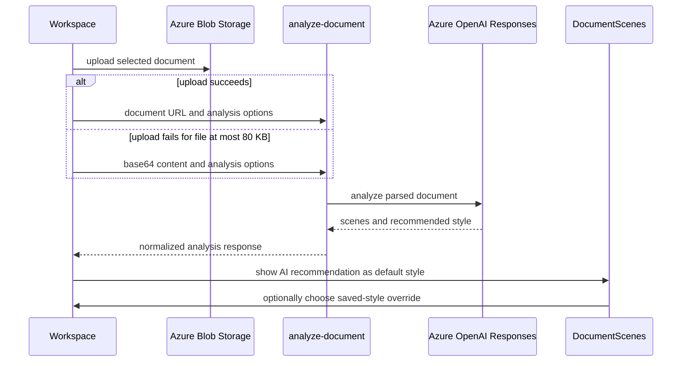

# Creation workspace, documents, and exports

`InfographicGenerator.jsx` is the creation workspace composition point. It combines generation, document analysis, transforms, styles, templates, history, settings and sharing components. Its hooks isolate remote interactions: `useImageGeneration`, `useDocumentAnalysis`, `useImageTransform`, `useStyles`, `useTemplates`, and `useHistory`.

## Generation and persistence

`useImageGeneration.runGeneration` requires a script, aborts an earlier browser wait, concurrently asks for a filename, builds a style/content/language prompt, calls `generateImage`, and polls a returned job. The generation model is display/progress state; server policy is authoritative. `useHistory` compresses images to max 800px JPEG before saving, while history deletion is optimistic and restores only failed deletions. Styles are debounced (300ms) server searches; saving compresses preview images. Templates snapshot script/style data.

`useImageTransform` limits source files to 10 MB, requests Blob SAS, uploads with XHR progress, retains preview plus SAS URL, and merges user prompt, palette tags and saved-style prompt before `/image-transform`. Cancellation aborts waiting, not necessarily remote work. See [AI generation](../backend/ai-generation.md) and [resources](../backend/resources.md).

`ImageGeneratingState` centralizes the visual in-progress treatment used by both `ImagePreview` for general creation and `DocumentScenes` / `SceneModal` for per-scene work. Its normal variant selects a framed layout for `16:9`, `4:3`, `1:1`, or `9:16`; its `compact` variant fills the caller's image region. Both variants expose `aria-busy`, and its screen-reader-only status uses `generationStatus.label` when supplied. It owns presentation only: `ImagePreview` and `DocumentScenes` still decide whether their respective request is generating. When changing this feedback, preserve that ownership split and check both general preview and scene-card/modal placements; there is no focused component test. Run `pnpm exec eslint src/components/create/ImagePreview.jsx src/components/create/DocumentScenes.jsx src/components/create/ImageGeneratingState.jsx`; perform an interactive check of normal and compact layouts only for styling, accessibility, or aspect-ratio changes.

## Document-to-scenes

`DocumentUploader` and `useDocumentAnalysis` enforce the same 50 MB browser limit and extension allow-list in `src/lib/documentFormats.js`: PDF; Word, PowerPoint, and Excel variants; OpenDocument; RTF; EPUB; CSV; TXT/Markdown; and PNG/JPEG. The shared module builds the file-input `accept` value, validates extensions, and supplies a deterministic MIME type when the browser reports none or `application/octet-stream`; it is also used by `storageService.uploadFileToBlob`. It uploads first to Blob to avoid SWA body limits; only if upload fails and the file is at most 80 KB does it send base64. It sends filename, MIME, requested `sceneCount` (or `auto`), and `mode` (`storyboard` or `presentation`).

This sequence shows client transport fallback and style ownership. Parsing, SSRF checks, response validation, and provider input adaptation remain server responsibilities in [AI generation](../backend/ai-generation.md).

The returned normalized object includes `title`, `summary`, `recommended_style`, `scenes`, `characters`, `total_scenes`, `estimated_generation_time`, `analysis_mode`, plus server provenance fields `analysis_provider`, `analysis_model`, `source_parser`, and `source_format`. `recommended_style` is `{ name, description, prompt, tags }`; the server rejects a response without its nonempty `prompt`. `InfographicGenerator` uses it as the default document-wide image style. A saved style chosen in `DocumentScenes` becomes a local `documentStyleOverride`; clearing that override restores the AI recommendation, while clearing or successfully replacing the document clears the override. Every scene generation passes the current style `prompt` as `analyzedStyle`, saves that prompt to history, and—only for a saved-style override—saves `styleId` and calls `markStyleUsed` after the image succeeds. The same prompt is supplied to scene optimization. This document-specific selection does not change the general workspace's `analyzedStyle`.

Each scene has compatible snake/camel source fields mapped to `scene_number`, title, description, visual prompt, key elements, mood, source text, plus guarded array `bullet_points`, `speaker_notes`, and `layout_type`. Local scene edits and deletions renumber `scene_number`; consumers must preserve this ordering when generating/exporting scenes. Server parsing, conversion errors, required recommendation, and provider input selection are specified in [AI generation](../backend/ai-generation.md). The feature-oriented `docs/PPTX_EXPORT.md` describes the style UX but currently calls the analysis provider Gemini; the handler and Azure Responses adapter show that current runtime analysis uses the configured Azure OpenAI deployment, so treat that provider statement as stale.

While an analysis is pending, `DocumentUploader::AnalysisProgress` shows an accessible client-side progress panel. It begins at mount, advances its displayed stages from elapsed time (reading before 5 seconds, analysis before 15, generation thereafter) and the hook's coarse phase strings, and caps the simulated bar at 95%. It is user feedback rather than server-side parser/provider telemetry; do not use it to infer that a remote phase completed. Outline input reports presentation mode and its generated `outline.txt` label; file input uses the selected analysis mode and filename.

When changing browser format support, update `documentFormats.js` first, then keep the server policy in [resources](../backend/resources.md) and [AI generation](../backend/ai-generation.md) aligned. `src/lib/__tests__/documentFormats.test.js` covers extension acceptance, MIME fallback, and the generated accept list; `src/services/__tests__/aiService.test.js` covers analysis request metadata. Run `pnpm test --run src/lib/__tests__/documentFormats.test.js src/services/__tests__/aiService.test.js`. No focused test covers document-style reset/override, per-scene style propagation, or the simulated progress panel; add component coverage when changing those behavior boundaries. Do not treat these client checks as proof that AnyDoc can convert a newly allowed format.

## Export boundary

Image, PDF, and PowerPoint output are browser artifacts, not API records. `DocumentScenes.jsx::exportToPptx()` excludes scenes without `generatedImage`; if none qualify it reports rather than writes a deck. It creates a 16:9 deck, one slide per included scene, with scene number/title, editable bullet text, generated image on the right, and optional speaker notes. Bullets use `bullet_points` when nonempty, otherwise `scene_description`. It loads/embed-converts images in parallel; a failed/CORS-blocked image becomes `null`, produces a partial-image warning, and does not discard other slides. Export-level errors remain visible. Filename sanitization permits word/CJK/space/hyphen characters with `presentation` fallback. Keep client-only download failures visible to the user; no server cleanup occurs. `jspdf` is the PDF dependency.

Focused tests: `generationProgress.test.js` validates time/model progress phases; `pptxExport.test.js` mirrors bullet fallback, API bullet guards, and filename sanitization. Service tests validate request contracts. Run `pnpm test`; browser-test actual export downloads after layout changes.