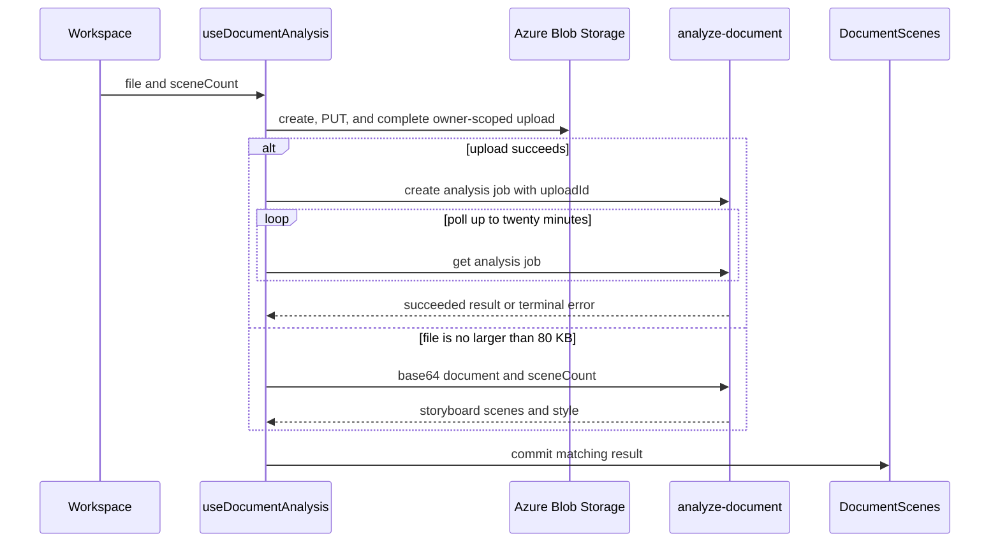
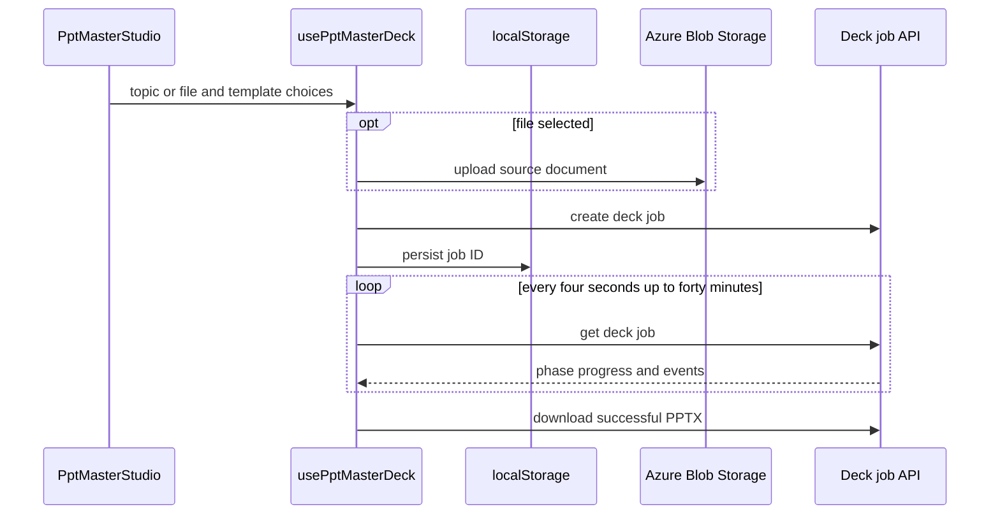

# Creation workspace, document storyboards, and exports

`InfographicGenerator.jsx` is the browser composition point for general image creation, document storyboards, image transforms, settings, library, and PPT Master. Shared asset lists compose through [Asset Center](asset-center.md); server model and document contracts are canonical in [AI generation](../backend/ai-generation.md).

The document area has two intentionally independent paths: **Document storyboard** calls `useDocumentAnalysis` and renders `DocumentScenes`; **PPT Master** renders `PptMasterStudio` and owns durable deck-job state. The previous editable company-template presentation path is not a current browser or API surface. Do not introduce `slides`, `slideCount`, or a presentation `mode` into the document-analysis request without restoring a complete server contract, route registration, and consumer workflow.

## General image output settings

`InfographicGenerator` derives its active image-model configuration from the authenticated public profile: it finds `modelPolicy.defaultModel` in `imageModels`, initializes quality from that model's `defaultQuality`, and blocks generation for a missing catalog/default or a quality no longer supported by that model. `GenerateBar` renders only the selected model's configured quality options; quality remains rendering effort, not resolution. The browser has no renderer/model picker: policy selection remains server-owned. Its `profileError` is also a configuration error rather than a reason to guess a model.

`generateImage` serializes `imageQuality` under the API field name `quality`, but it no longer submits a final `prompt` or a client-selected `model`. It sends `userScript`, optional reusable `stylePrompt`, palette `styleTags` as an array, `purpose`, `imageLanguage`, and aspect ratio; the BFF applies tenant model policy and assembles the final labeled prompt. `InfographicGenerator` owns ordinary-creation `imagePurpose`, initialized to `infographic`, and passes it through `ScriptEditor`'s `infographic`, `storyboard`, and `freeform` selector. Storyboard-scene generation remains fixed at `purpose: 'storyboard'`. `freeform` omits only deliverable-specific composition defaults; explicit canvas, style, reference, and text settings still reach the server. The other purposes add system composition only when content has not already specified framing. The client retains palette selections as an array so the server can normalize/de-duplicate them, while history still records a human-readable joined style string. `useImageGeneration` uses the returned `prompt` as `finalPrompt`; for queued GPT work that prompt arrives with the `202` job response.

The transform workspace reuses the fixed `GenerateBar` below `ImageTransformPanel`, rather than owning a separate output-settings or action control. `InfographicGenerator` therefore supplies the same `imageSize`, `imageQuality`, aspect-ratio controls, primary action, cancellation, and disabled state to both general generation and transforms. `getImageOutputLabel` is the shared presentation formatter used by the bar, general `ImagePreview`, and compact transform state. Its current browser map has labels for `16:9`, `4:3`, `1:1`, and `9:16`. It still labels `16:9` as `1536×1024` and `9:16` as `1024×1536`, while the server provider adapter currently requests `1536x864` and `864x1536`; treat that display/request mismatch as a cross-layer correction, not as a model setting. `generationProgress.js` similarly has one GPT Image phase sequence rather than model-dependent timing. Its `actionKind` selects a semantic `ProductGlyph` for the idle action. While generating, `GenerateBar` uses the registry-owned decorative `Loader2` spinner but keeps its progress label in the disabled action. `ImageGeneratingState` instead renders a final-aspect-ratio placeholder with static dots, two CSS-driven glow layers, a visible status label, and a non-compact prompt summary (or helper text when no summary exists). It normalizes summary whitespace and clips it to 180 characters before appending an ellipsis when needed. It is an atomic polite busy status region; compact scene/transform previews retain only the status overlay and resolution badge. The CSS drift/breathe animation and the `Loader2` spin stop for reduced-motion users. These presentation components do not alter request inputs, progress values, or cancellation semantics; their animation and reduced-motion boundary is documented in [shared UI motion, theme, and semantic icon styling](design-system.md). `handleTransform` passes `imageSize`, `imageQuality`, and `imageLanguage` into `useImageTransform::runTransform`; the hook now sends the raw edit `prompt`, saved `stylePrompt`, and palette `styleTags` separately with aspect ratio so the BFF can section them correctly. `ImageTransformPanel` gives optimizer requests `optimizationMode: 'transform'`, `transformMode`, and aspect ratio; it does not own the final preservation/canvas/text rules. `useImageTransform` preserves the BFF-applied prompt, receives `202` for every transform, and calls `waitForImageJob` until its owner-scoped terminal result provides `imageUrl`. `useImageGeneration` likewise receives `202` and polls for both plain generation and an owned-reference edit; there is no direct image result. Cancelling either hook aborts browser waiting only; queued server work can continue in the worker. Server assembly, validation, mode semantics, and durable-job behavior are canonical in [AI generation](../backend/ai-generation.md); the operation/source migration is in [schema](../data/schema.md).

For a purpose-selector or generation request/response change, edit `InfographicGenerator.jsx`, `ScriptEditor.jsx`, `useImageGeneration.js`, `aiService.js`, `imagePrompt.js`, `generate-images/index.js`, and `api/_shared/__tests__/imagePrompt.test.js` together. For shared output controls, follow `GenerateBar.jsx` through both its general and transform callers; keep `useImageTransform::runTransform` and `aiService::transformImage` aligned when adding a forwarded setting. For displayed output dimensions, change `src/lib/imageOutput.js` rather than copying a ratio map into a caller; for actual provider dimensions, change `api/_shared/gptImage.js` and reconcile both maps in the same change. Cover mapped display labels in `imageOutput.test.js`, provider sizes in `gptImage.test.js`, and keep `ImagePreview.test.jsx` representative of forwarded props. Include `imageTextLanguage.js` and `imageTextLanguage.test.js` when changing language defaults or quoted-text behavior, and `ImageTransformPanel.jsx` plus `image-transform/index.js` when changing the transform-specific UI, shared language directive, or transform response. `imagePrompt.test.js` proves server prompt composition and `aiService.test.js` proves the browser payload, including `quality`; `useImageTransform.test.js` proves a queued response is polled to its result, while `image-transform/index.test.js` and `imageJobs.test.js` cover the server handoff and worker-time source resolution. These do not replace a status-handler or migration integration test.

```sh
pnpm test --run api/_shared/__tests__/imagePrompt.test.js src/services/__tests__/aiService.test.js api/_shared/__tests__/gptImage.test.js api/_shared/__tests__/imageJobs.test.js api/image-transform/__tests__/index.test.js src/hooks/__tests__/useImageTransform.test.js
```

`GenerateBar.test.jsx` checks that `actionKind` resolves to the semantic glyph and that in-progress rendering uses a decorative spinner without hiding progress text or enabling the action. `ImageGeneratingState.test.jsx` checks the atomic busy live region, final-aspect placeholder, dots and glow layers, resolution badge, visible status/prompt summary, and compact rendering without the non-compact text line. `ImagePreview.test.jsx` proves general-preview forwarding for a ratio label; `imageOutput.test.js` covers the pure fixed aspect-ratio mapping. `useImageGeneration.test.js` covers all six supported quality values, asynchronous admission/polling, job-ID preservation, mismatched-result rejection, reference edits, and cancellation. `image-jobs/__tests__/index.test.js` covers owner-scoped status/result behavior; generation/transform handler suites cover their explicit input guards; `imageCatalog.integration.test.js` covers the isolated migration but is `TEST_DATABASE_URL`-gated and was skipped locally because Docker Engine was unavailable. These are mocked or isolated checks, not a live Azure, production migration, or worker/Blob integration run. A UI-only change normally does not require a package build; run consumer-facing handler and hook checks when changing JSON fields, allowed values, or returned job data.

## Image-text preference and optimization flow

`InfographicGenerator` initializes `imageLanguage` from `localStorage` key `genpic_image_language`, with `DEFAULT_IMAGE_LANGUAGE` as the fallback, and persists a changed value through `handleLanguageChange`. The setting controls text rendered **inside generated images**, not the browser UI language or the language of a user's prompt. Changing language or aspect ratio clears `optimizedPromptEn`, preventing an optimized content brief from being reused under changed optimizer context.

`ScriptEditor::handleOptimize` calls `aiService::optimizePrompt` with `userScript`, style context, image language, purpose, aspect ratio, and `optimizationMode: 'generation'`. Selecting a purpose or changing saved/palette style also clears the stored optimized English brief. `DocumentScenes::SceneModal` calls `aiService::optimizeScene` with scene fields, selected style context, image language, and aspect ratio. `ImageTransformPanel` uses `optimizationMode: 'transform'` plus the selected transform mode and aspect ratio; `useImageTransform` sends the actual image-language setting with its separate content/style fields. `AssetMetadataSheet` uses `optimizationMode: 'style_description'` to improve unsaved style prose. `aiService.js` is the common serialization seam. The server-side strategy and final prompt contract are canonical in [AI generation](../backend/ai-generation.md); every wrapper or reshaped request must preserve its applicable context.

For a new language ID, optimizer context, quoted-text/default-language behavior, or no-text behavior, update the settings option, default/consumer invalidation, `imageTextLanguage.js`, `imagePrompt.js`, `imagePromptStrategy.js`, generation and transform paths, both optimizer request paths, and focused tests together. The helper accepts only `en`, `zh-TW`, `zh-CN`, `ja`, `ko`, `es`, `fr`, `de`, and `none`; absent or unsupported values intentionally produce no extra directive. For a recognized language, quoted literal text stays exactly as authored and is rendered only at the requested count; necessary requested text without exact wording uses the selected language, while filler text is forbidden. `none` prohibits all text. `freeform` retains this explicit setting, despite omitting purpose-specific composition defaults. `api/_shared/__tests__/imageTextLanguage.test.js` verifies the helper; `imagePromptStrategy.test.js` verifies context serialization. There is no focused browser-propagation or optimizer-handler test, and `aiService.test.js` does not assert either optimization payload.

```sh
pnpm test --run api/_shared/__tests__/imagePromptStrategy.test.js api/_shared/__tests__/imagePrompt.test.js api/_shared/__tests__/imageTextLanguage.test.js
```

## Document upload and storyboard analysis

`DocumentUploader` accepts one supported file, permits a 1–10 or `auto` scene count, and has a 50 MB browser limit. It uses `src/lib/documentFormats.js` for the accept attribute, extension validation, and MIME fallback. The allowed set is PDF; Word, PowerPoint, and Excel variants; OpenDocument; RTF; EPUB; CSV; TXT/Markdown; and PNG/JPEG. It does not accept a pasted outline mode.



This diagram covers client transport only; server-owned upload authorization is canonical in [Owner-scoped uploads and staged Blob storage](../backend/uploads.md), while parsing, model selection, normalization, and the durable queue are in [AI generation](../backend/ai-generation.md).

`useDocumentAnalysis` uses `storageService::uploadFile` first: create the record, direct-PUT the fixed staging URL, and complete promotion before it calls `aiService::analyzeDocument`. With an `uploadId`, that adapter creates a document job and polls it every two seconds for up to twenty minutes; it returns the persisted `result` only after `succeeded`, and propagates terminal job errors. After an upload failure it sends base64 only for files at most 80 KB to the synchronous fallback. It commits state only when `result.scenes` is nonempty. `AnalysisProgress` is elapsed-time/coarse-phase feedback capped below completion; it is not queue telemetry. `clearDocument` clears the local result, selected-file metadata, phase, and error.

For browser format, upload, or request-shape work, update `documentFormats.js`, `DocumentUploader.jsx`, `useDocumentAnalysis.js`, `storageService.js`, and `aiService.js` together, then align the server pages linked above. Do not send a document URL, SAS token, container, or filename as a trusted analysis source once an upload ID exists. `documentFormats.test.js` covers extension acceptance/MIME fallback; `storageService.test.js` covers browser grant validation and the create-PUT-complete flow; `aiService.test.js` covers document-job serialization/polling.

```sh
pnpm test --run src/lib/__tests__/documentFormats.test.js src/services/__tests__/storageService.test.js src/services/__tests__/aiService.test.js src/hooks/__tests__/useDocumentAnalysis.test.js
```

## Storyboard editing and browser exports

Storyboard responses contain scenes plus a required AI-recommended style. `DocumentScenes` uses the recommendation by default; applying a saved style creates a local `documentStyleOverride`, and clearing/replacing the document clears that override. Scene generation uses the selected prompt as `analyzedStyle`, saves output to history, and marks a saved style as used only for an explicit override.

`useDocumentAnalysis::updateScene` merges edits by index. `removeScene` removes an item, reassigns `scene_number` in display order, and synchronizes `total_scenes`. These are local draft changes. Keep the scene contract separate from the server's normalization boundary: users can edit data after it was normalized.

`DocumentScenes::exportToPptx()` passes valid object scenes to `src/utils/pptxExport.js`. The browser dynamically loads `pptxgenjs`, fetches/base64-embeds available images, and downloads a 16:9 deck. PDF is also browser output. Valid native table/chart data takes precedence over a generated image or placeholder. The pure exporter retains image-less valid scenes once an export action is available.

`getPptxTables` and `getPptxCharts` re-normalize editable data: one table/chart, eight table columns, ten rows, twelve chart labels, and four series. `pptxExport.test.js` covers valid scene selection, image-less scenes, bullet fallback, filename sanitization, table limits, and chart aliases/numbers.

```sh
pnpm test --run src/utils/__tests__/pptxExport.test.js
```

## PPT Master design-deck workflow

`PptMasterStudio` is an asynchronous topic-or-document deck generator, distinct from the document storyboard. It accepts a topic of at least four characters or an optional supported file, limits a file to 50 MB, selects sidecar-provided style/layout plus `none`, `key`, or `every` image density, and allows 4–20 slides. The selected file uploads to `uploads`; `usePptMasterDeck::generate` creates the durable job.

The studio keeps these inputs in one `setup` object. `DeckSetupForm` is its controlled editor, organized as collapsible content, specification, and visual-design sections; it emits field patches and contains the recipe prefill rule. Before generation, `DeckBlueprint` derives its title, setup digest, and optional selected-style samples from that object. This keeps the preflight summary and submitted job input aligned without giving the blueprint its own state. Once a job is generating or ready, `DeckSetupSummary` collapses the form but can reopen it for inspection; it does not alter an already submitted job.



This sequence shows the PPT Master browser lifecycle from setup through server-owned job completion.

`DeckRecipePicker` appears before the normal topic/template settings. It selects `general` or a purpose-driven recipe and applies only local suggestions for slide count, image density, and a preferred style that is actually present in the fetched catalog; users may change all three afterwards. `PptMasterStudio` also collects optional purpose, audience, and intended-outcome fields, each capped at 200 characters to match the handler. `usePptMasterDeck::generate` -> `aiService::createDeckJob` forwards `recipeId` and the three brief fields alongside the existing job input. The recipe controls narrative structure; style/layout controls visual intent. Server normalization, persistence, design-system generation, and enforced spine behavior are canonical in [PPT Master deck jobs](../backend/ppt-master-decks.md).

`PptTemplatePicker` remains a text-first selector. `DeckBlueprint` is now the sole pre-generation display for static SVG samples from `templatePreviewManifest.js`; it shows the selected style's samples alongside the setup digest. A template with no manifest entry, or an image that fails to load, still renders as a selectable text card or an empty blueprint state. Samples demonstrate color, type, and decorative vocabulary—not deterministic page geometry—because production pages are independently authored. The manifest and `public/template-previews/styles/` SVG pairs are generated browser assets: `node api/scripts/generate-style-previews.cjs` is their producer, and it must be rerun after a PPT Master version, design-system, or frame change. Their generation pipeline is described in [PPT Master deck jobs](../backend/ppt-master-decks.md); the API registry is documented in [HTTP API](../backend/http-api.md).

The hook stores the active job under `genpic_deck_job`. On mount, queued/processing jobs resume polling; succeeded jobs restore the download state; a missing job clears the ID without an error; a terminal failure clears it with the server message. `waitForDeckJob` polls every four seconds for up to forty minutes, propagates `AbortError`, `AuthExpiredError`, and `404` immediately, retries other poll errors until five consecutive failures, and retains the ID after transient failure. `stopWatching` stops local browser I/O and removes continuation state; it does not cancel server work.

Previews are keyed by slide revision. `usePptMasterDeck` fetches each needed SVG once, exposes an object URL, refetches after a revision changes, revokes replaced/reset/unmounted URLs, and treats preview failure as non-fatal to job lifecycle. `DeckPreviewStage` composes the large current-page image with `DeckSlideRail`. With no explicit selection, `PptMasterStudio` passes the highest authored preview as the stage page, so the stage follows progress. Selecting a rail item or previous/next navigation pins that page; `回到最新` clears the selection and resumes following. The rail remains a sandboxed `` representation of the server-authored SVG and provides placeholders for planned but not-yet-authored pages. `DeckProgress` and `DeckTimeline` consume the append-only server event trace; `buildTimeline` sorts events by ID and keeps the newest state per step and per slide.

For studio composition, setup forwarding, blueprint samples, polling, event, or preview changes, start with `PptMasterStudio.jsx`, `DeckSetupForm.jsx`, `DeckSetupSection.jsx`, `DeckBlueprint.jsx`, `DeckPreviewStage.jsx`, `DeckSlideRail.jsx`, `DeckRecipePicker.jsx`, `pptRecipeCopy.js`, `PptTemplatePicker.jsx`, `templatePreviewManifest.js`, `usePptMasterDeck.js`, `DeckProgress.jsx`, `DeckTimeline.jsx`, `deckSteps.js`, and `aiService.js`, then follow the durable job seam in [PPT Master deck jobs](../backend/ppt-master-decks.md). Do not hand-edit `templatePreviewManifest.js` or files under `public/template-previews/styles/`; regenerate them from the canonical script when a source-backed preview change is required. `PptMasterStudio.test.jsx` covers idle blueprint and disabled submission, setup collapse, planned-page placeholders, latest-page following, manual pinning and return to latest, image-density forwarding, recipe prefill/available-style behavior, and structured-brief forwarding. `pptRecipeCopy.test.js` ensures frontend options and defaults match backend recipe IDs and accepted slide range; `templatePreviewManifest.test.js` verifies declared files exist and missing entries return an empty list. `usePptMasterDeck.test.jsx` covers resumption, missing/failed jobs, transient failure, stop tracking, preview revision caching, URL release, and non-fatal preview failure. These are not handler, Blob, worker, or authorization tests.

```sh
pnpm test --run src/components/create/__tests__/PptMasterStudio.test.jsx src/components/create/__tests__/pptRecipeCopy.test.js src/components/create/__tests__/templatePreviewManifest.test.js src/hooks/__tests__/usePptMasterDeck.test.jsx src/services/__tests__/aiService.test.js
```

## Change navigation

Consult this page for React composition, document upload/fallback, storyboard state, browser exports, or the PPT Master browser lifecycle. Start with `InfographicGenerator.jsx` to identify the active path. Use [AI generation](../backend/ai-generation.md) for document/model/provider changes, [PPT Master deck jobs](../backend/ppt-master-decks.md) for deck worker or contract changes, [HTTP API](../backend/http-api.md) for public route/OpenAPI changes, and [operations](../operations/development-deployment.md) only for configuration or deployment work.
