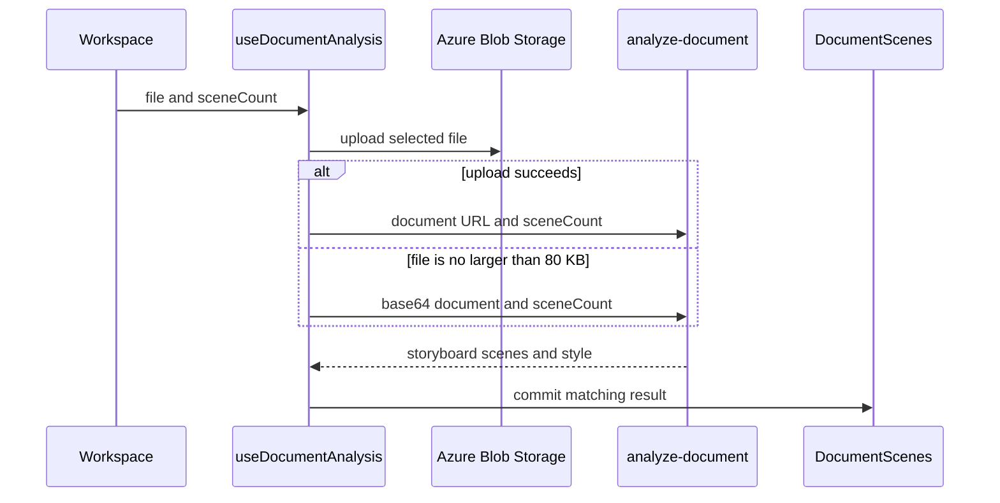
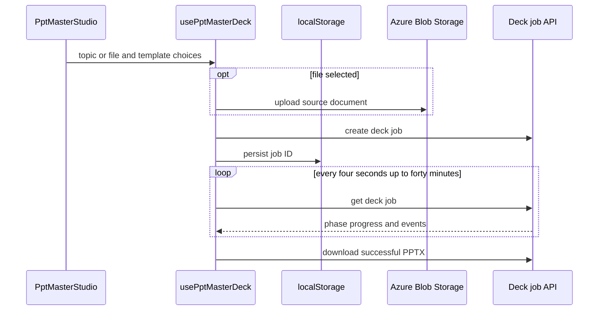

# Creation workspace, document storyboards, and exports

`InfographicGenerator.jsx` is the browser composition point for general image creation, document storyboards, image transforms, settings, library, and PPT Master. Shared asset lists compose through [Asset Center](asset-center.md); server model and document contracts are canonical in [AI generation](../backend/ai-generation.md).

The document area has two intentionally independent paths: **Document storyboard** calls `useDocumentAnalysis` and renders `DocumentScenes`; **PPT Master** renders `PptMasterStudio` and owns durable deck-job state. The previous editable company-template presentation path is not a current browser or API surface. Do not introduce `slides`, `slideCount`, or a presentation `mode` into the document-analysis request without restoring a complete server contract, route registration, and consumer workflow.

## General image output settings

`InfographicGenerator` owns one `imageQuality` state value, initialized from `DEFAULT_IMAGE_QUALITY` (`medium`), and passes it to `GenerateBar`, `useImageGeneration`, and `useImageTransform`. `GenerateBar` exposes the `low`/`medium`/`high` control only when the selected configuration has `supportsQuality`—currently `gpt-image-2`. Gemini instead shows its resolution picker; quality is not a resolution alias.

`generateImage` serializes `imageQuality` under the API field name `quality`, but it no longer submits a final `prompt` or a client-selected `model`. It sends `userScript`, optional reusable `stylePrompt`, palette `styleTags` as an array, `purpose`, and `imageLanguage`; the BFF applies tenant model policy and assembles the final prompt. `InfographicGenerator` uses `purpose: 'infographic'` for ordinary creation and `purpose: 'storyboard'` for storyboard scenes. It retains palette selections as an array so the server can normalize/de-duplicate them, while history still records a human-readable joined style string. `useImageGeneration` uses the returned `prompt` as `finalPrompt`; for queued GPT work that prompt arrives with the `202` job response.

`transformImage` similarly serializes `imageLanguage`; `useImageTransform` returns the BFF-applied `prompt` when available. `ImageTransformPanel` also forwards the preference when it asks the optimizer for a transform suggestion. Server assembly, validation, mode semantics, and durable-job behavior are canonical in [AI generation](../backend/ai-generation.md); the quality column migration is in [schema](../data/schema.md).

For this public request/response change, edit `InfographicGenerator.jsx`, `useImageGeneration.js`, `aiService.js`, `imagePrompt.js`, `generate-images/index.js`, and `api/_shared/__tests__/imagePrompt.test.js` together. Include `useImageTransform.js`, `ImageTransformPanel.jsx`, and `image-transform/index.js` when the shared language directive or transform response changes. `imagePrompt.test.js` proves server prompt composition and `aiService.test.js` proves the browser payload, including `quality`; neither is a handler or hook test.

```sh
pnpm test --run api/_shared/__tests__/imagePrompt.test.js src/services/__tests__/aiService.test.js api/_shared/__tests__/gptImage.test.js
```

There is no focused `GenerateBar`, generation-hook, transform-hook, handler, or async-worker test for this request boundary. A UI-only change normally does not require a package build; run a consumer-facing API check when changing the JSON field, allowed values, server-returned prompt, or model-dependent visibility.

## Image-text preference and optimization flow

`InfographicGenerator` initializes `imageLanguage` from `localStorage` key `genpic_image_language`, with `DEFAULT_IMAGE_LANGUAGE` as the fallback, and persists a changed value through `handleLanguageChange`. The setting controls text rendered **inside generated images**, not the browser UI language or the language of a user's prompt. It already travels with `generateImage`; it now also travels through both optimization paths so an optimized English prompt does not contradict the final image-generation instruction.

`ScriptEditor::handleOptimize` calls `aiService::optimizePrompt({ userScript, styleContext, imageLanguage })` for the general creation editor. `DocumentScenes::SceneModal` calls `aiService::optimizeScene` with the scene fields, selected style context, and the same `imageLanguage`. `ImageTransformPanel` passes it to its optimization request, while `useImageTransform` passes it to the actual transform. `aiService.js` serializes the optional field to both optimizer endpoints and `/api/image-transform`; generation sends it to `/api/generate-images`. The server-side directive and prompt contract are canonical in [AI generation](../backend/ai-generation.md). Every wrapper or reshaped request must preserve the field.

For a new language ID or a change to the no-text behavior, update the settings option, default/consumer wiring, `imageTextLanguage.js`, `imagePrompt.js`, generation and transform paths, both optimizer request paths, and focused tests together. The helper accepts only `en`, `zh-TW`, `zh-CN`, `ja`, `ko`, `es`, `fr`, `de`, and `none`; absent or unsupported values intentionally produce no extra directive. `api/_shared/__tests__/imageTextLanguage.test.js` currently verifies a recognized language, `none`, and absent/unsupported optimizer values. There is no focused browser-propagation or optimizer-handler test, and `aiService.test.js` does not assert either optimization payload.

```sh
pnpm test --run api/_shared/__tests__/imageTextLanguage.test.js
```

## Document upload and storyboard analysis

`DocumentUploader` accepts one supported file, permits a 1–10 or `auto` scene count, and has a 50 MB browser limit. It uses `src/lib/documentFormats.js` for the accept attribute, extension validation, and MIME fallback. The allowed set is PDF; Word, PowerPoint, and Excel variants; OpenDocument; RTF; EPUB; CSV; TXT/Markdown; and PNG/JPEG. It does not accept a pasted outline mode.



This diagram covers client transport only; parsing, SSRF checks, model selection, and normalization are server responsibilities in [AI generation](../backend/ai-generation.md).

`useDocumentAnalysis` uploads to `uploads` first to avoid Static Web App request limits. After an upload failure it sends base64 only for files at most 80 KB. It commits state only when `result.scenes` is nonempty. `AnalysisProgress` is elapsed-time/coarse-phase feedback capped below completion; it is not server telemetry. `clearDocument` clears the local result, selected-file metadata, phase, and error.

For browser format or request-shape work, update `documentFormats.js`, `DocumentUploader.jsx`, `useDocumentAnalysis.js`, and `aiService.js` together, then align the server in [AI generation](../backend/ai-generation.md). `documentFormats.test.js` covers extension acceptance, MIME fallback, and the accept list; `aiService.test.js` verifies the `/api/analyze-document` metadata payload.

```sh
pnpm test --run src/lib/__tests__/documentFormats.test.js src/services/__tests__/aiService.test.js
```

## Storyboard editing and browser exports

Storyboard responses contain scenes plus a required AI-recommended style. `DocumentScenes` uses the recommendation by default; applying a saved style creates a local `documentStyleOverride`, and clearing/replacing the document clears that override. Scene generation uses the selected prompt as `analyzedStyle`, saves output to history, and marks a saved style as used only for an explicit override.

`useDocumentAnalysis::updateScene` merges edits by index. `removeScene` removes an item, reassigns `scene_number` in display order, and synchronizes `total_scenes`. These are local draft changes. Keep the scene contract separate from the server's normalization boundary: users can edit data after it was normalized.

`DocumentScenes::exportToPptx()` passes valid object scenes to `src/utils/pptxExport.js`. The browser dynamically loads `pptxgenjs`, fetches/base64-embeds available images, and downloads a 16:9 deck. PDF is also browser output. Valid native table/chart data takes precedence over a generated image or placeholder. The pure exporter retains image-less valid scenes once an export action is available.

`getPptxTables` and `getPptxCharts` re-normalize editable data: one table/chart, eight table columns, ten rows, twelve chart labels, and four series. `pptxExport.test.js` covers valid scene selection, image-less scenes, bullet fallback, filename sanitization, table limits, and chart aliases/numbers.

```sh
pnpm test --run src/utils/__tests__/pptxExport.test.js
```

## PPT Master design-deck workflow

`PptMasterStudio` is an asynchronous topic-or-document deck generator, distinct from the document storyboard. It accepts a topic of at least four characters or an optional supported file, limits a file to 50 MB, selects sidecar-provided style/layout plus `none`, `key`, or `every` image density, and allows 4–12 slides. The selected file uploads to `uploads`; `usePptMasterDeck::generate` creates the durable job.



The server queue, authorization, SVG authoring, sidecar quality gate, Blob output, and template-canvas rules are canonical in [PPT Master deck jobs](../backend/ppt-master-decks.md). The API registry is documented in [HTTP API](../backend/http-api.md).

The hook stores the active job under `genpic_deck_job`. On mount, queued/processing jobs resume polling; succeeded jobs restore the download state; a missing job clears the ID without an error; a terminal failure clears it with the server message. `waitForDeckJob` polls every four seconds for up to forty minutes, propagates `AbortError`, `AuthExpiredError`, and `404` immediately, retries other poll errors until five consecutive failures, and retains the ID after transient failure. `stopWatching` stops local browser I/O and removes continuation state; it does not cancel server work.

Previews are keyed by slide revision. `usePptMasterDeck` fetches each needed SVG once, exposes an object URL, refetches after a revision changes, revokes replaced/reset/unmounted URLs, and treats preview failure as non-fatal to job lifecycle. `DeckProgress` and `DeckTimeline` consume the append-only server event trace; `buildTimeline` sorts events by ID and keeps the newest state per step and per slide.

For studio, polling, event, or preview changes, start with `PptMasterStudio.jsx`, `usePptMasterDeck.js`, `DeckProgress.jsx`, `DeckTimeline.jsx`, `deckSteps.js`, and `aiService.js`, then follow the server seam in [PPT Master deck jobs](../backend/ppt-master-decks.md). `PptMasterStudio.test.jsx` covers idle/generating/completed composition and rail selection; `usePptMasterDeck.test.jsx` covers resumption, missing/failed jobs, transient failure, stop tracking, preview revision caching, URL release, and non-fatal preview failure. These are not handler, Blob, worker, or authorization tests.

```sh
pnpm test --run src/components/create/__tests__/PptMasterStudio.test.jsx src/hooks/__tests__/usePptMasterDeck.test.jsx src/services/__tests__/aiService.test.js
```

## Change navigation

Consult this page for React composition, document upload/fallback, storyboard state, browser exports, or the PPT Master browser lifecycle. Start with `InfographicGenerator.jsx` to identify the active path. Use [AI generation](../backend/ai-generation.md) for document/model/provider changes, [PPT Master deck jobs](../backend/ppt-master-decks.md) for deck worker or contract changes, [HTTP API](../backend/http-api.md) for public route/OpenAPI changes, and [operations](../operations/development-deployment.md) only for configuration or deployment work.
