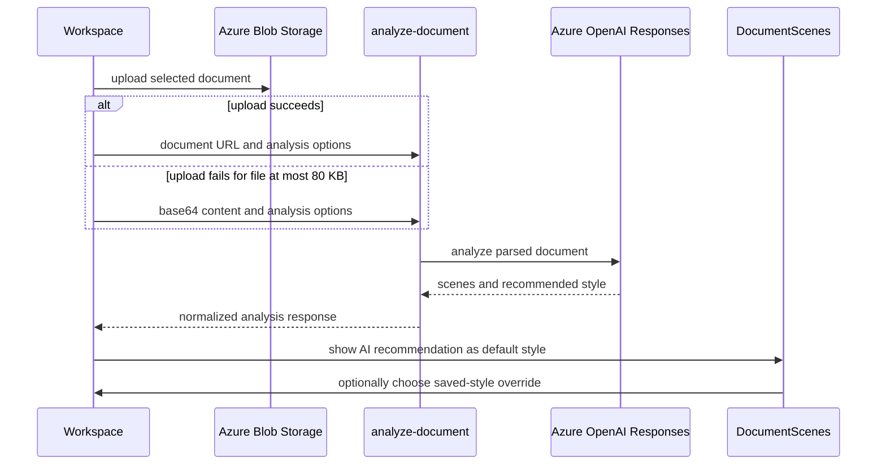

# Creation workspace, documents, and exports

`InfographicGenerator.jsx` is the creation workspace composition point. It combines general generation, document analysis, transforms, settings, sharing, and the library tab. Its hooks isolate remote interactions: `useImageGeneration`, `useDocumentAnalysis`, `useImageTransform`, `useStyles`, `useTemplates`, and `useHistory`. Templates, saved styles, and history are now composed through [Asset Center](asset-center.md), rather than independent creation tabs.

## Generation and persistence

`useImageGeneration.runGeneration` requires a script, aborts an earlier browser wait, concurrently asks for a filename, builds a style/content/language prompt, calls `generateImage`, and polls a returned job. The generation model is display/progress state; server policy is authoritative. `useHistory` compresses images to max 800px JPEG before saving, while history deletion is optimistic and restores only failed deletions. Styles are debounced (300ms) server searches; saving compresses preview images. Templates snapshot script/style data.

`useImageTransform` limits source files to 10 MB, requests Blob SAS, uploads with XHR progress, retains preview plus SAS URL, and merges user prompt, palette tags and saved-style prompt before `/image-transform`. Cancellation aborts waiting, not necessarily remote work. See [AI generation](../backend/ai-generation.md) and [resources](../backend/resources.md).

`ImageGeneratingState` centralizes the visual in-progress treatment used by both `ImagePreview` for general creation and `DocumentScenes` / `SceneModal` for per-scene work. Its normal variant selects a framed layout for `16:9`, `4:3`, `1:1`, or `9:16`; its `compact` variant fills the caller's image region. Both variants expose `aria-busy`, and its screen-reader-only status uses `generationStatus.label` when supplied. It owns presentation only: `ImagePreview` and `DocumentScenes` still decide whether their respective request is generating. When changing this feedback, preserve that ownership split and check both general preview and scene-card/modal placements; there is no focused component test. Run `pnpm exec eslint src/components/create/ImagePreview.jsx src/components/create/DocumentScenes.jsx src/components/create/ImageGeneratingState.jsx`; perform an interactive check of normal and compact layouts only for styling, accessibility, or aspect-ratio changes.

## Document-to-scenes

`DocumentUploader` and `useDocumentAnalysis` enforce the same 50 MB browser limit and extension allow-list in `src/lib/documentFormats.js`: PDF; Word, PowerPoint, and Excel variants; OpenDocument; RTF; EPUB; CSV; TXT/Markdown; and PNG/JPEG. The shared module builds the file-input `accept` value, validates extensions, and supplies a deterministic MIME type when the browser reports none or `application/octet-stream`; it is also used by `storageService.uploadFileToBlob`. It uploads first to Blob to avoid SWA body limits; only if upload fails and the file is at most 80 KB does it send base64. It sends filename, MIME, requested `sceneCount` (or `auto`), and `mode` (`storyboard` or `presentation`).



This sequence shows client transport fallback and style ownership. Parsing, SSRF checks, response validation, and provider input adaptation remain server responsibilities in [AI generation](../backend/ai-generation.md).

The returned normalized object includes `title`, `summary`, `recommended_style`, `scenes`, `characters`, `total_scenes`, `estimated_generation_time`, `analysis_mode`, plus server provenance fields `analysis_provider`, `analysis_model`, `source_parser`, and `source_format`. `recommended_style` is `{ name, description, prompt, tags }`; the server rejects a response without its nonempty `prompt`. `InfographicGenerator` uses it as the default document-wide image style. A saved style chosen in `DocumentScenes` becomes a local `documentStyleOverride`; clearing that override restores the AI recommendation, while clearing or successfully replacing the document clears the override. Every scene generation passes the current style `prompt` as `analyzedStyle`, saves that prompt to history, and—only for a saved-style override—saves `styleId` and calls `markStyleUsed` after the image succeeds. The same prompt is supplied to scene optimization. This document-specific selection does not change the general workspace's `analyzedStyle`.

Each scene has compatible snake/camel source fields mapped to `scene_number`, title, description, visual prompt, key elements, mood, source text, plus guarded array `bullet_points`, `speaker_notes`, and `layout_type`. In presentation mode, the response may additionally contain one normalized `tables` item and one normalized `charts` item, with `presentation_schema_version: 1`; the server bounds and validates those structures before the browser receives them. Local scene edits and deletions renumber `scene_number`; consumers must preserve this ordering when generating/exporting scenes. Server parsing, conversion errors, required recommendation, provider input selection, and the presentation-schema boundary are specified in [AI generation](../backend/ai-generation.md). The feature-oriented `docs/PPTX_EXPORT.md` describes the style UX but currently calls the analysis provider Gemini; the handler and Azure Responses adapter show that current runtime analysis uses the configured Azure OpenAI deployment, so treat that provider statement as stale.

While an analysis is pending, `DocumentUploader::AnalysisProgress` shows an accessible client-side progress panel. It begins at mount, advances its displayed stages from elapsed time (reading before 5 seconds, analysis before 15, generation thereafter) and the hook's coarse phase strings, and caps the simulated bar at 95%. It is user feedback rather than server-side parser/provider telemetry; do not use it to infer that a remote phase completed. Outline input reports presentation mode and its generated `outline.txt` label; file input uses the selected analysis mode and filename.

When changing browser format support, update `documentFormats.js` first, then keep the server policy in [resources](../backend/resources.md) and [AI generation](../backend/ai-generation.md) aligned. `src/lib/__tests__/documentFormats.test.js` covers extension acceptance, MIME fallback, and the generated accept list; `src/services/__tests__/aiService.test.js` covers analysis request metadata. Run `pnpm test --run src/lib/__tests__/documentFormats.test.js src/services/__tests__/aiService.test.js`. No focused test covers document-style reset/override, per-scene style propagation, or the simulated progress panel; add component coverage when changing those behavior boundaries. Do not treat these client checks as proof that AnyDoc can convert a newly allowed format.

## Export boundary

Image, PDF, and PowerPoint output are browser artifacts, not API records. `DocumentScenes.jsx::exportToPptx()` is available once `scenes.length > 0`; unlike PDF export, it does not require `generatedCount > 0`. It passes valid object scenes through `src/utils/pptxExport.js::getPptxScenes`, creates a 16:9 deck with one slide per returned scene, and renders scene number/title, editable bullet text, and optional speaker notes. Thus, a missing `generatedImage` does not exclude the analyzed slide. `extractPptxBullets` trims and drops empty/null bullet values, then falls back to a nonempty `scene_description`; `sanitizePptxFilename` permits word/CJK/space/hyphen characters with a `presentation` fallback.

For each slide, `getPptxTables` and `getPptxCharts` independently normalize the editable scene data before rendering it. Each helper returns no more than one valid visual: tables are rectangularized and limited to eight columns and ten nonempty rows; charts are limited to twelve labels and four series, numeric strings are converted, invalid values become zero when the series otherwise has data, and `column`/`donut` map to `bar`/`doughnut`. A valid native table or chart takes precedence over the generated image or replacement placeholder in the right column; when both exist, the table uses the upper half and the chart the lower half. This client boundary deliberately repeats the server's response normalization because scene objects can be locally edited. `title_content` and `closing` use a full-width text area only when there is neither a valid native visual nor an embedded image; `closing` also centers its title. `two_column`, `table`, and `chart` are accepted server layout hints, but the exporter does not otherwise branch on them.

`exportToPptx` dynamically loads `pptxgenjs`, fetches and base64-embeds only scenes that have a `generatedImage`, and does so in parallel. If no native visual is valid, a failed/CORS-blocked fetch of an existing image becomes `null`, leaves that slide's text and replacement placeholder intact, and increments the partial-image warning; intentionally image-less scenes do not increment it. Native visuals do not suppress that image fetch, so an image failure may still produce the warning even though the slide displays a table or chart. Export-level errors remain visible. Keep client-only download failures visible to the user; no server cleanup occurs. `jspdf` remains the PDF dependency.

For a PPTX rule change, start with the pure helper when selection, bullet normalization, filename behavior, or visual-data normalization changes; change `addPptxTable`, `addPptxChart`, or `exportToPptx` only for native component options, deck layout, browser I/O, embedding, or download behavior. `src/utils/__tests__/pptxExport.test.js` directly covers bullet fallback/normalization, valid-scene selection including image-less scenes, filename sanitization, table rectangularization/limits, and chart alias/numeric/label fallback. Run:

```sh
pnpm test --run src/utils/__tests__/pptxExport.test.js
```

`api/_shared/__tests__/presentationSchema.test.js` is the corresponding server-contract check; run it with the frontend helper test when changing a shared presentation limit, alias, or fallback policy. Browser-test an actual export only after changing deck layout, dynamic loading, image embedding, or native PPTX rendering; test an image-less scene, an image-bearing scene, a table-only scene, a chart-only scene, and a scene with both visuals. `generationProgress.test.js` validates time/model progress phases, and service tests validate request contracts.