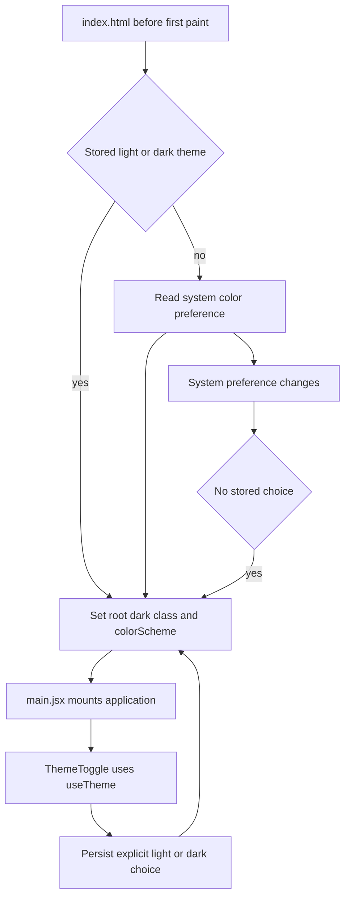
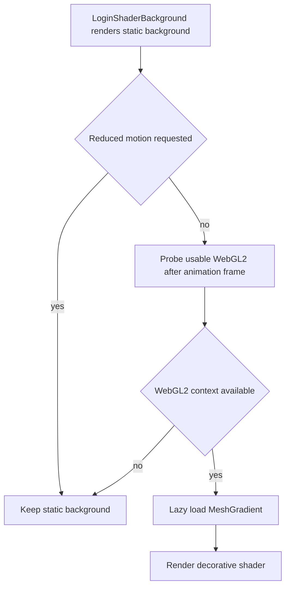

# Shared UI motion, theme, and semantic icon styling

This page is the canonical browser-foundation boundary for the React application in [browser application](application.md). `src/main.jsx` wraps the authenticated app in `MotionProvider`; `InfographicGenerator` surfaces `ThemeToggle`; feature components consume semantic icon components or exports from the curated Lucide registries rather than importing arbitrary icon implementations. It is shared infrastructure, not a resource, API, or product-workflow owner. Feature behavior remains canonical in [creation workflows](create-workflows.md) and [Asset Center](asset-center.md).

## Theme lifecycle

`index.html` runs a small pre-paint script before the application mounts. It reads `localStorage["pixora.theme"]`; only `light` and `dark` are accepted, otherwise it uses `prefers-color-scheme`. It sets the root `dark` class and `colorScheme`, preventing a light-theme flash before CSS and React load. `src/lib/theme.js` applies the same root state at runtime. `useTheme` subscribes with `useSyncExternalStore`, and `ThemeToggle` changes the stored explicit choice while keeping its accessible label synchronized with the target state.



This shows the source-backed theme resolution path. An explicit choice always wins; the `matchMedia` listener updates the root only while no valid stored choice exists. Do not introduce a second theme key, React-only initialization, or a server-side preference source without updating both the pre-paint and runtime boundaries.

`src/index.css` provides separate light and dark token sets. The light tokens distinguish the page background, inset muted surface, and white card/popover elevation; dark tokens make card and popover surfaces progressively lighter than the root background. The theme is therefore an application-wide visual contract, not an isolated toggle decoration.

## Login visual boundary

The public sign-in UI described in [browser application and authentication](application.md) intentionally does not inherit the root theme. `LoginPage` wraps both its loading and interactive states in `login-light-theme`, a scoped light token set in `src/index.css`; `login-glass-panel` supplies the translucent panel. If blur is unsupported, or the user prefers reduced transparency, CSS replaces that surface with an opaque background. This is a readability and preference fallback, not an authentication decision.

`LoginShaderBackground` is decorative (`aria-hidden`) and starts as the static `#83cbea` background. After mount it waits one animation frame, checks for a usable WebGL2 context with `failIfMajorPerformanceCaveat`, releases that probe context, and only then lazy-loads `MeshGradient` from `@paper-design/shaders-react`. `useReducedMotion()` prevents the check and shader render entirely for users who request reduced motion. The always-rendered gradient overlays retain a visual fallback while the lazy module is pending or unavailable.



This shows the source-backed capability and preference gate for the optional login shader.

`MicrosoftMark` is a local, decorative SVG for the branded provider button; it is not a new general-purpose icon vocabulary. The direct Lucide policy below still applies to `lucide-react` imports, while provider-specific marks remain close to their provider control.

## Motion and icon contracts

`MotionProvider` configures `MotionConfig reducedMotion="user"` and `LazyMotion` in strict mode. Its feature loader dynamically imports `src/lib/motionFeatures.js`, which supplies `domAnimation`; animated glyphs import `motion/react-m` and get their shared transition values from `motionTokens.js`. `ProductGlyph`, `ThemeGlyph`, `ViewModeGlyph`, `PixoraMark`, and `GenerationSignature` ask `useReducedMotion` and replace kinetic transforms or loops with static states when users request reduced motion. `GenerationSignature` must retain an accessible textual loading message even though its SVG itself is decorative.

The CSS layer complements this behavior. `src/index.css` imports Tailwind and `tw-animate-css`, declares `--motion-enter` (250 ms), `--motion-exit` (150 ms), `--motion-hover` (200 ms), `--ease-emphasized`, and `--ease-exit`, and changes the durations to `0.01ms` under `prefers-reduced-motion: reduce`. It also owns the `image-generation-drift` and `image-generation-breathe` keyframes used by the creation placeholder's glow and status dot; its local reduced-motion rule removes those repeating animations and fixes glow opacity. `alert-dialog.jsx`, `select.jsx`, and `tooltip.jsx` use distinct state-scoped entry and exit utilities; `button.jsx`, `badge.jsx`, `scroll-area.jsx`, and `tabs.jsx` use shared hover timing. Components that need no movement at all add `motion-reduce:animate-none` or `motion-reduce:transition-none`.

Semantic icon ownership is deliberately centralized:

- `lucideControls.js`, `lucideContent.js`, and `lucideStatus.js` are the only allowed direct `lucide-react` import points. ESLint's `no-restricted-imports` rule and `iconPolicy.test.js` enforce that boundary.
- `iconPolicy.js` fixes the common 24px view box, `1.75` stroke width, five CSS size utilities (`icon-xs` through `icon-display`), and the six `ProductGlyph` kinds: `create`, `document`, `transform`, `library`, `deck`, and `settings`.
- `ProductGlyph` provides the named product action; `ViewModeGlyph` is the animated grid/list/table state marker; `ThemeGlyph` is the light/dark control; and `GenerationSignature` remains the working/success indicator used by deck progress. `Loader2` is the registry-owned decorative spinner used by the image-generation controls. Reuse these or the relevant registry export rather than drawing a near-duplicate in a feature component.

The creation UI consumes `ProductGlyph` for actions and the `lucideStatus` `Loader2` export for the in-progress `GenerateBar`; `ImageGeneratingState` separately pairs dots and CSS-owned glow/status-dot animation with visible status text. `DeckProgress` still consumes `GenerationSignature`. See [creation workflows](create-workflows.md) for those feature contracts. `AssetViewModeToggle` consumes `ViewModeGlyph` for its currently selected presentation mode; its URL behavior remains owned by [Asset Center](asset-center.md).

## Change surface and validation

Consult this page for global theme behavior, theme storage, Motion package/runtime configuration, motion tokens, reduced-motion handling, semantic icon ownership, or shared primitive animation. Start according to the concern:

- **Theme:** change `index.html`, `src/lib/theme.js`, `useTheme.js`, `ThemeToggle.jsx`, and CSS tokens together. Verify initial stored preference, initial system fallback, explicit toggle persistence, and live system changes before altering the listener rule.
- **Motion runtime or kinetic glyph:** change `MotionProvider.jsx`, `motionFeatures.js`, `motionTokens.js`, and the owning glyph. Preserve the lazy strict boundary and the static reduced-motion alternative. `motion` is a consumer dependency; do not bypass the provider with a separate feature-loader configuration.
- **Icon vocabulary or direct imports:** change `iconPolicy.js`, the appropriate Lucide registry, consumer imports, ESLint configuration, and `iconPolicy.test.js` together. Adding a public product glyph kind also requires `ProductGlyph` geometry and a focused glyph test.
- **Primitive/Tailwind animation or the generation placeholder:** start at `src/index.css`, then change only the primitive or feature animation whose interaction differs. Keep `@import "tw-animate-css"` and `package.json` synchronized; `tailwindcss-animate` is no longer the utility source. For `image-generation-drift` or `image-generation-breathe`, also change `ImageGeneratingState.jsx` and preserve the CSS reduced-motion override. For the `GenerateBar` spinner, preserve its `motion-reduce:animate-none` rule.
- **Login visual treatment:** change `LoginPage.jsx`, `LoginShaderBackground.jsx`, and the scoped `login-light-theme` / `login-glass-panel` CSS together when the visible login surface changes. Preserve the light-token isolation, static initial/background fallback, `aria-hidden` decoration, reduced-motion bypass, WebGL2 performance-caveat probe, and Google width bounds. A shader package or shader-prop change crosses the bundled dependency boundary, so run `pnpm build`; do not hand-edit `pnpm-lock.yaml`.
- **Vitest/theme test harness:** retain the `matchMedia` fallback in `src/test/setupTests.js` because theme modules register a media-query listener during import. `vite.config.js` deliberately excludes `.superpowers` and `.pnpm-store` copies from discovery; preserve those exclusions when changing Vitest configuration so `pnpm test` runs this repository's tests rather than duplicate workspace trees.

Run the focused foundation suite first:

```sh
pnpm test --run src/pages/__tests__/LoginPage.test.jsx src/components/motion/__tests__/MotionProvider.test.jsx src/components/icons/__tests__/iconPolicy.test.js src/components/icons/__tests__/KineticGlyphs.test.jsx src/components/common/__tests__/ThemeToggle.test.jsx src/components/create/__tests__/GenerateBar.test.jsx src/components/create/__tests__/ImageGeneratingState.test.jsx src/components/create/__tests__/ImagePreview.test.jsx src/lib/__tests__/imageOutput.test.js
```

`LoginPage.test.jsx` is the focused login presentation suite: it verifies both provider callbacks, light-theme isolation under a dark root, Google error display, auth error precedence, loading status, and the requested-route redirect. It mocks the shader component, so manually verify the static and supported shader paths when changing its capability gate. `MotionProvider.test.jsx` confirms the lazy reduced-motion boundary mounts children. `iconPolicy.test.js` checks finite vocabularies and rejects direct Lucide imports outside registries. `KineticGlyphs.test.jsx` checks finite state markers and decorative/accessibility behavior. `ThemeToggle.test.jsx` checks root state, label, and glyph synchronization. `GenerateBar.test.jsx` verifies the decorative spinner replaces the image-generation signature without hiding progress text or enabling the action. `ImageGeneratingState.test.jsx` verifies the busy live region, visible status/prompt summary, dots/glow layers, resolution badge, and compact variant without the non-compact text line. `ImagePreview.test.jsx` and `imageOutput.test.js` verify fixed GPT Image displayed dimensions at the component-forwarding and pure-formatting boundaries. Run `pnpm lint` for any icon-import change; run `pnpm build` when changing CSS imports, Tailwind utilities, `@paper-design/shaders-react`, the `motion` package, or Vite configuration because those checks exercise the bundled surface. These broader checks are conditional, not routine validation for an isolated feature label or icon swap.
